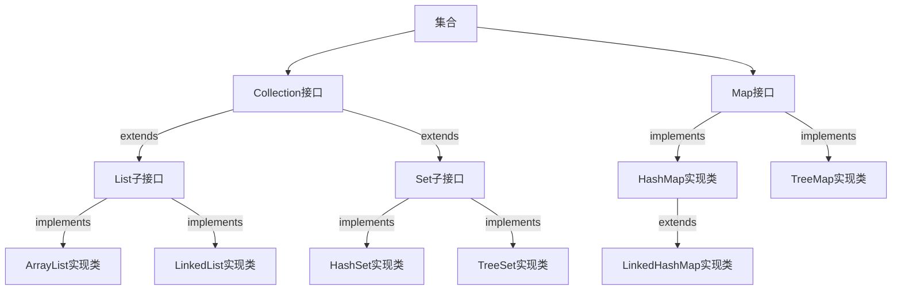
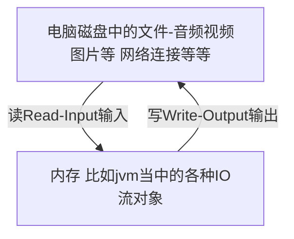
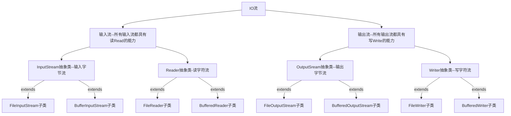
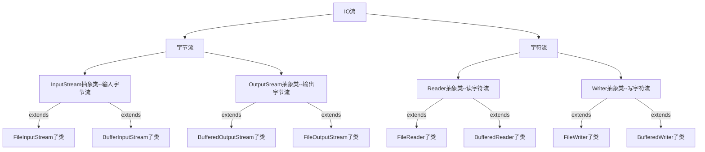
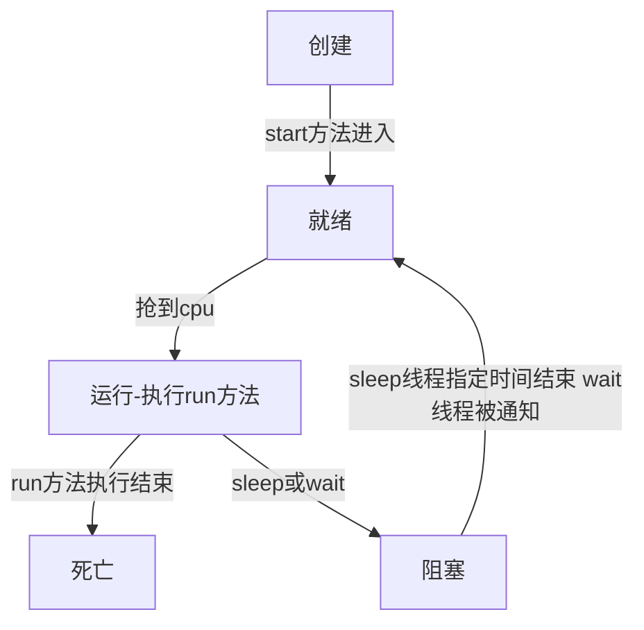

# Java学习笔记

## 第一章 java概述

### 1.1 java概述

#### 1.1.1 Java语言的特性

​	1.跨平台
​	2.安全
​	3.简单
​	4.面向对象
​	5.动态特性
​	6.分布式

#### 1.1.1 java的三个分支

​	**Java SE**：标准版Java SE（Java Platform，Standard Edition）。JavaSE以前成为J2SE。 它语序开发和部署在桌面，服务器，嵌入式环境和实时环境中使用Java应用程序。JavaSE包含了支持JavaWeb服务的开发的类，并为Java Platform,Enterprise Edition(Java EE)提供了基础。 C/S
​      **Java EE**：企业版Java EE（Java Platform，Enterprise Edition）。这个版本以前成为J2EE。 企业版本帮助开发和部署可移植，健壮，可伸缩切安全的服务器端Java应用程序。B/S
​      **Java ME：**微型版Java ME（Java Platform，Micro Edition）。这个版本以前称为J2ME。 Java ME为在移动设备和嵌入式设备（笔记手机，PDA，电视机顶盒和打印机）上运行的应用程序提供一个健壮且灵活的环境。

#### 1.1.2  JDK、JRE、JVM三者之间的关系

​	**JDK ：**英文名称（Java Development Kit），Java 开发工具包。jdk 是整个 Java 开发的核心，它集成了 jre 和一些好用的小工具。例如：javac.exe，java.exe，jar.exe 等。

​	**JRE ：**英文名称（Java Runtime Environment），我们叫它：Java 运行时环境。它主要包含两个部分，jvm 的标准实现和 Java 的一些基本类库。它相对于 jvm 来说，多出来的是一部分的 Java 类库。

​	**JVM ：**英文名称（Java Virtual Machine），就是我们耳熟能详的 Java 虚拟机。它只认识 xxx.class 这种类型的文件，它能够将 class 文件中的字节码指令进行识别并调用操作系统向上的 API 完成动作。所以说，jvm 是 Java 能够跨平台的核心。

   显然，这三者的关系是：一层层的嵌套关系。JDK>JRE>JVM。


#### 1.1.3 java运行机制

​	（1）将java代码编写到扩展名为.java的目标文件中
​	（2）通过javac对该java文件进行编译
​	（3）同过java命令对编译的class文件进行运行	


## 第二章 java基础

### 1.1 java关键字和标识符

```java
关键字：
    一般是编译器（eclipse或者idea）高亮显示的都是java当中的关键字，这些关键字是程序员开发者不能修改的东西，比如public class static package等等，是sun公司规定好的。


```


```java
标识符：程序开发人员可以自己命名的，常用于变量名、 方法名、类名。
     标识符的命名遵循规则和规范
           a)规则：字母、数组、下划线(_)、美元符号$，不能以数字开头
                 不能使用关键字，严格区分大小写
               补充：注意不要使用中文
               规则一定要严格遵守，不遵守的话，java程序报错，不能执行
           b)规范：
               (1)见名知意
               (2)驼峰式命名：有高有低
                   类名：首字母大写
                   方法名：第一个单词首字母小写其余单词首字母大写
                          getName、firstName
                   变量名：和方法名命名规范一致
                           userName
              规范可以不遵守，也不会报错，我们平时开发时还是要严格要求遵守的
    
```

练习：

```java
观察以下哪些标识符是合法的？
    username  
    137.1
    _hello
    hello world
    User+Name
```


### 1.2 基本数据类型

```java
了解计算机的一些常识
（1）字面值：java当中的数据，java语言组成部分，跟关键字、标识符一样
    10、100、-200 整数
    1.2 -1.2 浮点数
    true、false 布尔值
    'A' 'b' '我' 字符
    “LiMing” 字符串
（2）进制
       在java当中常用的进制
          二进制：0b，  0b10表示2
          十进制：不加前缀默认就是十进制
          八进制：0,  比如010表示8
          十六进制：0x,  比如010表示16
```

#### 1.2.1 常见的基本数据类型的使用

```java
（1）java当中的8种数据类型：
    整数型：
        byte
        short
        int
        long
    浮点型（一般用来表示小数的）：
    	float
    	double
    字符型
    	char
    布尔型
    	booblean
    
    数据类型          占用字节数（1字节=8bit 也就是8位）
    --------------------------------------------
    byte			1
    short			2
    int				4
    long			8
    float			4
    double			8
    boolean         1
    char			2
    
    注意：
     1、在java当中定义的整数字面值默认是int类型
    	在我们平常使用的时候，不要太过纠结它的大小，一般用默认的int类型定义整数就可以了。
     2、类型转换问题：
    	用小范围的数接收大范围的数的时候，需要进行强制类型转换，但是转换之后的数据会不准确，也就是精度丢失。
    	强制类型转换的时候慎重加慎重。
    	只要涉及到类型转换就要慎重！！！！！
     3、在java当中定义浮点字面值的时候默认是double类型
     
     4、默认值：一切向0看齐
    		 整数：默认值就是0
    		 浮点数：默认0.0
             布尔值：默认false
```

####1.2.2 字符

```java
在计算机领域，编码和解码通常涉及将数据从一种形式转换为另一种形式，以便它们能够在网络上传输、存储到文件或在程序中处理。
a)编码：计算机协会规定了一套标准，用来作为计算机和文字之间的一套字典参照表，文字和数字之间的转换表，
    因为计算只认0、1，单纯的文字计算机解释不了。
b)解码：计算机按照规定格式的字典参照（编码格式），将存储到计算机内存当中的编码后的二进制文字再解释出来。
  编码-解码要按照同一套标准，如果两边标准不一致，就会出现乱码的问题。
    常见的编码格式：
    	Ascll、
    	GBK(国标码)
    	Unicode(万国码)：UTF-8 UTF-16 UTF-32
    以后开发当中经常用到的编码UTF-8  
  如何定义一个字符：
    语法： char 变量名 = 字面值;
		  字面值是用''括起来的字符,字符只能是单个字符，当然转义字符是一种特殊的字符，不要混淆了，其实也是单个字符。
          如： char num1 = 'A';
              char num2 = '我';
		

```

```java
public class DataType01 {

    public static void main(String[] args) {
        //如何定义一个数据
        //数据类型 变量名 = 字面值;
        //java当中每一条语句要以分号结尾
        byte num1 = 100;
        short num2 = 200;
        int num3 = 300;
        long num4 = 400;

        double num5 = 1.1;
        float num6 = 1.1f;

        boolean num7 = true;
        boolean num8 = false;
        //单引号括起来,不加单引号只能用整数表示
        char num9 = 'a';
        char num10 = '你';
        char num11 = '9';
        char num12 = 99;
        System.out.println(num12);
        System.out.println(num9);
        System.out.println(num11);

    }
}
```

#### 1.2.3 基本数据类型转换

```java
1、数据类型转换
      因为java是一种强类型语言，在程序当中对数据进行运算（赋值运算、算术运算）时，
      要求参与运算的数据类型必须要保持一致，这个时候必须要对数据进行类型转换。
2、有哪几种类型转换？
      a) 隐式类型转化（自动）
      b)强制类型转换
3、哪些数据类型可以相互转换？
      除了布尔型，其他类型都可以相互转换
4、自动类型转换
      byte-->short-->int-->long-->float-->double
      char-->int
      低字节到高字节自动转换
      赋值运算：
          自动类型转换的一个特例：
          将int型的值给到byte、short、char类型的变量时，只要对应的值
          不超出给到的变量对应类型的范围也可以自动转换。
      算数运算：
          两个数据进行运算的时候，如果其中有一个数据是double型，
          会将另一个数据先转为double型再运算，结果也为double
          否则，如果中有一个数据是float型，
          会将另一个数据先转为float型再运算，结果也为float
          否则，如果中有一个数据是long型，
           会将另一个数据先转为long型再运算，结果也为long，
          否则，其他情况会将另一个数据先转为int型再运算，结果也为int
          最终发现，算数运算时，如果多个数据类型不一致，会以高字节的
          数据类型为准。
 5、强制类型转换
      有时候需要将高字节的变量赋给低字节的变量，不能进行自动转换，
      只能通过强制转换的方式实现。
      如何实现：
          目标类型变量 = (目标类型)变量;
      强制类型转换要慎重，容易出现精度丢失，数据不准确的问题。

 基本数据类型学习目标：
      会基本的使用和定义，进行简单的运算。
```

```java
public class DataType02 {
    public static void main(String[] args) {
        byte num1 = 100;
        int num2 = num1;
        int num3 = 100;
//        byte num4 = num3;
        double num4 = 1.1;
        int num5 = 10;
        float num7 = 1.2f;
        double sum1 = num4+num5;
        float sum2 = num7 + num5;
        long num8 = 11;
        long sum3 = num5 + num8;
        byte num9 = 11;
        int sum4 = num9 + num5;

//        byte num11 = 100;
        int num10 = 200;
        byte num12 = (byte)num10;
        System.out.println(num12);

    }
}
```

### 1.3  java当中的运算符

#### 1.3.1 java表达式

```java
由运算符和操作数（数据或者字面值或者变量）组成的语句。
```

#### 1.3.2 算数运算符

加（+）、减（-）、乘（*）、除（取商/ 取余%）、自增（++）、自减（--）

注意：核心点自增和自减

自增： ++前后都可以放变量

​			变量在前：先用后本身的值加1

​			变量在后：先本身的值加1再用

自减： --前后都可以放变量

​			变量在前：先用后变量本身的值减1

​			变量在后：先本身的值减1再用

```java
public class Operator01 {
    public static void main(String[] args) {
        int num1 = 10;
        int num2 = 3;
        System.out.println(num1 + num2);
        System.out.println(num1 - num2);
        System.out.println(num1 * num2);
        System.out.println(num1 / num2);
        System.out.println(num1 % num2);

        int num3 = 2;
        int num4 = num3++;
        System.out.println(num4);//2
        System.out.println(num3);//3
        int num5 = ++num3;
        System.out.println(num5);//4
        System.out.println(num3);//4
        System.out.println(num3++);//4
        System.out.println(++num3);//6

        int num6 = 10;
        System.out.println(num6--);//10
        System.out.println(--num6);//8

    }
}
```

#### 1.3.3 赋值运算

= (赋值)

+=（加等于）

 -=  （减等于）

*=（乘等于）

/=  （除等于）

%=（模等于）

注意：

​			+= 运算可能存在数据精度丢失的问题

​			a+=b 并不是想当然的认为a=a+b,会存在着强制类型转换,具体看以下例子。

​			所以说像+= -= ....这种赋值运算使用时容易出现数据不准确的问题要慎重。

```java
public class Operator03 {
    public static void main(String[] args) {
        int num1 = 10;
        int num2 = 3;
        //先可以简单的认为num1=num1+num2
        num1 += num2;
        System.out.println(num1);//13
        System.out.println(num2);//3
        num1 -= num2;
        System.out.println(num1);//10
        System.out.println(num2);//3
        num1 %= num2;
        System.out.println(num1);//1
        System.out.println(num2);//3

        byte num3 = 120;
        int num4 = 9;
        //此处并不会报错
        //此处其实相当于num3 = (byte)(num3 + num4)
        num3 += num4;
        //此处报错，因为此处做的是算数运算，num4+num3的结果是一个int，二num3是byte，类型不匹配
//        num3 = num3 + num4;
        System.out.println(num3);
    }
}
```

#### 1.3.4  关系运算

表达式:   由运算符和变量或者数值组成，用于在程序产指定或者产生一个值。

​			    也就是表达式的结果是一个值，不能作为一条独立的语句。

<  <=  >=  ==

关系运算符参与的表达式结果是一个布尔值

表达式和表达式之间可以串联使用

```java
public class Operator02 {
    public static void main(String[] args) {
        int num1 = 20;
        int num2 = 11;
        System.out.println(num1 == num2);
        System.out.println(num1 != num2);
        System.out.println(num1 > num2);
        System.out.println(num1 < num2);
    }
}
```

#### 1.3.5 逻辑运算符

什么是短路：

​			在程序当中正常的执行顺序被某个运算符给中断了，一条语句后边程序就不执行（不是不需要）了，

​			类似于生活中的短路现象。

常用的逻辑运算符：

​			！非 

​			**&**逻辑与 **&&**短路与

​				两个都是并且的意思，但是&在进行运算的时候，无论什么情况前后的表达式

​				都要执行，&&如果前面的表达式是假，就会发生短路现象，后边的表达式不再执行了

​			**|**逻辑或 **||** 短路或

​				两个都是或者的意思，但是|在进行运算的时候，无论什么情况前后的表达式

​				 都要执行，||如果前面的表达式是真，就会发生短路现象，后边的表达式不再执行了

​			具体后两种逻辑运算符达短路现象以下程序为例

```java
public class Operator04 {
    public static void main(String[] args) {
        int num1 = 10;
        int num2 = 20;
        System.out.println(!true);
        System.out.println(!(num1 > num2));
        //逻辑与，只有两个都为真结果为真，其余为假
        System.out.println(true & false);
        System.out.println(true & true);
        System.out.println((2>3) & (3>4));
        //逻辑或，只要其中一个为真，结果就为真
        System.out.println(false | true);
        System.out.println(false | false);
        System.out.println((4 > 3) | (2 < 1));

        System.out.println(true && true);
        System.out.println(false && true);
        System.out.println((4 > 3) && (5 > 6));
        int num3 = 2;
//        System.out.println((6 < 5) & (3 > num3++));
//        System.out.println((6 < 5) && (3 > num3++));
        System.out.println((4>2) && (3 > num3++));
        System.out.println(num3);

        int num4 = 5;
//        System.out.println(5 >= num4++);

//        System.out.println((4 > 3) | (3 > num4++));
        System.out.println((4 > 3) || (3 > num4++));
        System.out.println(num4);


    }
}

```

#### 1.3.6 三元运算表达式

语法：

​			条件表达式 ？ 表达式1 ： 表达式2；

​		    意为：如果条件为真执行1，为假执行2

注意：

​		1、三元运算结果是一个值，不能作为一条独立的语句；

​		2、后边两个表达式的数据类型要统一，不然编译期出错，当然发生自动类型转换的时候没问题的。

```java
public class Operator05 {
    public static void main(String[] args) {
        //三元表达式
        boolean num5 = ((4 > 3) ? true : false);
        int num6 = (5 > 7 ? 10 : 100);
        System.out.println(num6);


    }
}

```

#### 1.3.7 关于运算符的优先级

​		关于优先级的问题？没有必要记忆，实在搞不清谁先执行，就将部分整体表达式用小括号括起来。

​		比如上面三元表达式的例子。


### 1.4 程序流程控制

没有学习程序流程控制之前，我们都知道程序是按照顺序自上而下执行的，但是在实际业务开发当中，有些程序我们需要选择性的去执行或者需要重复的执行，这个时候之前的顺序流程可能不好实现，所以就出现了后续的选择结构和循环结构来实现这些需求。

#### 1.4.1 选择结构

​         可以让某些程序按照条件选择性的执行或不执行

##### 1.4.1.1 选择结构if

三种语法

1、if(布尔值){

​			语句体；	

​       }

2、if(布尔值){

​			语句体1;

​      }else{

​			语句体2；		

​      }

3、if(布尔值){

​			语句体1;

​		}else if(布尔值){

​       	语句体2； 

​       }else if(布尔值){

​       	语句体3； 

​       }.......esle{

​		   语句体...;

​		}

注意：

​     1、if else else if可以相互结合或者嵌套使用

​     2、在第三种方式里面else if是除了if或者elseif的其他情况，有些条件不要写重了

​     3、花括号括起来的是代码块，}不需要以分号结尾，他是一个整体结构，

​          只有一条条语句才需要分号结尾

```java
public class IfTest01 {
    public static void main(String[] args) {
        boolean sex = true;
        if(sex){
            System.out.println("男");
        }

        if(sex == false){
            System.out.println("女");
        }

        if(sex){
            System.out.println("男");
        }else {
            System.out.println("女");
        }

        int score = 90;
        //成绩>90 优秀，80-90 良; 60-80 及格; <60不及格
        if(score >= 90){
            System.out.println("优秀");
        }else if (score > 80){
            System.out.println("良");
        }else if(score > 60){
            System.out.println("及格");
        }else{
            System.out.println("不及格");
        }
       /* if(score > 80 && score < 90){
            System.out.println("良");

        }*/

    }
}
```

##### 1.4.1.2 选择结构switch语句


switch开关的意思

语法：

​	switch(变量){

​		case 常量值：

​				语句体；

​				break;//可加可不加，但是要慎重

​       case 常量值：

​				语句体；

​                break；

​		......

​		default:

​				语句体；

}


注意：

​	1、break和default可以不写

​	2、switch中的表达式一般使用变量，这个变量可以为int short String 枚举等等，但是平时开发
 	 用的最多的是基本数据类型。
​    3、default默认的意思，case都匹配不到执行默认语句体

​	4、switch开关在用的时候，只需要知道什么时候打开什么时候结束；

​		当switch表达式与case常量值匹配的时候开关打开，依次执行语句，去寻找break，直到遇到break

​		switch结束，找不到的话，直到switch结束

**平时开发当中，选择结构用到最多的是if else这种，比较灵活，switch用的比较少。**

```java
public class IfTest02 {
    public static void main(String[] args) {

        //给定num值，如果num=1,打印星期一,如果....
        int num = 7;
        switch (num){
            case 1:
                System.out.println("星期一");
                break;
            case 2:
                System.out.println("星期二");
                break;
            case 3:
                System.out.println("星期三");
                break;
            case 4:
                System.out.println("星期四");
                break;
            case 5:
                System.out.println("星期五");
                break;
            case 6:
                System.out.println("星期六");
                break;
            case 7:
                System.out.println("星期天");
                break;
            default:
                System.out.println("不存在");
        }

        System.out.println("over......");
    }
}
```


#### 1.4.2 循环结构

可以使某段程序按照条件重复循环的去执行。

##### 1.4.2.1 for循环

注意：写循环一定不要写死循环，比如for(;;)    while(true){}   do{}while(true)

语法结构：

for(1初始条件表达式；2是否循环判断表达式；4更新表达式){

​			3循环执行的程序（循环体）；

}

它的执行顺序：

​	第一步：先执行1，第一步只执行一次
​	第二步：执行2，2为真执行第三步，2为假结束
​	第三步：执行3,3执行结束，执行第四步
​	第四步：执行4,4执行结束，执行第二步

```java
public class ForTest01 {
    public static void main(String[] args) {
        System.out.println(1);
        System.out.println(2);
        System.out.println(3);
        System.out.println(4);

        for (int i = 1; i <= 100; i++){
            System.out.println(i);

        }

    }
}
```

##### 1.4.2.2 while循环

语法：

​			 while(循环条件表达式){

​				 循环语句；

​			}

​         如果布尔表达式为真重复执行循环语句

```java
public class WhileTest01 {
    public static void main(String[] args) {
        //打印十遍1
        for (int i = 1; i <=10; i++){
            System.out.println(1);
        }
        int num = 1;
        while(num <= 10){
            System.out.println(1);
            num++;
        }
    }
}
```

##### 1.4.2.3 do while循环

语法：

​		 do{

​				循环语句；

​		    }while(是否继续执行循环);

先执行do中的语句，在判断循环是否继续执行

注意: 无论while当中的表达式是否为真，先执行do中的循环语句一次，后续继续判断表达式，注意和while的区别

```java
public class WhileTest02 {
    public static void main(String[] args) {
        
        //打印5遍2
        int num1 = 1;
        do{
            System.out.println(2);
            num1++;
        }while(num1 <= 2);

        do{
            System.out.println("+++++");
        }while (false);


    }
}
```

##### 1.4.2.4 break和continue

break：

​		1、意为中断终止的意思

​		2、break；是一条独立的语句

​	   3、可以用在switch中，可以用在循环当中

​				用在switch中是用来关闭开关的

​				用在循环当中用来结束**当前循环（for while dowhile），离它最近的循环**，结束不意味着整个程序终止，终止的是一个代码				块，代码块这里就是所谓的循环体

```java
public static void main(String[] args) {
        /*
        * 找出1000-2000之间能被7整除的5个整数
        * */
        int count = 0;
        for(int i = 1000; i <= 2000; i++){

            if (i % 7 == 0){
                System.out.println(i);
                count++;
                if (count == 5){
                    break;
                }
            }
            if (count == 5){
                break;
            }

        }
		
    
        for (int x = 1; x <= 10; x++){
            for (int y = 1; y <= 10; y++){
                System.out.println("=======");
                if (y == 6){
                    break;//结束的是里面的for循环
                }
            }
        }

    }
```

continue: 

​	继续的意思，用于跳出当前循环（离它最近的循环），继续下一次循环；

​	continue；是一条独立的语句

```java
public static void main(String[] args) {
        /*
        * 打印1-10十个数字，6不打印
        * */
        for(int i = 1; i <= 10; i++){
            /*if (i != 6){
                System.out.println(i);
            }*/
            if (i == 6){
                continue;
            }
            System.out.println(i);
        }
        int count = 1;
        while (count <= 10){
            if (count == 6){
                count++;
                continue;
            }
            System.out.println(count);
            count++;
        }

        System.out.println("==========");

    }
```


### 1.5 数组

定义：用来存储多个相同数据类型的数据模型（相同、多个）

#### 1.5.1 数组的声明：

声明方式：

​	第一种： 数据类型[] 数组变量名 = {数据1,数据2,.....,数据n};

​					{}里面是具体存放的一个对应数据类型的数据

​					**声明一个数组，并给初始值。**

​					例：int[] twoDepAges = {20,30,18};

​	第二种：数据类型[] 数组变量名 = new 数据类型[数组的长度]；

​					**声明一个数组，并给默认值。**

​		注意：一切向0看齐
​			 		整数：默认值就是0
​			 		浮点数：默认0.0
​	         		布尔值：默认false
​				

```java
public static void main(String[] args) {
        /*
        * 定义一个数组，存放一组同学的年龄
        * */
    	//第一种方式：
        int[] ageArrays = {20,21,22,20,23,19};
        double[] highArrays = {180.1, 190.2, 180, 185.5};
        boolean[] isMale = {true, false, true};
        System.out.println(ageArrays[0]);
        /*
        * 第二种方式，是定义一个数组并赋默认值
        * 整型：0
        * 浮点型：0.0
        * 布尔型：false
        *
        * */
        int[] ages = new int[6];
        //int[] ages = {0,0,0,0,0,0};
    

    }
```


#### 1.5.2 数组的取值、修改、遍历

（1）取值

​			数组变量[索引或下标],代表当前下标所对应的数据

​	注意：索引或者下标，从0开始，到数组的长度-1，指的是数组当中每个数据的位置。

（2）修改：

​		数组变量名[下标] = 要修改的值;

（3）遍历：把整个数组的数据全部走一遍

   	语法：
   	   	 a) 普通for循环
   	      	  for(int i = 0; i < 数组变量的长度; i++){
   	           	 循环语句;
   	      	  }
   	   	 b)增强for循环-**先了解**
   	       	 for(数组对应的数据类型 变量 : 要遍历的数组变量){
   	               	 循环语句;
   	        	}

```java
public static void main(String[] args) {
       	int[] ageArrays = {20,21,22,20,23,19};
        int[] ages = new int[6];
    	boolean[] isMale = {true, false, true};
        /*
        * 数组数据的获取
        * 获取数组数据： 数组变量名[下标]
        * 获取数组的长度： 数组变量名.length
        * */
        System.out.println(ageArrays[2]);
        System.out.println(ageArrays.length);

        /*
        * 改变isMale数组第二个位置的数据true
        * */
        isMale[1] = true;
        System.out.println(isMale[1]);
        //此处数组下标超出了范围，运行时会报错
        /*
           程序在运行时分两个阶段，编译期和运行期
        * 编译时异常：语法不通过，报红
        * 运行时异常：比如数组越界，程序语法通过，但是实际运行的时候
        *           逻辑错误。控制台打印错误。
                    运行时异常，如果不处理，整个程序结束不再往下执行。
        *
        * */
//        System.out.println(ageArrays[6]);
        System.out.println("==========");
        System.out.println(ageArrays);


        int[] stuScores = {90, 89, 75, 66, 70, 80, 40, 30, 70, 33, 77, 91};
        /*
        * 取出学生成绩当中>80的所有成绩
        * */
        System.out.println("============");
        for (int i = 0; i <= stuScores.length-1; i++){
            if (stuScores[i] > 80){
                System.out.println(stuScores[i]);
            }

        }

        //增强for循环
        //循环取出stuScores中每一个数据，每一次把
        // 对应的数据给到变量score
        for(int score : stuScores){
            if (score > 80){
                System.out.println(score);
            }
        }

    }
```

#### 1.5.3 数组的比较

```java
public static void main(String[] args) {
        /*
        * 数组的比较
        * */
        int[] arr1 = {10,20,30};
        int[] arr2 = {30,40,50};
        int[] arr3 = {10,20,30};
        int num1 = 10;
        int num2 = 10;
        System.out.println(arr1 == arr2);
        System.out.println(arr1);
        System.out.println(arr3);
        System.out.println(arr1 == arr3);
        arr3[1] = 60;
        System.out.println(arr1[1]);
        arr2 = arr1;
        System.out.println(arr2[0]);
        arr2[2] = 100;
        System.out.println(arr1[2]);

        //定义了一个长度为0的数组，不能存入任何数据
        int[] arr4 = {};
//        System.out.println(arr4[0]);
        //数组一旦定义好了长度就不能再改变了
        int[] arr5 = {1,2,3,4};
        System.out.println(arr5);
        arr5 = new int[5];
        System.out.println(arr5);

    }
```


### 1.6 字符串

#### 1.6.1 定义

​		**概念：**多个字符组在一起就构成了字符串，使用String关键字来表示。

​						字符串是引用数据类型;

​						引用数据类型：引用是一个变量，变量指向的是一个内存地址

​						具有不变性，字符串一旦定义，他的内容不会再改变。

​		**声明方式：**

​					 **1、String 变量名 = "字符串常量值";**

​							 这种定义方式，是在字符串常量池中创建一块内存，将变量指向常量池中字符串的地址

​					**2、String 变量名 = new String("字符串常量值");**

​							先在堆内存中创建一个对象，然后去常量池内存中找是否存在这样的字符串，如果有，

​							将常量池中的字符串对应的内存地址保存到当前对象中，如果没有，就在常量池中新

​							开辟一块内存，存放此字符串。字符串变量指向的是对象的地址。

```java
public static void main(String[] args) {
//        char c1 = 'hello';
        String s1 = "hello";
        String s2 = new String("hello");
        System.out.println(s1 == s2);
        String s3 = "你好";
        String s4 = "qwer123|)()*&*%#|~";
        String s5 = "helll";
        s5 = "hello";

        
    }
```


#### 1.6.2 字符串的拼接

字符串拼接： 使用+

 + 在使用的时候，不加()的前提，遵循自左向右进行运算，如果+前后出现字符串按照字符串进行拼接，如果都是数字就进行算术运算。

```java
public static void main(String[] args) {


        //字符串拼接+
        String s6 = "hello";
        String s7 = "world";
        String s8 = s6 + s7;
        System.out.println(s8);
        System.out.println(1 + "2");//12
        System.out.println(1 + 2);//3
        System.out.println(1 + 2 + "3");//33
        System.out.println(1 + 2 + "3" + 4);//334
        System.out.println(1+ 2 + "3" + 4 + 5);//3345
        System.out.println(1+ 2 + "3" + (4 + 5));//339

    }
```


#### 1.6.3 字符串的比较

##### 1.6.3.1 基本字符串比较

 **1、== 比较**
       两个字符串 == 比较，是判断两个字符串的地址是否相同
       说明：以后引用数据类型，== 比较默认就是比较内存地址
 **2、equals比较**
      比较的是字符串的值或者内容是否相等
      例如：
          "hello".equals("world")

​		字符串变量1.equals(字符串变量2)，意为：变量1和变量2字符串的内容(常量池当中的值)是否一致


```java
		//字符串的比较
        String s9 = "hello";
        String s10 = "kitty";
        String s11 = new String("hello");
        String s12 = "hello";
        String s13 = new String("kitty");
        String s14 = "hellokitty";
        System.out.println(s9 == s10);//false
 		System.out.println(s11);
        System.out.println(s9);
        System.out.println(s9 == s11);//false
        System.out.println(s9 == s12);//true
        System.out.println(s9.equals(s12));//true
        System.out.println(s9.equals(s11));//true
```


##### 1.6.3.2 字符串拼接比较（作为了解部分）

```java
		
		String s9 = "hello";
        String s10 = "kitty";
        String s11 = new String("hello");
        String s12 = "hello";
        String s13 = new String("kitty");
        String s14 = "hellokitty";
		/*
        * 字符串+拼接的时候，如果其中有变量，就需要创建对象，指向对象的地址
        * 如果没有，不创建，直接字符串拼接，指向常量池地址。
        * */
        String s15 = s9 + s10;
        String s16 = "hello" + "kitty";
        String s17 = "hello" + s10;
        System.out.println(s15);
        System.out.println(s15 == s14);
        System.out.println(s16 == s14);
        System.out.println(s17 == s14);
        System.out.println(s15 == s17);
        System.out.println(s15.equals(s14));
        System.out.println(s16.equals(s14));
```

#### 1.6.4 字符串常用方法

```java
public static void main(String[] args) {
        /*
        * 字符串的一些常见方法
        * */
        String s1 = "abcdef";
        //获取字符串的长度
        System.out.println(s1.length());
        //判断字符串是否为空
        System.out.println(s1.isEmpty());
        //将字符串的字母小写全部转为大写
        System.out.println(s1.toUpperCase());
        //转为小写
        System.out.println(s1.toLowerCase());
        //获取字符串中某个位置的字符
        System.out.println(s1.charAt(1));
        //获取某个子串的位置
        //子串是当前字符串中可以截取的连续的字符
        //如果没有此子串统一都返回-1
        System.out.println(s1.indexOf("cd"));//2
        System.out.println(s1.indexOf("cf"));//-1

        //截取字符串
        //注意subString(begainIndex,endIndex)
        //在截取字符串的时候不包含endIndex所在位置的字符，包含
        //begainIndex值endIndex-1区间所有的字符
        System.out.println(s1.substring(2,5));//cde

        //拼接字符串
        System.out.println(s1.concat("mn"));

        //将字符串转为字符数组
        //"abcdef"  {'a','b','c','d','e','f'}
        char[] array = s1.toCharArray();

        String s2 = "    ghk lmn      ";
        String s3 = " ";
        //去除字符串前后的空格
        System.out.println(s2.trim());

        String s4 = "q ww e r yyy u";
        //将字符串按照给定方式进行分隔，分隔之后返回的是一个字符串数组
        String[] ss = s4.split(" ");
        System.out.println(ss[1]);

    }
```

#### 1.6.5 字符串相关的两个类StringBuffer和StringBuilder

另外两种创建字符串的类,拼接过程中**不创建新对象**,节省内存，效率更高

​			StringBuilder：非线程安全(后续了解什么是线程安全)

​			StringBuffer：线程安全

```java
public static void main(String[] args) {
      

        //字符串相关的两个类
        //StringBuffer  StringBulider
        //StringBuffer 变量名 = new StringBuffer("字符串常量值");
        //StringBuilder 变量名 = new StringBuilder(“字符串常量值”);
        StringBuffer s5 = new StringBuffer("123");
        StringBuilder s6 = new StringBuilder("456");
        System.out.println(s5);
        s5.append("789");
        System.out.println(s5);

        System.out.println(Method01.add(1,2));

    }
```

### 1.7 方法

#### 1.7.1 概念

​		一组完成特定任务的代码集合，它是类的一部分，用于对一类问题提供解决方案；	

​		在Java中，方法（也称为函数）是一段用于执行特定任务的代码块。你可以将方法视为执行特定操作的指令集。当你需要多次执行相同的任务时，可以将这些任务封装成一个方法，并在需要时调用它。

​		方法的使用在java当中叫做调用。

​			

#### 1.7.2 方法的定义

​		 修饰符列表  返回类型 方法名(形参列表){

​							 方法体；

​						    return 对应的数据类型；（当有返回值时使用）

​			}


​			==注意==：方法只能定义在类当中，不能在方法中定义方法，但是可以在方法中调用方法


​	a)修饰符列表：
​      1、修饰符是对方法的一种描述，加了修饰符的方法就会有一些
​      相应的限制。
​      2、修饰符可以不写
​      3、常见的修饰符有哪些？
​          public、static、private、synchronized等等

  b)返回类型：基本数据类型和引用数据类型，一个特殊的void
           void是此方法不返回任何值。

   c)方法名：遵循标识符的命名规则和规范

  d)形参列表：形式参数，此方法可以接收什么类型的参数，
             形式参数可以没有，也可以多个（如果有多个，逗号分隔）.
             形式参数的类型：基本数据类型和引用数据类型
            public void m1(int a, String b){
            }
            这里的a,b都是形式参数

  f)方法体：执行特定功能的一个整体语句
  g)return: 是返回的意思
      （1）return;可以作为一条单独的语句，表示整个方法结束
         (2) retrun 值;表示此方法返回某个值;
        (3)方法如果是返回为void，return可以不加
      (4)如果方法返回类型不是void，此方法在方法体
          终止的地方必须要有return 对应返回类型的值

```java
 /*
    * 方法只能定义在类当中
    * */
    public static int add(int num1, int num2){
        int sum = num1 + num2;
        return sum;
    }

 /*
    * 定义一个打印的方法
    * */
    public static void print(){
        System.out.println("hello world");
//        print();
    }

 /*
    * 传入一个整数n,打印1-n之间所有的偶数
    * */
    public static void printOu(int n){
        for (int i = 1; i <= n; i++){
            if (i % 2 == 0){
                System.out.println(i);
            }
        }
    }
```

#### 1.7.3 方法的调用

​       1、方法的使用叫做方法的调用

​	   2、如何调用方法：

​						方法名(实参列表)

​						比如：add(1,2)

​					==注意==：实参是指实际传入的参数

​						

​		3、如果方法有返回值可以定义一个变量来接收

​					比如： int sum = add(10,20);

```java
public class Method01 {
    public static void main(String[] args) {
        int num1 = 10;
        int num2 = 20;
        //定义一个变量来接收方法的返回值
        int sum1 = add(10,20);
        add(num1,num2);
        System.out.println(sum1);
        System.out.println(num1+ num2);


        print();
        printOu(20);
        printOu(100);
    }
    /*
    * 方法只能定义在类当中
    * */
    public static int add(int num1, int num2){
        int sum = num1 + num2;
        return sum;
    }
    /*
    * 定义一个打印的方法
    * */
    public static void print(){
        System.out.println("hello world");
//        print();
    }

    /*
    * 传入一个整数n,打印1-n之间所有的偶数
    * */
    public static void printOu(int n){
        for (int i = 1; i <= n; i++){
            if (i % 2 == 0){
                System.out.println(i);
            }
        }
    }
	
    public static void m1(){
        //m2();
    }
    public static void m2(){
        //m1();
    }
}

```


#### 1.7.4 方法的变量和调用顺序

a、定义在方法体中的变量叫做**局部变量**

​		局部变量使用时必须要给初值，不然编译报错。

b、方法和方法之间的调用顺序--遵循栈的执行顺序--先进后出

​		栈---类似于子弹夹，先进后出

​		方法之间调用时尽量不要写递归调用,如果一定要用递归，要有控制结束的语句，

​				递归调用容易造成栈溢出错误的问题。

​		  比如最经典菲波那切数列实现。

​		    a()-b()-a()

```java
public static void main(String[] args) {
        //int sum = add(10,20);
        /*
        * 1、方法的传参
        *      实参类型要和形参一致
        *         类型一致、个数一致、顺序一致
        * 2、关于方法当中的参数（变量）：局部变量
        *       方法体中的局部变量使用时一定要赋初值.
        * 3、方法的调用顺序-先进后出（栈），像子弹夹一样
        *
        * */
        short s1 = 10;
        //int sum = add(10.1,20);
        //int sum = add(s1,20);
        //int sum = add(10,20,30);
        //double sum = add1(10, 20.1);
        //System.out.println(sum);
        int num1;
        //int num2 = 20 + num1;
        //System.out.println(num1);
        m1();
        //报错：栈溢出，每个方法调用一次，会开辟一个栈内存，
        //此处循环调用方法回无限开辟占内存，内存回溢出报错
        //a();
    }
    /*
    * 加法，根据传入的两个整数，返回两个整数的和
    * */
    public static int add(int num1, int num2){
        //int sum = num1 + num2;
        //return sum;
        return num1 + num2;
    }
    public static double add1(double num1, int num2){
        return num1 + num2;
    }

    public static void m1(){
        System.out.println("111111111");
        m2();
        System.out.println("22222222222");
    }
    public static void m2(){
        System.out.println("33333333");
        m3();
        System.out.println("4444444444");
    }
    public static void m3(){
        System.out.println("55555555");
    }

    public static void a(){
        System.out.println("aaaaaaaa");
        b();
    }
    public static void b(){
        System.out.println("bbbbbbbbbb");
        a();
    }
```


#### 1.7.5  方法的传参--值传递和引用传递

​	**值传递-**方法相互调用时，基本数据类型传递的是数据，方法调用时，改变传入的值对原来的变量没有影响

​	**引用传递**-方法相互调用时传递的是变量指向的地址，如果改变引用，变量的数据会对指向该地址的所有变量造成影响

==注意==：此处String虽然是引用数据类型，但是传递的时候比较特殊。

```java
public static void main(String[] args) {
        //值传递：传递的变量的值
        int num1 = 10;
        m1(num1);
        System.out.println(num1);
        //引用传递：传递的是变量的地址，其实就是当
        //形参变量为引用数据类型时
        //但是String除外
        int[] arr1 = {1,2,3};
        int[] arr2 = arr1;
        arr2 = new int[3];
        System.out.println(arr1[1]);


        m2(arr1);
        System.out.println(arr1[1]);


        String s1 = "111";
        m3(s1);
        System.out.println(s1);

        int num2 = 30;
        m4(num2);
    }
    public static void m1(int num){
        num++;
    }

    public static void m2(int[] arr){
        arr = new int[3];
        //arr = {0,0,0}
        System.out.println(arr[1]);
//        arr[1] = 99;
    }

    public static void m3(String str){
        str = "222";
    }

    public static void m4(int num){

    }
```


值传递：


引用传递：


#### 1.7.6 return的用法

```java
/*
* return
*      return;可以作为一条独立的语句，用于结束当前方法
*      如果方法有返回值，return一定要出现在方法终止的地方，
*       要保证方法所有的语句都有可能都被执行到。
* */
public class Method03 {
    public static void main(String[] args) {
        print(10);
        int ret = m1(9);
    }
    /*
    * (1)打印1-n所有的整数
    * (2)打印n以内第一个被3整除的整数
    * */
    public static void print(int n){

        for(int i = 1; i <= n; i++){
//            System.out.println(i);
            if (i % 3 == 0){
                System.out.println(i);
//                break;
                return;
            }
        }

    }

    public static int m1(int n){
        if (n > 10){
            n++;
//            return n;
        }else {
            n--;
//            return n;
        }
        return n;
    }
}
```


### 1.8 类和对象

#### 1.8.1 面向过程和面向对象

**面向过程**：整个系统由一个主方法去完成，然后如果某一环节出问题，其他环节都受到影响。

这样，系统的耦合度（程序和程序之间关联度）非常高，复用率非常低。涉及一些小的系统的时候，

面向过程还是有优势的，效率要高。

​		比如：如何实现开车：  点火---->踩油门--->跑

**面向对象：**整个系统由主方法去完成对象和对象之间的相互协作完成。

​		比如造一辆汽车：

​				  可以将汽车拆解为 车架、轮胎、座椅、发动机几个部分

​						每一部分独立完成然后组装在一起


当涉及的系统比较简单、可以用线性的思维解决时可以使用面向过程解决，当系统比较复杂，简单的线性思维

无法解决可以考虑使用面向对象。


#### 1.8.2 类

概念：就是将具有相同属性和行为的事物提取（抽象）出来的一个概念或模板。

抽象：是将事物具有的相同的属性和行为提取出来的一个过程

类—>对象的过程，在java当中叫实例化

对象—>类的过程，在java当中叫抽象

##### 1.8.2.2.1类的定义

[修饰符列表]  class  类名 {

​				类体；		

​		}

1、修饰符列表： public，用它修饰类的时候类名要和文件名必须保持一致

​							abstract final等也可作为类的修饰符

2、类名：参考标识符规范去定义

3、类体：包括属性和方法

​		   属性：用变量表示，类体当中定义的变量叫成员变量。

​						成员变量分两种：

​									实例变量----变量的访问需要创建实例

​									静态变量：后边补充...

​			方法：实例方法和静态方法

​					[修饰符列表] 返回类型 方法名(参数列表){

​										方法体

​					}

**注意：**现在不能在类里面定义类，后续会学习这种写法


```java
public class Student {
    /*
        1、如何在类中声明变量：
            修饰符列表 数据类型 变量名;
        2、变量：可以为基本数据类型和引用数据类型
        3、成员变量当中的实例变量什么时候才有值？
             实例化出对象之后才会有值。
        4、实例变量的值如果不给是有默认值的：
              整型：0
              浮点型：0.0
              布尔型：false
              引用数据类型：null
                一切向0看齐
     */
    String stuId;
    int age;
    String name;
    char sex;
    //ZhuXi zhuxi;

    /*
    * 1、方法：实例方法和静态方法
    * 2、实例方法如何使用或者调用：
    *       需要实例化对象才能使用
    *
    * */
    public void study(){
        System.out.println("会学习.......");
    }

    public void sleep(){
        System.out.println("会睡觉........");
    }

}
```

#### 1.8.3 对象

​	**对象**是具体存在的一个事物

**1、创建（实例化）对象：**

​			类名 引用变量名 = new 类名();

**2、访问类的变量和方法：**

​			**访问变量：** 引用变量名.实例变量名

​					给实例赋值：  引用变量名.实例变量名 = 字面值 

​						比如如下代码(Test02)：

​			**访问方法：**引用变量名.方法名(实参列表)		

​			 ==这里的.理解为“的”==

```java
public class Teacher {
    String name;
    int age;

    public void teaching(Student student){
        System.out.println(name + "给" + student.name +  "上课");
    }
}
```


```java
public static void main(String[] args) {
        //new就是开辟一块新的内存
        Student xiaoHong = new Student();
        //stuId是String类型，引用类型，没有给值得话
        //默认为null,null就是没有指向任何内存地址
        System.out.println(xiaoHong.stuId);
        System.out.println(xiaoHong.age);
        System.out.println(xiaoHong.name);
        System.out.println(xiaoHong.sex);
        //给对象一个具体的值
        xiaoHong.stuId = "2023010201";
        xiaoHong.age = 20;
        xiaoHong.name = "张小红";
        xiaoHong.sex = '女';
        xiaoHong.study();
        xiaoHong.sleep();

        System.out.println(xiaoHong.age);
//        xiaoHong = new Student();
        System.out.println(xiaoHong.age);

        Student xiaoHua = new Student();
        xiaoHua.stuId = "2023010201";
        xiaoHua.age = 20;
        xiaoHua.sex = '女';
        xiaoHua.name = "张小红";
        System.out.println(xiaoHua == xiaoHong);

        Student xiaoMing = new Student();
        xiaoMing.name = "王晓明";
        Student ming = xiaoMing;
        ming.name = "张小明";
        System.out.println(xiaoMing.name);

        Student kaiFa = new Student();
        kaiFa.name = "开发";
        Teacher peng = new Teacher();
        peng.name = "彭";
        peng.teaching(kaiFa);


    }
```

#### 1.8.4 方法的重载

​		重载：在同一个类当中存在方法名相同、形参列表不同的方法，这种现象叫做重载。

​        作用：方便调用者使用，在使用的时候就像是在使用同一个方法，其实本质不是一个。

​               

​	    什么时候用到重载：多个方法的功能相似的时候可以考虑。

​       重载的条件： 1、方法名相同（区分大小写）

​						       2、形参不同（类型、个数、顺序不同）

​				   **注意：**跟方法的返回类型无关

```java
public class Calculator {

    /*
    * 定义一个加法，实现两个整数相加并返回结果
    * */
    public int add(int num1, int num2){
        return num1 + num2;
    }

    /*
    * 定义一个加法，实现两个小数相加
    * */
    public double add(double num1, double num2){
        return num1 + num2;
    }


    /*
    * 定义一个加法，实现三个整数相加
    * */
    public int add(int num1, int num2, int num3){
        return num1 + num2 + num3;
    }
    /*
    * 定义一个加法，实现一个小数和一个整数相加
    * */
    public double add(int num1, double num2){
        return num1 + num2;
    }

    public double add(double num1, int num2){
        return num1 + num2;
    }

}
```

```java
public static void main(String[] args) {
        Calculator cal = new Calculator();
        cal.add(10,20);
        int sum1 = cal.add(20,30);
        System.out.println(cal.add(30,40));
//        System.out.println(cal.addTwo(10, 1.1));
//        System.out.println(cal.addDouble(1.1, 1.2));
        System.out.println(cal.add(10, 10.1));
        System.out.println(cal.add(1,2,3));

        System.out.println(1);
        System.out.println(0.1);
        System.out.println("你好");
        System.out.println(false);

    }
```

#### 1.8.5 包package

1. 把功能相似或相关的类或接口组织在同一个包中，方便类的查找和使用
2. 避免命名冲突，不同的包可以有同名的类，因为它们的全名（包括包名和类名）是不同的。
3. 提供访问保护级别，某些类、接口或成员可以被声明为package-private，这意味着它们只能被同一个包内的其他类访问。
4. 包可以用于实现特定功能的代码隐藏，例如内部使用的辅助类等。

(1) 如果使用的是同一个包下的类，不需要导入。
(2)如果使用的是不同包下的类，需要使用import导入
    	==import 包名.类名;==
         其中：包名.类名 统称为全限定类名
(3)如果在同一个代码块当中使用了不同包下的同名的类，首先不加限制的话，默认使用导入的类或者是当前包下的类。
   	如果非要指定，通过此方式
      		 全限定类名 变量名 = new 全限定类名();

```java
import com.shuangti.basic.day09.mm.Mouse;

public class Test01 {
    public static void main(String[] args) {
        Mouse lei = new Mouse();
        lei.click();
        com.shuangti.basic.day09.Mouse miky = new com.shuangti.basic.day09.Mouse();
        miky.eat();

    }
}
```

#### 1.8.6 this关键字

1、this在java当中是一个关键字，是这个的意思，用来表示指向当前对象的引用。

​      什么是引用？ 引用是一个变量，变量指向的是一个内存地址

2、this有时可以省略不写，但是，经过编译之后，编译器会自动添加。

3、this一般在实例方法和构造方法中使用，在调用实例方法时，如果访问了类当中的属性或者方法，就会默认存在

​		一个this指向属性或者方法的调用者。谁用this就是指向谁。

```java
public class Person {
    int weight;

    public void run(){
        this.weight = this.weight - 1;
        this.sing();
    }
    public void playBall(){
        this.weight = this.weight - 2;
    }
    public void sing(){
        System.out.println("边跑步边唱歌.....");
    }
}
```

```java
public class Test02 {
    public static void main(String[] args) {
        Person pang = new Person();
        pang.weight = 200;
        for (int i = 1; i <= 10; i++){
            pang.run();
        }
        for (int i = 1; i <= 3; i++){
            pang.playBall();
        }
        System.out.println(pang.weight);

        Person ming = new Person();
        ming.weight = 20;
        ming.run();
        System.out.println(pang.weight);
        System.out.println(ming.weight);

    }
}
```


#### 1.8.7 构造方法

1、构造方法，又叫构造器Constructor，是用于创建对象的方法。只有在创建对象的时候才会调用此方法，只有调用了

​						构造方法才会为对象分配内存空间。

2、构造方法分两种：

​			 无参构造（缺省构造、空构造）
​      		修饰符列表 类名(){
​         		 方法体;
​     		 }
  			有参构造
​      		修饰符列表 类名(形参列表){
​          			方法体;
​    		  }

​			注意：构造方法是没有返回类型的，即使是void也不能加		


3、

​			a、如果类当中没有声明构造方法，其实是有一个默认的无参构造；

​			b、如果类当中声明了构造方法（不管有参无参），系统不会再默认有一个无参构造了！！！

​				 如果想要调用无参构造创建对象必须显示在类当中声明出来；

4、构造方法的作用：主要是创建对象同时给对象赋值。如果使用有参构造可以给对象赋初值，如果不赋值就是默认值。

5、 当我们频繁的创建对象时，而且需要给对象的每个属性赋值，如果属性过多，会导致一些重复的代码，我们

​	可以通过有参构造简化这个创建对象并赋值的程序。具体可以参考以下代码：

```java
public class Car {
    String name;
    String color;
    int wheels;
    int light;
    int price;

    /*
    * 无参构造
    * 创建对象同时给对象赋默认值；
    * */
    public Car(){

        System.out.println("=======");
    }

    /*
    * 有参构造
    * 1、有参构造的形参，一般情况下和此类的属性对应
    * 2、创建对象同时给对象赋值
    * */
    public Car(String name, String color,
               int light, int wheels, int price){
        //此处需要区分形参和属性的区别
        this.name = name;
        this.color = color;
        this.light = light;
        this.wheels = wheels;
        this.price = price;
    }


    public void run(){
        System.out.println("汽车会跑...");
    }

    public void sing(){
        System.out.println("能放音乐...");
    }
}
```

```java
public class Test03 {
    public static void main(String[] args) {
        Car car = new Car();
        car.color = "红色";
        car.name = "五菱";
        car.light = 4;
        car.wheels = 4;
        car.price = 200000;

        car.run();
        car.sing();
        Car car1 = new Car();
        System.out.println(car1.name);
        car1.color = "白色";
        car1.name = "BMW";
        car1.wheels = 4;

        Car car2 = new Car("Benz","紫色",
                3,4,100000);
        System.out.println(car2.name);

        Car car3 = new Car();
        car3.color = "黑色";
        car3.wheels = 4;
    }
}
```

### 1.8.8 静态

被static修饰的成员变量和成员方法独立于该类的任何对象。也就是说，它不依赖类特定的实例，被类的所有实例共享。
只要这个类被加载，Java虚拟机就能根据类名在运行时数据区的方法区内定找到他们。因此，static对象可以在它的任何对象创建之前访问，无需引用任何对象。
静态的内容(属性,方法*下文同步)基于类而存在，非静态的内容基于对象而存在。也就是说静态内容是一类事物（即基于该类的所有对象）的共有特征，而非静态内容每个对象的独有特征。

##### 静态变量、实例变量

1、静态变量，用static修饰符修饰的变量，它是类级别的变量，使用的时候通过 类名.变量名

​			比如：`American.nation`

所谓的类级别的变量是指，定义在这个类当中的某个属性只会有一个值，比如国家的国籍问题

一般情况下这种变量被定义为 static final的

2、实例变量，所谓的实例就是指对象，对象级别的变量，只能通过创建对象访问。

##### 静态方法

静态方法:静态方法不能访问实例变量和实例方法,其实就是静态方法中不能使用this

静态方法如果一定要访问实例变量或者实例方法也可以，但是必须通过实例化对象的方式来访问。

静态方法一般在==工具类==中出现最多，比如我们常用的**Math**类

```java
public class American {
    String name;
    int age;
    static String nation = "美国国籍";

    /*
    * 实例方法
    *   实例方法可以访问静态变量和静态方法
    * */
    public void eat(){
        this.age = 20;
        System.out.println(American.nation);
        m1();
        System.out.println("吃饭.....");
    }

    /*
    * 静态方法
    *     类级别的方法，通过 类名.方法名(实参列表) 访问
    * 静态方法不能访问实例变量和实例方法,其实就是静态方法中不能使用this
    * 静态方法如果一定要访问实例变量或者实例方法也可以，但是必须通过
    *       实例化对象的方式来访问。
    * */
    public static void m1(){
//        this.eat();
//        this.age = 10;
//        American american = new American();
//        american.age = 10;
        System.out.println("静态方法...");
    }
}
```

```java
    public static void main(String[] args) {
        
        American aoBaMa = new American();
        aoBaMa.name = "奥巴马";
        aoBaMa.age = 55;
        aoBaMa.nation = "美国国籍";
        American chuanPu = new American();
        chuanPu.name = "特朗普";
        chuanPu.age = 66;
        chuanPu.nation = "中国国籍";
        System.out.println(chuanPu.nation);
        System.out.println(aoBaMa.nation);

        aoBaMa.eat();
        chuanPu.eat();

        American.m1();
        System.out.println(American.nation);
        System.out.println(Math.PI);
        System.out.println(Math.random());

    }
```

### 1.9 面向对象的三大特征：（封装、继承、多态）

####(1)封装

**封装：**隐藏类的实现细节，让使用者只能通过事先定制好的方法来访问数据，可方便地加入控制逻辑，限制对属性的不合理操作，便于修改，增强代码的可维护性

**实现方法：**使用范围修饰符隐藏内部状态

​			对象间的交互都通过方法调用进行

以下说明没有必要强制记忆，平时使用最多的是public和private

---

修饰符                    同类             同包不同类        子类 （后边补充）         不同包不同类

public      				true             true                   true                                   true

protected               true             true                    true                                   false

无修饰符                 true              true                   false                                  false

private                    true              false                  false                                  false

```java
public class Student {
    public String name;
    private int age;
    int id;
    protected char sex;	
    
    //通过间接的方式访问私有变量，然后内部实现限制变量的不合理操作
    public void setAge(int a){
       if (a > 200 || a < 0){
           System.out.println("年龄不合法");
       }else {
           this.age = a;
       }
    }

    public void study(){
        System.out.println("学习.....");
    }
}
```


java当中最常用的一种封装方式是，将类当中的属性设置为**private**私有属性，然后通过生成对应的**get/se**t方法访问属性。

生成的get/set方法一般都要按照开发规范来定义，比如方法名setName  getName都是get/set加上对应的属性名首字母大写开头

具体以下代码为例：

```java
public class Person {
    private int age;
    private String name;


    public int getAge() {
        return age;
    }

    public void setAge(int age) {
        this.age = age;
    }

    public String getName() {
        return name;
    }

    public void setName(String name) {
        this.name = name;
    }
}
```


####(2)继承

1、继承：继承是从已有的类中派生出新的类，新的类能拥有已有类的数据属性和行为，并能扩展新的能力。 

2、在java当中的作用：

​				可以提高代码的复用性

​				体现在覆盖和多态方面（没有继承就没有多态）

3、怎么实现继承：用关键字 extends

​         public 子类名 extends 父类名{

​					类体

​		}

4、关于继承，在java当中只能单继承，一个子类只能有一个父类，也就是不能出现这种现象

​				public A extends B,C{}

​      但是可以间接继承，

​				public A extends B , public B entends C

​	这个时候A间接继承C

5、public A extends B{}

​	 A叫做子类，派生类、衍生类

​	 B叫做父类、基类、超类

​	在java当中有祖宗类叫Object，所有的类都默认继承它，只要是定义的类都拥有Object的一些属性和方法

6、私有属性和方法不能被子类直接访问（可以通过父类的get、set方法访问）

```java
public class Fruit {
    public String color;
    public int weight = 10;

    public void bad(){
        System.out.println("水果会腐烂......");
    }

    /*public Fruit(){
        System.out.println("Fruit的构造方法");
    }*/

    public Fruit(String color, int weight) {
        this.color = color;
        this.weight = weight;
    }

    public void m(){
        System.out.println("++++++++++");
    }
}
```

```java
public class Apple extends Fruit{
    /*public String color;
    public int weight;

    public void bad(){
        System.out.println("苹果会腐烂...");
    }*/
    public String content;
    public void drink(){
        System.out.println("苹果能榨汁...");
    }

    public Apple(){

//        super();
        super("蓝色",20);

    }

    public Apple(String color, int weight, String content) {

        super(color, weight);

        //通过super调用从父类继承过来的方法
        super.m();
        super.color = "红色";

    }
}
```

```java
public class Test {
    public static void main(String[] args) {
       /* Fruit fruit = new Fruit();
        fruit.color = "红色";
        fruit.weight = 10;
        fruit.bad();*/
        //fruit.drink();

        Apple apple = new Apple();
//        System.out.println(apple.weight);
        /*apple.color = "紫色";
        apple.weight = 20;
        apple.content = "维C";
        apple.bad();
        apple.drink();*/
        Apple apple1 =
                new Apple("蓝色", 30, "D");

    }
}
```

##### 继承-super

1）super是java当中的一个关键字，不是引用，指向子类当中创建的父类对象

​      1、super是一个关键字，代表的是子类继承过来父类的那一部分特征， 内存当中创建的子类对象，会拥有子类和父类两部分内容。
 	 2、super有两种用法：
 	   		super(实参列表);是调用父类的构造方法，将父类的属性和方法继承过来。
 	    	**super.** 访问父类的属性和调用父类的方法
 	3、子类在通过无参构造创建对象时，会在子类的构造方法中通过super()默认调用父类的无参构造，如果父类当中
 	   	显示的声明了构造方法，子类当中的构造方法也必须显示的进行调用。
 	4、super(实参列表)一定要置于子类构造方法的第一行，因为现有父类才有子类，也就是子类实例化对象的时候，

​			需要先将父类的特征通过 super继承过来。

（2）为什么子类实例化要调用父类构造方法？？

​		因为子类继承了父类，子类实例化时想要继承父类的属性和方法（实例变量、实例方法），需要有父类对象才能继承，所以要先创建父类对象，创建父类对象就要调用父类的构造方法。

```java
public class Parent {

    public Parent(){
        System.out.println("----");
        this.m();
    }
    public void m(){
        System.out.println("??????");
    }
}

```

```java
public class Child extends Parent{

    public Child(){

        System.out.println("++++");
    }

    public void m(){
        super.m();
        System.out.println("**********");
    }
}
```

```java
public class Test03 {
    public static void main(String[] args) {
        Child child = new Child();
    }
}

```

```java
打印结果：
----
??????
**********
++++

```


##### 方法重写

（1）重写：子类当中有一个和父类当中相同的方法，子类将父类当中的方法重新实现了一下

（2）重写的条件：

​	1、两个类，类之间存在着继承关系（包括间接继承）

​	2、方法名相同

​	3、参数列表相同，和参数名无关

​	4、返回类型相同，必须严格一致（不存在所谓的自动转型）

​	5、访问修饰符相同或者子类的访问修饰符权限高于父类的访问修饰符

（3）什么情况下使用重写？重写有什么好处？

​		当子类继承父类的方法无法满足当前的业务需求时需要重写；

​		重写可以提高代码的复用性，有了继承和继承重写机制，才有了后边面向对象**多态**的机制

（4）构造方法不能被重写


​	(5)自己总结一下方法重载和方法重写的区别？？

```java
public class Animal {
    public String color;
    public int weight;

    public void move(){
        System.out.println("动物会动...");
    }
    
}
```

```java
public class Snake extends Animal{
    public int tooth;

    public void move(){
        System.out.println("会爬行...");
    }

}
```

```java
public class Test02 {
    public static void main(String[] args) {
        Snake snake = new Snake();
        snake.move();
    }
}
```

####(3)多态

1、概念

​      对象或者方法在编译期和运行期存在着不同的状态。

​      **多态**的**前提**是两个对象（类）存在**继承**关系，多态是建立在封装和继承基础之上的。

2、多态的具体体现：

​	**对象的多态**是多态的核心和**重点**。

​	**规则**：

- 一个对象的编译类型与运行类型可以不一致
- 编译类型在定义对象时，就确定了，不能改变，而运行类型是可以变化的
- **编译类型**看定义对象时 = 号的**左边**，**运行类型**看 = 号的**右边**

3、 多态的转型

​		自动向上转型：父类的引用变量指向子类实例对象

​		向下转型：一个已经向上转型的子类对象，将**父类引用转为子类引用**，通过强制类型转换

​						要求父类的引用必须指向的是当前目标类型的对象

​					    当向下转型后，可以调用子类类型中所有的成员

4、为了防止类型转换异常，可以通过运算符**instanceof**在转换之前进行类型判断

​		语法： A instanceof B，结果是一个布尔值，表示A是否是一个B的类型

```java
public class Person {
    public int age;
    public String name;

    public void eat(){
        System.out.println("吃饭...");
    }
    public void sleep(){
        System.out.println("睡觉...");
    }
}
```

```java
public class Student extends Person{

    public void sleep(){
        System.out.println("睡6小时...");
    }
}
```

```java
public class Test03 {
    public static void main(String[] args) {
        Person xiaoHong = new Student();
        System.out.println(xiaoHong instanceof Student);
        System.out.println(xiaoHong instanceof Human);
        System.out.println(xiaoHong instanceof Person);


        xiaoHong.sleep();
        Student hong = (Student) xiaoHong;
        //instanceof是一个运算符，可以判断变量属于什么类型
        //a instanceof A, a属于A类型则为true，否则为false
        if(xiaoHong instanceof Human){
            Human honghong = (Human) xiaoHong;
        }


        Person ming = new Human();

        Human ming1 = (Human) ming;
        if (ming instanceof Student){
            Student student1 = (Student) ming;
        }

    }
}
```


####(4)Object类

**1、Object类：是java当中所有类的父类或者祖宗类。**
	  无论我们定义出的任何类都会默认继承它。
**2、Object有一些常用的方法：**
      （1）toString()可以将对象的信息转成字符串形式， 如果自己定义的类没有重写此方法，在打印对象的信息时
               默认调用Object类中的toString方法，其实是打印
                                  **全限定类名@地址**
          		有时我们为了方便查看对象的具体信息，可以自己重写toString()方法
       (2)equals()两个对象变量的比较，如果不重写Object类中的此方法，按照地址来比较（==比较）
            我们可以重写来自己定义规则进行equals比较。
       (3)finalize()对象被回收的时候会被调用
       (4)getClass()获取类的信息

​       ==以下几个 线程相关的方法==
​       (5)wait()
​       (6)notify()
​       (7)notifyAll()

```java
public class Car {
    public int age;
    public String name;
    public int high;

    @Override
    public String toString() {
        return "Car{" +
                "age=" + age +
                ", name='" + name + '\'' +
                ", high=" + high +
                '}';
    }

    public boolean equals(Object obj){
        Car car = (Car) obj;
        if (this.name.equals(car.name) ){
            return true;
        }
        return false;

    }


    protected void finalize() throws Throwable {
        System.out.println("对象被回收了");
    }
}

```

```java
public class Test05 {
    public static void main(String[] args) {
        Car bmw = new Car();
        bmw.age = 10;
        bmw.name = "奔驰";
        System.out.println(bmw);
        String s = "123";
        System.out.println(s);
        String s1 = "456";
        System.out.println(s.equals(s1));

        Car benz = new Car();
        benz.age = 10;
        benz.name = "奔驰";
        System.out.println(benz.equals(bmw));
        System.out.println(benz.getClass());
//        benz = null;
        //通知垃圾回收器回收不再使用的对象
//        System.gc();

    }
}
```


## 第二章 数据库基础

###1、数据库概述：

#### 1.1 数据库

​	数据库是存放数据的仓库，只不过这些数据存在一定的关联，并按一定的格式存放在计算机里。从广义上讲，数据不仅包含数字，还包括文本，图像，音频和视频等
​	数据库是指一组相关数据的集合，它们按照某种数据模型进行组织和存储，并且可以被访问、操作和更新。
数据库的数据模型是指用于描述数据库中数据结构、数据类型、数据关系等方面的一种模型。在数据库中，数据模型被用来规定如何组织和表示数据，从而使得数据的存储、检索和管理变得更加高效和可靠。
​	常见的数据库数据模型-关系模型，关系模型是目前最广泛使用的数据模型，它采用表格形式来组织数据，通过关系型代数和 SQL 查询语言实现对数据的操作。

例如把一个学校的学生姓名、课程、学生成绩等数据有序的组织并放在计算机，就可以构成一个数据库。因此，数据库由一些持久的、相互关联的数据集合组成，并以一定的组织形式存放在计算机的存储介质中。数据库是事物处理、信息管理等应用管理系统的基础。


####1.2 DBMS(数据库管理系统)

数据库管理系统 (DBMS)是一种软件系统，用于管理这些数据库。因此，数据库是数据的集合，而DBMS是管理这些数据的软件。
具体来说，数据库是由数据表、关系、索引、视图等组成的数据集合，而 DBMS 是一种软件系统，它可以处理数据的存储、检索、备份、恢复、安全性管理、并发控制等操作。DBMS可以管理多个数据库，而且可以为多个用户提供访问和操作这些数据库的接口和权限控制。
需要注意的是，数据库和 DBMS 是密切相关的，它们经常一起出现。数据库是 DBMS 的核心组成部分，而 DBMS 则提供了对数据库进行管理和操作的接口和功能。没有 DBMS，数据库就无法被有效地管理和利用，而没有数据库，DBMS 就失去了意义。


**关系型数据库**是一种基于关系模型的数据库，它使用表格来存储和组织数据。关系型数据库中的数据被分成多个表格，每个表格代表一个实体或一组相关实体。每个表格包含一组列，每一列代表一种特定类型的数据，例如数字、字符串、日期等等。表格之间可以通过共同的列进行连接，以便进行复杂的查询和数据分析。

关系型数据库通常具有严格的结构和数据完整性约束，因此可以确保数据的一致性和准确性。常见的关系型数据库包括Oracle、MySQL、Microsoft SQL Server和PostgreSQL等。


**非关系型数据库**（NoSQL）是一种不使用传统关系型数据库结构的数据库管理系统。与关系型数据库不同，非关系型数据库不使用固定的表格模式和SQL语言。相反，它们使用非结构化数据模型，例如文档、键值、列族和图形，以存储和访问数据。
非关系型数据库具有高可扩展性、灵活性和性能优势，适用于大数据量和高并发读写的场景。非关系型数据库通常采用分布式架构，可以在多台服务器之间分散数据存储，提高了数据的可用性和可靠性。此外，非关系型数据库也可以支持实时数据分析和处理，适用于互联网应用程序、社交媒体、物联网、大数据分析等领域。

​	常见的非关系型数据库由Redis、MongoDB

####1.3 DBA（数据库管理员）

​		数据库管理员（Database Administrator，简称DBA），是从事管理和维护数据库管理系统(DBMS)的相关工作人员的统称，属于运维工程师的一个分支，主要负责业务数据库从设计、测试到部署交付的全生命周期管理。


#### 1.4 数据库管理工具

​		数据库管理工具，用于管理数据库系统的可视化图形界面的工具。

​		常见的数据库管理工具有Navicat、SqlYog等


#### 1.5 数据库学习概要：


#### 1.6 数据库模型设计-ER图

​		世界由一组称作实体的基本对象及这些对象间的联系组成，用图形的方法，描述实体集之间的联系

**实体（Entity）**：客观存在并可相互区别的事件或物体

**实体集（Entity Set）**:具有相同类型、相同性质的实体的集合,用矩形表示

**属性**:实体所具有的某一特性,用与实体集相连的椭圆表示,主标识属性加下划线表示

**联系(Relationship)**:用与相应的实体集相连的菱形表示,表示实体集之间的关联,联系可能有自己的属性

**实体之间的联系：**

​		==1对1  1对多  多对多==


####1.7 范式

​			范式是符合某一种级别的关系模式的集合，是我们设计数据模型（表）的时候要遵循的一种规范。

为什么要是用范式：

​			避免数据冗余太大

​			更新数据时，维护数据完整性代价大

##### 第一范式：

​		表中没有多值字段

​				第一范式是关系数据库设计中的一个基本原则，要求每个数据项都是原子性的，即不能再分解成更小的数据项。

​		不遵循第一范式的例子是一个包含多个值的字段，如一个存储了多个电话号码的字段例如:


##### 第二范式：

​		不存在非关键字段对任一候选关键字段的部分函数依赖

​		比如下表，表中学号和年龄在表中有唯一数据，属于关键字段。

​						但是我们发现姓名、年龄、课程名称依赖学号，但是学分依赖于课程名称，也就是说这里的非关键字段学分只是部分依赖了

表中的课程名称。这样的话，我们加入有一天需要更新课程的学分的话，其实这个表的数据没必要更新的，所以我们可以把课程名称和学分拆分出来：

​		


##### 第三范式：

​		没有非关键字段传递依赖主键。


这里的系主任不是表中的关键字段，但是它依赖于系名，系名又依赖于学号，存在着传递依赖的问题。

如果有一天某一个系的系主任变了，我们需要更新所有此系相关的数据。

我们可以这样拆分：（如果以后修改系主任了，这时我们只要修改系表中的一条数据就可以了）

​		


### 2、SQL语句

​		SQL（Structured Query Language)是结构化查询语言，专门用来访问和处理数据库的编程语言。能够以编程的形式，操作数据库里面的数据。

#### 2.1 SQL语句的命名规范：

​	名称见名知意。
​	数据库名称、表名、列名和索引名应该使用小写字母。
​	用下划线（_）分隔单词，不要使用空格或驼峰命名法。
​	避免使用MySQL保留字作为名称。如果必须使用保留字，将名称用反引号（`）括起来。
​	使用单数名词命名表，而不是复数。
​	对于关联表，可以使用两个表的名称，用下划线分隔。
​	使用统一的命名约定，以便团队中的所有人都能理解和使用。
​	尽量避免缩写和缩略语，以减少歧义和混淆。
例如，以下是一个示例表和列的命名规范：
​	数据库名称：mydatabase
​	表名：users
​	列名：user_id、username、email、created_at、updated_at
​	索引名：idx_users_username
​	请注意，这只是一些通用的建议。实际上，每个团队和组织都可能有不同的命名规范和惯例，因此建议您在团队中与其他人协商并达成	一致。

#### 2.2 数据库的数据类型

数值型：tinyint、smallint、int、bigint、float、double、decimal

​				tinyint用来定义一些标识字段，比如男女（0 1表示）、删除标识（0 1 表示）

​				int或bigint用来表示大范围的整数（正数、负数），比如主键id

​				float、decimal用来表示小数，特别是decimal常用来表示金钱

时间: date、datetime、timestamp

​				date表示年月日 datetime 年月日时分秒

​				timestamp时间戳

字符串型：char 一般用来表示类似于 男女性别这样的字段

​					varchar 用来定义大范围的文字

​					text 用来表示文本

​				以上这些类型在java当中是定义为String类型的字段

####2.3 SQL语句的分类

DDL(Data Definition Language)：主要是包含库、表结构相关的语句

​			create、drop、alter

DQL(Data QueryLanguage)：查询语句select

DML(Data Manipulation Language):  增删改语句 insert、delete、update

DCL(Data Control Language):   事务相关、控制相关

​			if else when commit rollback

​			授权相关 grant revoke

#### 2.4 补充

1、每一条独立的sql语句要以分号（英文）结尾

2、sql的注释

​		--  (后边有空格)  #  /**/

```sql
-- 第一种单行注释
# 第二种单行注释
/*
	第三种多行注释
*/
```

3、sql语句的关键字不区分大小写


#### 2.5 建库相关SQL

**建库语法**： create database 库名 CHARACTER SET utf8 COLLATE utf8_general_ci;

​		以后建库要按照以下格式来建库
​		CHARACTER设置数据库字符集编码，不设置容易出现乱码的问题
​		COLLATE 设置数据库数据排序和忽略大小写

**删库语法**： drop database 库名;

**用库:**   use 库名；

​		注意：删除数据库，像之后删库、删表、改库、改表这种操作一定慎重。


#### 2.6 表相关SQL

**建表语法**：

​		create table 表名(
​				 栏位名1 数据类型(长度) 描述,
​				 栏位名2 数据类型(长度) 描述,
​				 栏位名3 数据类型(长度) 描述,
​				 ...,
​				 栏位名n 数据类型(长度) 描述
​		);

​		**注意：**小括号内多个字段语句以逗号分隔，最后一个不加逗号

其中，描述为该栏位的约束条件（如NOT NULL、DEFAULT、UNIQUE等）,每一个栏位的描述可以不加，根据具体的需求来定。

**注意：**

（1）整数数值型，8版本不需要设置长度，5版本可以设置长度。
  (2)字符串型，在创建表的时候必须要指定长度，
		它表示的长度是指实际能存入的字符的个数。

（3）decimal(m,n) m是指表示的数据的长度，n表示的是保留小数的个数

```sql
CREATE TABLE student(
	id int COMMENT '学生编号',
	sname VARCHAR(2) COMMENT '姓名',
	age TINYINT COMMENT '年龄' 
);

create table goods(
	id int comment '编号',
	gname VARCHAR(20) comment '名称',
	price DECIMAL(11,2) COMMENT '价格',
	stock smallint comment '库存'
);

```

#### 2.7 插入数据(insert)

 **语法1：**插入一条数据

​	 insert into 表名(栏位名1,栏位名2,栏位名3,...,栏位名n) values(值1,值2,值3,...,值n);
​			注意：字符串型的值要用单引号括起来用双引号也可以，但不建议

```sql
INSERT into goods(id,gname,price,stock) VALUES(1,'手机',1000.1,30);
```


```sql
CREATE TABLE student(
		id INT COMMENT '编号',
		sname VARCHAR(10) COMMENT '姓名',
		age TINYINT COMMENT '年龄',
		score SMALLINT COMMENT '成绩'
);
```


**语法2：**插入一条数据

​		insert into 表名 values(字段值1, 字段值2, ..........,字段值n);

==注意：==此种语法需要给全部的栏位赋值。

```sql
INSERT INTO student VALUES(1,'张三',20,90); 

```

总结：

​		如果使用语法1插入数据时，指定的不是全部的栏位的话，没有给值的栏位会自动给一个默认值。此时其他栏位的默认值为null。

如果有的栏位设置不能为空，以下语法是会报错的：

```sql
CREATE TABLE student(
		id INT COMMENT '编号',
		sname VARCHAR(10) COMMENT '姓名',
		age TINYINT NOT NULL COMMENT '年龄',
		score SMALLINT COMMENT '成绩'
);
# 此处要求age的值不能为空，但是插入数据的时候age没有值，所以会报错
INSERT INTO student(id,sname) VALUES(2,'李四');

```

当然我们在建表的时候还可以给栏位设置默认值，比如

```sql
CREATE TABLE student(
		id INT COMMENT '编号',
		sname VARCHAR(10) COMMENT '姓名',
		age TINYINT DEFAULT 0 COMMENT '年龄',
		score SMALLINT COMMENT '成绩'
);
```


**语法3**：一次插入多条数据
		 INSERT into 表名(栏位1,...,栏位n) VALUES (值1,...,值n),(值1,...,值n),...,(值1,...,值n);

```sql
INSERT INTO student(id,sname,age,score) VALUES(3,'王五',22,91),(4,'赵六',23,81);
```


**语法4：**一次插入多条数据

​       insert into 表名(栏位1, 栏位2, ......., 栏位n) values(值1, 值2, ......, 值n),(值1, 值2, ......, 值n),....(值1, 值2, ......, 值n);

```sql
INSERT INTO student VALUES(5,'王七',22,90),(6,'赵四',23,77);
```


####2.8 修改数据（update）

**语法：** update 表名  set  栏位名1=值, 栏位名2=值,....., 栏位名n=值   where 条件；

update修改的意思 set设定值的意思 where在符合条件的地方

==注意==：使用此语句时一定要加where,不加的话会导致更新整张表。

```sql
UPDATE student SET age = 30 WHERE id = 6;
```

#### 2.9 删除数据（delete）

**语法**： DELETE FROM 表名 WHERE 条件;
		删除语句知道语法就可以了，但是平时业务不会使用。

注意：1、delete以后能不用就不用，一般业务上要删除数据用update给表中建立一个删除标记栏位，将此栏位进行逻辑删除。

​			2、如果非要用delete，要加明确的条件，不然会把整张表的数据全删掉了。

​			3、后边的where条件可以有多个，用操作符连接。

```sql
DELETE FROM student WHERE id = 6;

UPDATE student SET del_flag = 1 WHERE id = 4;
```

#### 小结

总结：drop delete truncate
 	drop 用来删库、删表
 	delete 删数据
	 truncate 清空表数据
	 以上操作平时都是禁止的


#### 3.0 查询语句

##### (1)普通查询

**语法1：**select 栏位名1,栏位名2,...,栏位名n FROM 表名 WHERE 条件;

查询出来是一个多条数据的结果集，其实就是将原来表中的数据根据条件筛选出来组成新的表

```sql
select sname,score FROM student;
SELECT score from student where id = 5;
select id,sname,age,score from student where id = 6;

```

**语法2**：select  *  from 表名 where 条件;

这里的* 是代表全部栏位的意思

```sql
SELECT * FROM student WHERE id = 6;
```

##### (2)使用操作符查询

<  > <= >=  !=  <>

and or not

between and 

is null          is not null

like       not like

```sql
select * from student where score < 80;
SELECT * FROM student where age > 20 and score > 80;
SELECT * FROM student where age > 20 OR score > 80;
-- between and 是包含边界值的
select * from student where age BETWEEN 22 and 23;
-- 等价于
SELECT * from student where age >= 22 and age <= 23;
```

**模糊查询like**要结合通配符% 和_使用

注意：%是匹配任意个字符的意思，_匹配单个字符

```sql
-- 查询表中姓名包含小字的所有数据
select * from student WHERE sname like '%小%';
```

7	王小红	22	98
8	朱小明	19	72
8	欧阳小峰	18	93
9	张小明天	13	89
10	尼古拉斯小丽	15	65
16	小英	11	87

```sql
-- 查询姓名以小字开头的数据
select * from student WHERE sname like '小%';
```

16	小英	11	87

```sql
-- 查询姓名为三个字中间是小字的数据
select * from student where sname like '_小_';
```

7	王小红	22	98
8	朱小明	19	72

```sql
-- 查询姓名为六个字，第五个字为小的数据
select * from student where sname like '____小_';
```

10	尼古拉斯小丽	15	65


##### (3)查询并排序

语法：

​	1、 select  栏位1,栏位2,.....,栏位n   from 表名 order by 栏位名

​			按照order by后边的对应栏位进行升序排列（默认升序）			

​    2、升序排列

​		  select  栏位1,栏位2,.....,栏位n   from 表名 order by 栏位名1 asc 

​    3、降序排列

​		select  栏位1,栏位2,.....,栏位n   from 表名 order by 栏位名1 desc

​	4、多个栏位排序

​		select  栏位1,栏位2,.....,栏位n   from 表名 order by 栏位名1 desc(或asc),栏位2 desc(或asc)，...

​		注意：如果是升序asc可不加

​					字符串类型的字段或者栏位也可以作为排序条件，但是它有固定的排序规则，

​					排序之后的结果并不一定是我们想要的。

```sql
select * from student order by age asc;
select * from student order by age desc;
select * from student order by sname desc;
-- ORDER BY 后边如果不加排序的关键字，则默认升序
select * from student order by age;
-- 多个栏位排序
-- select * from 表名 ORDER BY 栏位1 asc(或desc),...,栏位n asc(desc);
select * from student ORDER BY age asc, score asc;
select * from student ORDER BY age asc, score desc;
```


#### 数据准备

```sql
CREATE DATABASE data_03 CHARACTER SET utf8 COLLATE utf8_general_ci;
USE data_03;
CREATE TABLE employee(
	id INT COMMENT '编号',
	ename VARCHAR(10) COMMENT '员工姓名',
	sex CHAR(1) COMMENT '性别',
	age TINYINT COMMENT '年龄',
	dep_id SMALLINT COMMENT '部门编号',
	salary DECIMAL COMMENT '薪水'
);
INSERT INTO employee VALUES
(1,'张三','男',22,1001,2000),
(2,'李四','女',23,1001,3000),
(3,'王五','男',24,1001,4200),
(4,'赵六','女',25,1002,3000),
(5,'刘二','女',21,1002,6000),
(6,'高一','男',25,1002,5000),
(7,'吴三','女',27,1003,1000),
(8,'周八','女',30,1003,2200),
(9,'陈九','男',20,1003,6600);
CREATE TABLE department(
	id INT COMMENT '编号',
	dname VARCHAR(20) COMMENT '部门名称'
);

INSERT INTO department 
VALUES
(1001,'向阳一部'),
(1002,'字节二部'),
(1003,'瑶光三部');

```


#### 3.1 分组查询

##### (1)分组函数

​	**count() 计数**

​	**sum() 求和**

​	**avg()  平均数**

​	**max() 最大值**

​	**min() 最小值**


==count()==的使用

​		count(*) count(1) count(指定栏位名)
​		count(栏位名)不会统计null值
​		count(*) count(1)会将null数据统计在内

```sql
SELECT count(*) FROM employee;
SELECT count(sex) FROM employee;

```

```sql
select sum(salary) from employee where age > 20;
select AVG(salary) from employee WHERE age > 25 and sex = '女';
select MAX(age), MIN(age) FROM employee;

```

##### (2)分组-group by

**语法：** **select  分组之后的信息  from 表名 group by 栏位名 having 条件；**

​                     having 条件可不加！

​           意思是将表中的数据按照某个栏位进行分组；

```sql
select avg(salary),dep_id from employee group by dep_id;
```

多个栏位分组

```sql
-- 多个栏位分组 group by 栏位1,...,栏位n
select avg(salary),dep_id,sex FROM employee GROUP BY dep_id,sex;
-- 查询每个部门男女平均薪水大于2000的信息
-- having可以对分组后的数据进行查询筛选
select avg(salary),dep_id,sex FROM employee GROUP BY dep_id,sex HAVING avg(salary) > 2000;

-- 以下语法错误，和分组无关的数据是不能作为having的筛选条件的
select avg(salary),dep_id,sex FROM employee GROUP BY dep_id,sex HAVING age > 20;


```

分组并排序

```sql
select avg(salary),dep_id,sex FROM employee GROUP BY dep_id,sex
HAVING dep_id > 1000 ORDER BY avg(salary) asc;
```


#### 3.2 分页查询（limit）

查询表中前n条数据
**语法：**select * from 表名 limit n;
查询表中从m+1行数据开始，获取n条数据
**语法：**select * from 表名 limit m,n;

```sql
select * from employee LIMIT 2;
select * from employee LIMIT 2,4;
```


#### 3.3 多表查询

**多表连接的方式**

​		内连接（inner join,   inner可以省略）--基础部分要掌握的

​		外连接(左外连接、右外连接)---高级部分讲

​		全连接（不用，不讲）

==注意：==多表连接连接时如果不加条件就是笛卡尔积操作，列数相加，行数相乘
		多表连接时如果使用笛卡尔积数据量会很大，相应的我们查询时会严重影响查询效率
		这个时候我们可以使用加限制条件的方式消除笛卡尔积


##### 内连接语法1

​    	 select 表1.栏位名,......,表1.栏位n,表2.栏位名,......,表2.栏位n from 表1,表2 where 条件；

```sql
-- 此处因为合并表格之后id重复，查询的时候需要指定查询哪个表的id不然会报错
select employee.id,ename,department.id,dname FROM employee,department
where employee.dep_id = department.id;

-- 可以通过使用as给表起别名
select a.id,ename,b.id,dname FROM employee as a,department as b
where a.dep_id = b.id;
-- 给表期别名时as也可以省略
select a.id,ename,b.id,dname FROM employee a,department b
where a.dep_id = b.id;
```


##### 内连接语法2

​		select 表1.栏位名,......,表1.栏位n,表2.栏位名,......,表2.栏位n from 表1 inner join表2  on 条件；

==注意:==inner可以省略,建议使用语法2作内连接，可读性更强一些

```sql
select ename,salary,dname from employee as a inner join department as b on a.dep_id = b.id;
-- 查询员工的每个部门平均薪水及部门名称
select avg(salary),dname from employee as a inner join department as b on a.dep_id = b.id GROUP BY dname;

select avg(salary),dname from employee as a inner join department as b 
on a.dep_id = b.id GROUP BY dname
ORDER BY avg(salary) desc;
-- 可以使用as给查询出来的栏位起别名
-- as同样也可以省略
select avg(salary) as ag,dname from employee as a 
inner join department as b
on a.dep_id = b.id GROUP BY dname ORDER BY ag desc;
```


## 第三章 JDBC

### 1、概述

java database connection 使用java程序连接数据库

JDBC是SUN公司制定的一套**接口、类库，**一套别人开发好的各种类库，在java.sql.*包， 我们如果想和数据库建立连接，只需要按照对应类要求的标准传入指定的参数调用相应的方法就可以和数据库进行数据传递。


### 2、Idea当中使用JDBC的准备工作

第一步、创建java项目

第二步：在项目根路径下创建一个lib文件夹，将mysql-connector-java-**.jar复制到此文件夹


第三步：选中此jar包右键add as library

​			此步骤的作用主要是将别人开发好的jdbc类库添加为自己的项目依赖，然后自己的项目就可以用此jar包中别人开发好的类了


### 3、通过Jdbc实现增删改查

JDBC编程五步(需要记住)

**第一步:加载驱动(作用:告诉Java程序，即将要连接的是哪个品牌的数据库）**

```java
Class.forName("com.mysql.cj.jdbc.Driver");
```

注意：

​					1：其中com.mysql.cj.jdbc.Driver需要注意不能写错，否则会报错`ClassNotFoundException`

​					2：针对Mysql 不同版本的数据库，名字不一样

​							5点几的版本用`com.mysql.jdbc.Driver`

​							8点几的版本用`com.mysql.cj.jdbc.Driver`

​					不过一般情况下数据库是向下兼容的！！

**第二步:获取连接(表示M的进程和数据库进程之间的通道打开了，这属于进程之间的通信，重量级的，使用完之后一定要释放**

```java
        Connection con = DriverManager.getConnection("jdbc:mysql://127.0.0.1:3306/data_06?characterEncoding=utf-8","root","123456");

```

注意：

​                    1：其中DriverManager是驱动管理类，就是我们导入的jar包当中提供类库，此类的getConnection可以建立数据库的连接。

​					2：jdbc:mysql://123.57.80.59:3306/data_06?characterEncoding=utf-8 是连接数据库的url，它主要分为以下几个部分：

​						     （1）jdbc:mysql   代表协议，类似于浏览器请求当中的http、https，那什么是协议呢？

​												协议就是双方约定好数据以什么样的形式进行传输

​							（2）127.0.0.1代表数据库系统所在服务器的地址，关于IP？IP就是每一台服务器（电脑）的唯一标识

​							（3）3306 代表数据库系统这个程序占用的端口号（一般数据库系统的端口默认都是3306，当然也可以修改），每一个										进程占用一个端口，端口在每一个服务器上也是惟一的							

​							（4）data_06 代表数据库，就是我所连接的服务器所在的数据库系统中的数据库名称				

​							（5）？,是分隔符，问号后边的	characterEncoding=utf-8是url当中的参数设置，多个参数设置可以用&拼接，比如这										些参数以对连接进行一些设置

​										  **jdbc:mysql://127.0.0.1:3306/data_06?characterEncoding=utf-8&useSSL=true**	


**第三步:获取数据库操作对象(专门执行sql语句的对象)**

```java
//Statement通过连接获得的对象，可以用来执行sql
Statement stat = con.createStatement();
```


**第四步:执行sQL语句 (DQL Dml....)，处理查询结果**

==注意：增、删、改都使用executeUpdate方法，而且此方法返回的是一个int值，int值代表sql执行成功的记录数。==

插入数据

```java
		/*
        * 4、执行sql，处理数据
        *    jdbc连接数据库之后最终还是需要使用sql进行通信
        * */
        //往student表中插入一条数据(1, 张三, 20)
        String sql = "insert into student values(1, '张三',20)";
        int flag = stat.executeUpdate(sql);
        System.out.println(flag);
```

修改数据：

```java
		String sql = "update student set age=30 where id = 1";
        int flag = stat.executeUpdate(sql);
        System.out.println(flag);
```

删除数据：

```java
		String sql = "delete from student where id = 1";
        int flag = stat.executeUpdate(sql);
        System.out.println(flag);
```


查询数据：

==注意：executeQuery只能执行查询语句==

```java
        ResultSet ret = stat.executeQuery(sql);
        //ret是查询处来的多行数据的结果集
        //ret.next()用来指向每一行数据的指针，如果为true
        //就代表下一行有数据，如果为false就代表下一行没有数据
        while (ret.next()){
            /*
            * ret.getXXX("栏位名")
            * ret.getXXX(查询语句中栏位的对应序号), 注意序号从1开始
            * getXXX由具体的每一栏的数据类型来决定
            *如果数据库当中的栏位是字符串型 就用getString
            *如果数据库当中的栏位是数值型 就用getInt
            *如果数据库当中的栏位是小数 就用getDouble
            * XXX代表类型
            * */
            //根据栏位名获取数据
            System.out.print(ret.getInt("id"));
            System.out.print(ret.getString("sname"));
            //获取第几列或者第几栏的数据
            System.out.println(ret.getString(3));
        }
```

==注意：ret可以认为是一个多行数据的集合，ret.next()可以认为是指向每一行的指针==

处理查询结果集的方式其实总结下来就是：

​					通过ret.next()依次指向ret结果集中的每一行数据，有数据，就从ret结果集中获取指向的每一行数据


第五步: 释放资源(使用完资源之后一定要关闭资源。Java和数据库属于进程间的通信，开启之后一定要关闭。)

```
 		/*
        * 5、释放资源 ret->stat->con
        *   倒叙释放
        * */
        ret.close();//如果有的话
        stat.close();
        con.close();
```

​	释放资源的作用：提高系统的可用度，提高系统的性能。一个数据库系统的资源或者连接是有限的，如果一段程序出错了或者长时间占用着资源会影响到其他的程序访问数据库。

​			当然长时间不主动释放资源，java和数据库系统有一些机制也会自动释放，但是自动释放是需要等待的，这会导致系统的性能大打折扣。


#### 完整增删改查示例：

增删改：

```java
package com.shuangti.jdbc;

import java.sql.Connection;
import java.sql.DriverManager;
import java.sql.Statement;

/*
* Jdbc实现插入数据：
* 步骤：
*   1、装载驱动（mysql-connector-java-版本.jar）
*   2、获得连接
*   3、获得处理对象
*   4、执行sql,处理结果
*   5、释放资源
* */
public class Jdbc01 {
    public static void main(String[] args) throws Exception{
        /*
        * 1、装载驱动
        * */
        Class.forName("com.mysql.cj.jdbc.Driver");
        /*
        * 2、获得连接
        * 此方法返回的Connection对象可以用来操作数据库了
        * */
        Connection con = DriverManager.getConnection("jdbc:mysql://127.0.0.1:3306/data_06?characterEncoding=utf-8","root","123456");
        /*
        * 3、获得处理对象
        *   用建立的连接对象来获得
        *   Statement通过连接获得的对象，可以用来执行sql
        * */
        Statement stat = con.createStatement();

        /*
        * 4、执行sql，处理数据
        *    jdbc连接数据库之后最终还是需要使用sql进行通信
        * */
        //往student表中插入一条数据(1, 张三, 20)
        //String sql = "insert into student values(1, '张三',20)";

        //删除数据
        //String sql = "delete from student where id = 1";
        //由stat对象告诉数据库要执行哪一条sql语句(指令)

        //修改数据
        //String sql = "update student set age=30 where id = 1";
        String sql = "update student set age=30";
        int flag = stat.executeUpdate(sql);
        System.out.println(flag);

        /*
        * 5、释放资源
        * */
        stat.close();
        con.close();


    }

}

```

查询：

```java
package com.shuangti.jdbc;

import java.sql.Connection;
import java.sql.DriverManager;
import java.sql.ResultSet;
import java.sql.Statement;

public class Jdbc02 {
    public static void main(String[] args) throws Exception{
        //1、加载驱动
        Class.forName("com.mysql.cj.jdbc.Driver");
        //2、获得连接
        Connection con = DriverManager.getConnection("jdbc:mysql://127.0.0.1:3306/data_06?characterEncoding=utf-8","root","123456");
        //3、获得处理对象
        Statement stat = con.createStatement();
        //4、执行sql，处理数据
        String sql = "select * from student";
        //executeQuery只能执行查询语句
        ResultSet ret = stat.executeQuery(sql);
        //ret是查询处来的多行数据的结果集
        //ret.next()用来指向每一行数据的指针，如果为true
        //就代表下一行有数据，如果为false就代表下一行没有数据
        while (ret.next()){
            System.out.print(ret.getInt("id"));
            System.out.print(ret.getString("sname"));
            //获取第几列或者第几栏的数据
            System.out.println(ret.getString(3));
        }

        /*
        * 5、释放资源 ret->stat->con
        *   倒叙释放
        * */
        ret.close();
        stat.close();
        con.close();

    }
}

```

### 4、PrepareStatement和Statement的区别

平时开发当中需要掌握的是PreparedStatement的用法，但是Statement也要了解。

```sql
USE data_06;
CREATE TABLE goods(
   id INT COMMENT '编号',
   gname VARCHAR(10),
   price DECIMAL(10,2),
   inventory INT
);
INSERT INTO goods VALUES(1,'手机',2000,30),(2,'香烟',3000,50),(3,'电脑',2000,10);
```

使用Statement完成商品搜索功能

```java
public static void main(String[] args) throws Exception{
        Scanner scanner = new Scanner(System.in);
        System.out.println("请输入你查找的商品名称：");
        String gname = scanner.nextLine();

        //1、加载驱动
        Class.forName("com.mysql.cj.jdbc.Driver");
        //2、获得连接
        Connection con = DriverManager.getConnection("jdbc:mysql://127.0.0.1:3306/data_06?characterEncoding=utf-8","root","123456");
        //3、获得处理对象
        Statement stat = con.createStatement();
        String sql = "select * from goods where gname='" + gname + "'";
        //4、执行sql，处理数据
        //select * from goods where gname='手机'
        //executeUpdate只能执行update、delete、insert语句
        //executeQuery只能执行查询语句
        ResultSet ret = stat.executeQuery(sql);
        while (ret.next()){
            System.out.print(ret.getInt(1));
            System.out.print(ret.getString(2));
            System.out.print(ret.getDouble(3));
            System.out.println(ret.getInt(4));
        }
        /*
        * 5、释放资源
        * */
    }
```

使用PreparedStatement预编译完成商品搜索功能：

```java
public static void main(String[] args) throws Exception{
        Scanner scanner = new Scanner(System.in);
        System.out.println("请输入你查找的商品名称：");
        String gname = scanner.nextLine();

        //1、加载驱动
        Class.forName("com.mysql.cj.jdbc.Driver");
        //2、获得连接
        Connection con = DriverManager.getConnection("jdbc:mysql://127.0.0.1:3306/data_06?characterEncoding=utf-8","root","123456");
        //3、获得处理对象
        String sql = "select * from goods where gname=?";
        PreparedStatement ps = con.prepareStatement(sql);
        ps.setString(1,gname);
        //4、执行sql，处理数据
        ResultSet ret = ps.executeQuery();
        while (ret.next()){
            System.out.print(ret.getInt(1));
            System.out.print(ret.getString(2));
            System.out.print(ret.getDouble(3));
            System.out.println(ret.getInt(4));
        }
        /*
        * 5、释放资源
        * */
    }
```

如果采用第一种方式，用户传入的是   **手机' or gname = '香烟**；

sql就变成了 select * from goods where gname='香烟' or gname = '香烟'

这样的话就篡改了此业务原有的搜索逻辑了，查出的结果也显然不是我们开发的程序所预想的结果，也就是存在所谓的安全漏洞（sql注入）。

如果采用第二种方式，用户传入的**香烟' or gname= '香烟**；

sql就变成了 `select * from goods where gname="手机' or gname = '香烟"`

**手机' or gname = '香烟**会作为一个字符串值作为sql当中的gname的条件，也就不存在所谓的安全漏洞了。


**使用PrepareStatement实现插入数据**

```java
public static void main(String[] args) throws Exception{
        Scanner scanner = new Scanner(System.in);
        System.out.println("请输入商品id");
        int id = scanner.nextInt();
        System.out.println("请输入商品名称");
        String gname = scanner.next();
        System.out.println("请输入商品价格");
        Double price = scanner.nextDouble();
        //1、加载驱动
        Class.forName("com.mysql.cj.jdbc.Driver");
        //2、获得连接
        Connection con = DriverManager.getConnection("jdbc:mysql://127.0.0.1:3306/data_06?characterEncoding=utf-8","root","123456");
        //3、获得处理对象
        //?是占位符，占据一个位置，注意它的索引从1开始
        String sql = "insert into goods (id,gname,price) values (?,?,?)";
        PreparedStatement ps = con.prepareStatement(sql);
        //ps.setXXX(问号的位置, 具体栏位对应的值)
        //就是将sql语句中的？替换掉实际的值
        //XXX由栏位的类型来决定
        //栏位是varchar    setString()
        //栏位是int    setInt()
        ps.setInt(1, id);
        ps.setString(2, gname);
        ps.setDouble(3, price);

        /*
        * 4、执行sql
        * ps.executeUpdate()
        * ps.executeQuery()是无参的方法不需要传入sql实参
        * 因为ps对象中已经保存了sql了
        * */
        ps.executeUpdate();
    }
```


### 5、Jdbc工具类封装

我们可以把jdbc的第一步和第二步以及第五步封装在一个类当中，不需要每次连接数据库都做同样的步骤

```java
import java.sql.*;
public class JdbcUtils {

    private static String url = "jdbc:mysql://127.0.0.1:3306/data_06?characterEncoding=utf-8";
    private static String userName = "root";
    private static String password = "123456";

    /*
    * 类加载的时候执行，只执行一次
    * 类加载可以理解为类被用到的时候
    * */
    static {
        try {
            Class.forName("com.mysql.cj.jdbc.Driver");
        } catch (ClassNotFoundException e) {
            //e.printStackTrace();
            System.out.println("驱动找不到...");
        }
    }

    public static Connection getCon(){
        Connection con = null;
        try {
            con = DriverManager.
                    getConnection(url,userName,password);
        } catch (SQLException e) {
            //将错误信息打印在控制台上
            e.printStackTrace();
        }
        return con;

    }

    /*
    * 释放资源
    * */
    public static void close(Connection con, ResultSet ret, PreparedStatement ps){
        if(ret != null){
            try {
                ret.close();
            } catch (SQLException e) {
                e.printStackTrace();
            }
        }
        if(ps != null){
            try {
                ps.close();
            } catch (SQLException e) {
                e.printStackTrace();
            }
        }
        if(con != null){
            try {
                con.close();
            } catch (SQLException e) {
                e.printStackTrace();
            }
        }


    }
}
```


### 5、补充：java异常

#####(1) 什么是异常？？

不正常的现象，在代码当中就是我们常见的报错，

​	**Exception**: CalassCastException、ArrayIndexOutOfBoundException、NullPointerException、		ArithmeticException          	

​	**Error**:   StackOverflowError、OutOfMemoryError

#####(2)异常的分类：

​	运行时异常（非检查异常）： 

​							CalassCastException ArrayIndexOutOfBoundException NullPointerException

​							ArithmeticException  

​	非运行时异常（可检查异常、编译期异常）：

​							FileNotFoundException (IO学习时会使用)SQLException（Jdbc学习时使用）

​	注意：运行时异常一般情况下不需要处理，用业务逻辑去控制，比如if else，比如类型转换时用

​				instanceof，空指针异常用非空校验去处理，而不是用trycatch或throws

​				非运行时异常，尽量自己trycatch 不要throws，这种异常建议必须要处理。

​    错误（error）StackOverflowError、OutOfMemoryError

​				这种错误容错率是非常低的。

​				解决不了，只能避免，平时写代码尽量不要写死循环、不要写递归。

#####(3) 处理异常的方式：

1、try catch

​	try{

​		可能出现异常的代码块

​	}catch(异常类){

​		异常处理代码块；

​	}


​	try花括号内的代码一定要是可能出现的代码，不要把所有代码都放在try内

```java
import java.sql.Connection;
import java.sql.DriverManager;
import java.sql.SQLException;

/*
 *           try{
 *               可能出现异常的程序，一般指编译期异常
 *           }catch(异常1 变量名){
 *               异常处理逻辑
 *           }catch(异常2 变量名){
 *               异常处理逻辑
 *           }...finally{
 *               不管try中是否出现异常，都会执行此处的逻辑
 *               自己去了解一下
 *           }
 *
 *
 * */
public class Exception02 {

    public static void main(String[] args) {
        save();
    }

    public static void save() {
        try {
            Class.forName("com.mysql.cj.jdbc.Driver");
            System.out.println("+++");
            Connection connection =
                    DriverManager.getConnection("", "", "");

        } catch (ClassNotFoundException e) {
            //打印错误信息
            //e.printStackTrace();
            System.out.println("找不到驱动程序");
        } catch (SQLException s) {
            System.out.println("数据库连接异常");
        }

    }
}

```

2、throws

​	   方法名 throws 异常类（）{

​			方法体；

​		}

​	2.1 throws类似于现实生活当中的甩锅，推卸责任，所以尽量少用

​	2.2 如果方法一致往上throws，最终还是要交给JVM所以不建议

​	2.3 假如方法A throws一个异常，表示这个方法有问题，类似于我们生活当中，

​		你用我的东西可以但     是可能有问题，要么你自己处理，要么你再甩（throws）给别人

```java
public class Exception01 {

    public static void main(String[] args) {
        getClz();//此处编译期异常，因为此方法抛出了一个异常需要处理
    }


    public static void getClz() throws ClassNotFoundException{
        Class.forName("com.mysql.cj.jdbc.Driver");
    }
```

#### 总结：

​		主要是编译期异常的处理，我们可以把出现异常的程序比作明天有雨这件事情，就是我们的程序此处在编译期有可能有问题，如果有问题我们是选择自己处理掉（try catch）还是抛出（throws）问题而不管它。

​		和明天有雨这件事情一样，明天有雨是一件可能发生的事情，我们一种选择是带伞来提前预防这件事情，一种选择是忽视问题，那假设明天真的下雨了我们就可能挨淋，那反过来在程序中可能就会出错，影响程序的运行。


## 第四章 JavaEE

### 1、http请求

http://127.0.0.1:8080/oa/hello.html

​       （1） http、https协议

​				规定了服务器和服务器之间网路传输时数据发送与接收的格式。

​       		比如请求类型：Get、Post

​        （2）127.0.0.1 域名-代表服务器或者计算的唯一编号

​                  www.baidu.com	

​           (3)8080 端口号：代表每一台服务上的应用

​				这里8080 就代表tomcat应用

​				比如3306代表mysql应用

​    	（4）/oa/hello.html叫uri，用来定位应用中的资源

​					oa代表上下文路径，类似于文件夹

​					hello.html类似于文件夹中的文件

### 2、Tomcat服务器

首先了解什么是web服务器？

​		WEB可以简单理解为我们所看到的HTML页面就是WEB的数据元素，处理这些数据元素的应用软件就叫WEB服务器，WEB服务器与客户端打交道。

​		严格意义上Web服务器只负责处理HTTP协议，只能发送静态页面的内容。而JSP，ASP，PHP等动态内容需要通过CGI、FastCGI、ISAPI等接口交给其他程序去处理。这个其他程序就是应用服务器。

​        Tomcat就是所谓的应用服务器。Tomcat本质上是一个java编写的应用程序，但是它能够根据客户端的请求会将数据转化为动态内容，一般还需要数据库的支持。

​		

#### Tomcat的目录结构


​			

### 3、什么是Servlet

Servlet是和平台无关的，运行在Tomcat服务器端的Java程序，是浏览器端和服务器端其他应用程序（如服务器）之间的中间层

狭义的Servlet是指Java语言实现的一个接口，广义的Servlet是指任何实现了这个Servlet接口的类，一般情况下，我们将Servlet理解为后者。Servlet运行于支持Java的应用服务器中。从原理上讲，Servlet可以响应任何类型的请求，但绝大多数情况下Servlet只用来扩展基于HTTP协议的Web服务器。


#### **如何创建servlet，并通过servlet接收一个请求？**

##### 第一种方式：配置web.xml,创建servlet类并继承HttpServlet

```java
public class FirstServlet extends HttpServlet {

}
```

配置web.xml

```xml
<?xml version="1.0" encoding="UTF-8"?>
<web-app xmlns="http://xmlns.jcp.org/xml/ns/javaee"
         xmlns:xsi="http://www.w3.org/2001/XMLSchema-instance"
         xsi:schemaLocation="http://xmlns.jcp.org/xml/ns/javaee http://xmlns.jcp.org/xml/ns/javaee/web-app_4_0.xsd"
         version="4.0">

    <!--
        <servlet> </servlet>
        此配置 相当于 FirstServlet first = new FirstServlet();
        这个地方是利用了java的反射机制
       -->
    <servlet>
        <servlet-name>first</servlet-name>
        <servlet-class>com.shuangti.ee.FirstServlet</servlet-class>
        <!-- 通过此配置，可以让tomcat启动时自动创建好此对象
               没有此配置的时候，默认是请求发起时创建-->
        <load-on-startup>1</load-on-startup>
    </servlet>
    <!--根据请求地址寻找tomcat中创建的servlet对象first，
        根据具体的请求方式调用对象的不同方法，处理不同的业务逻辑-->
    <servlet-mapping>
        <servlet-name>first</servlet-name>
        <url-pattern>/first</url-pattern>
    </servlet-mapping>

</web-app>
```


**知识补充---反射机制**

​			JAVA反射机制是在运行状态中，对于任意一个类，都能够知道这个类的所有属性和方法；对于任意一个对象，都能够调用它的任意一个方法和属性；这种动态获取的信息以及动态调用对象的法的功能称为java语言的反射机制。

举一个简单的例子：

```java
public class Cat {

    public void move(){
        System.out.println("猫在移动.....");
    }

    public static void main(String[] args) throws ClassNotFoundException, InstantiationException, IllegalAccessException {
        Class c = Class.forName("com.shuangti.ee.Cat");
        Cat cat = (Cat) c.newInstance();
        cat.move();
    }
}

```

##### 第二种方式-使用注解@WebServlet

```java
/*
* @WebServlet("请求地址")可以代替web.xml中的servlet配置
* 请求地址要以/开头
* */
@WebServlet("/second")
public class SecondServlet extends HttpServlet {

    @Override
    public void service(ServletRequest req, ServletResponse res) throws ServletException, IOException {
        System.out.println("second请求进来了....");
    }
}
```

### 4、Tomcat和Servlet的关系

​         我们可以把Tomcat认为是一个用来管理Servlet的容器，客户端向Tomcat服务器发起的每一个请求，都会为此请求创建一个对应的servlet对象，然后统一交个Tomcat容器来管理这些对象。每一个servlet用来处理用户请求的数据，并做出业务处理，然后最终做出响应给到tomcat再响应给客户端。

#### （1）Servlet的生命周期

​				**创建servlet对象----->初始化----->servlet执行----->销毁**


1、创建：

​		就是创建servlet对象

​		创建对象需要new，然后调用构造方法

​		每一个请求，只创建一次，后续请求不再创建

​		为什么只创建一次？

​			 如果每一次请求创建一个对象需要消耗大量的内存，严重影响服务器的性能。


2、初始化：（init）

​		每一个请求，只执行一次初始化，后续请求不再调用

3、请求处理（service）

​		每一个请求，执行一次

4、销毁（destroy）

​		tomcat停止服务，对象被销毁，而且也是只执行一次


​		总结：

​			  （1）什么是请求？

​						浏览器地址栏输入url，回车

​						点击网页的一个连接

​						form表单提交

​				（2）有了servlet，浏览器发起请求，后端可以接收请求（`request`）数据，并做出响应(`response`)。

```java
public class FirstServlet extends HttpServlet {

    public FirstServlet(){
        System.out.println("first对象被创建...");
    }
    /*
    * 初始化
    *   初始化只调用一次，第一次请求时调用
    * */
    @Override
    public void init() throws ServletException {
        System.out.println("init方法被调用....");
    }
    /*
    * 请求服务方法
    *   每一次请求调用一次
    * */
    @Override
    protected void service(HttpServletRequest req, HttpServletResponse resp) throws ServletException, IOException {
        System.out.println("service方法被调用.....");
    }
    /*
    * servlet对象销毁方法
    *   当前应用终止的时候servlet对象被销毁
    * */
    @Override
    public void destroy() {
        System.out.println("destroy方法被调用......");
    }
}

```

​					


#### （2）Tomcat是如何处理一个请求的？

第一步：一个客户端的请求到达 Tomcat

第二步：Tomcat创建一个请求对象（request），处理客户端请求

​				Tomcat创建一个响应对象（response），响应客户端请求

第三步：Tomcat根据请求创建对应的servlet对象，并激活 Servlet 的 service() 方法，传递请求和响应对象作为参数

第四步：service() 方法获得关于请求对象的信息，处理请求，访问其他资源，获得需要的信息

​		         service() 方法使用响应对象的方法，将响应传回Tomcat，最终到达客户端。

​		         service()方法可能激活其它方法以处理请求，如 doGet() 或 doPost() 或程序员自己开发的新的方法。


​		

### 5、url请求传递数据请求格式

（1）Get请求方式

http://127.0.0.1:8080/javaEE-03/first?key1=value1&key2=value2&key3=value3.......

http://127.0.0.1:8080/javaEE-03/first对应Url

？后边对应请求传递参数，key代表参数名，value代表参数值，多个参数用&分隔开

（2）Post请求

http://127.0.0.1:8080/javaEE-03/first地址栏是不会有参数的。

我们最常用的form表单post提交的方式，数据会统一放在form data当中


Get和Post请求的区别

1、Get请求地址栏能看到参数，post不会

2、Get、Post都是Http协议的一部分，本质都是TCP/IP协议

3、Get请求Url不同浏览器的的长度都是限制的，Post不会

4、Get请求不能传递超文本数据，Post可以

5、Get发送数据经过一次请求，Post其实底层是经历了两次。


### 6、如何获取请求当中的参数并做出响应

```html
<!DOCTYPE html>
<html lang="en">
<head>
    <meta charset="UTF-8">
    <title>servlet01</title>
</head>
<body>
    <form action="http://127.0.0.1:8080/ee02/login" method="get">
        用户名：<input type="text" name="uname">
        <br>
        密码：<input type="password" name="pwd">
        <br>
        爱好：<input type="checkbox" name="hobby" value="music">音乐
            <input type="checkbox" name="hobby" value="ball">篮球
        <br>
        <input type="submit" value="登录">
    </form>
</body>
</html>
```

通过request对象的一些方法比如getParameter、getParameterValues可以获取

```java
@WebServlet("/login")
public class LoginServlet extends HttpServlet {

    /*
        浏览器发起请求，请求到达服务器，tomcat会自动创建两个
        对象req和resp给到当前的servlet对象
    * req请求对象，用来存放请求数据
    * resp响应对象，用来给客户信息响应数据
    * */
    @Override
    protected void doGet(HttpServletRequest req, HttpServletResponse resp) throws ServletException, IOException {
        //req.getParameter可以获取请求当中参数值
        String uname = req.getParameter("uname");
        String pwd = req.getParameter("pwd");
        String[] hobbys = req.getParameterValues("hobby");
        for (int x = 0; x < hobbys.length;x++){
            System.out.println(hobbys[x]);
        }
        //获取响应对象流，将数据写入流当中，就可以给到客户端了
        PrintWriter pw = resp.getWriter();
        if(uname.equals("zhang") && pwd.equals("123")){
            pw.write("success");
        }else {
            pw.write("failed");
        }
    }
    @Override
    protected void doPost(HttpServletRequest req, HttpServletResponse resp) throws ServletException, IOException {

        System.out.println("post请求进来了.....");
    }
}

```


### 7、servlet域对象

  在我们的tomcat启动时，浏览器打开关闭发起请求时，浏览器每发起一次请求时，服务端会为我们创建好一些对象，不过不同的对象有  不同的适用范围，也就是所谓的域对象中域指的是作用域。
	(1)请求域对象request-HttpServletRequest对应的对象
	(2)会话域对象session-HttpSession对应的对象
	(3)应用域对象application-ServletContext对应的对象
	(4)响应对象response-HttpServletResponse对应的对象

#### （1）请求域对象

​		每一个请求到达Tomcat服务器，服务端都会给每一个请求创建一个请求request和响应response对象，每一个请求私有的，当前请求的请求域对象中的数据是共享的，不同请求（servlet）之间不能共享request当中存放的数据。


我们可以模拟一种场景：

​		浏览器先发起请求req1，然后再发起req2看一下能不能获取s1的值。结果不能获取。

```java
@WebServlet("/req1")
public class Req1 extends HttpServlet {

    @Override
    protected void doGet(HttpServletRequest req, HttpServletResponse resp) throws ServletException, IOException {
        /*
        * req有一个属性attribute，可以使用get、set方法
        * 往req当中存值取值
        * 注意：req.getParameter是获取浏览器发送的数据
        *      attribute是服务端往req存放的数据
        * */
        /*
        * setAttribute(key,value)键值对的形式存放数据
        * key=value
        * */
        req.setAttribute("s1","hello");

    }
}
```

```java
@WebServlet("/req2")
public class Req2 extends HttpServlet {
    @Override
    protected void doGet(HttpServletRequest req, HttpServletResponse resp) throws ServletException, IOException {
        String s1 = (String)req.getAttribute("s1");
        System.out.println(s1);//发起请求无法获取
    }
}
```

#### （2）session域对象

​			说到session就要提到Cookies，那么我们先谈一下Cookies的区别：

​	Cookies和session的区别：

​			Cookies可以认为是客户端（浏览器）存放数据的数据库，可以存放会话的sessionId（服务端返回的），以及用户相关信息

​			Session是用来在服务端存放数据的

​		


​	一般情况下Cookies和session配合来使用的，那么通常情况下是怎么配合的呢？

​			浏览器发起请求，到达服务器端，如果是对当前服务发起的第一次请求，服务端会创建一个session对象，然后生成一个sessionId，请求响应返给客户端，客户端会把sessionId保存在cookies中

​			下一次发起请求时，客户端会携带上一次返回的sessionId到达服务端，服务端根据此sessionId找到原来已经创建的session对象，就不会再次创建。

​			如果下一次请求前客户端把cookie中的数据清掉，然后再次发起请求时，这时服务端发现没有sessionId，会再次创建一个新的

session对象。

​			当然浏览器每次发起请求时，创建的session对象是有有效期的，默认30分钟会自动将原来cookie中的sessionId清掉，当然也可以

在服务端手动设置有效期。

```java
/*
* session会话：
*      浏览器每打开一次，向服务端发起一次请求就会创建一次会话
*      不同浏览器之间会话不能共享，如果是另一个浏览器向同一个服务端
*       发起同一个请求，会产生新的会话。
*      同一个会话和同一个会话之间数据是共享的。
*   注意：会话是有有效期的，默认有效期是半小时
*         可以手动设置有效期-setMaxInactiveInterval(秒数)
* */
@WebServlet("/s1")
public class Session1 extends HttpServlet {

    @Override
    protected void doGet(HttpServletRequest req, HttpServletResponse resp) throws ServletException, IOException {
        /*
        * 获取当前请求的session会话对象
        * */
        HttpSession session = req.getSession();
        System.out.println(session.getId());
        session.setAttribute("name","zhangsan");
        session.setMaxInactiveInterval(10);
    }
}
```

```java
/*
* 第一种场景：
*      同一种浏览器，发起请求s1，查看s2中能不能取到name，可以取到，同一个浏览器对此服务发起的请求数据是会话
	   共享的
* 第二种场景：
*      换一个浏览器直接发起请求s2能不能取到name，结果不能，因为不同的浏览器是不同的会话，不能共享数据
* 第三种场景：
*      同一种浏览器，发起请求s1，然后清一下cookies的数据，
*      发起请求s2能不能取到name，结果不能
*
*
* */
@WebServlet("/s2")
public class Session2 extends HttpServlet {

    @Override
    protected void doGet(HttpServletRequest req, HttpServletResponse resp) throws ServletException, IOException {
        /*
        * 获取当前请求的session会话对象
        * */
        HttpSession session = req.getSession();
        System.out.println(session.getId());
        String name = (String) session.getAttribute("name");
        System.out.println("name===" + name);
    }
}
```

#### 

#### (3) 应用域对象

a、 每一个web应用（在tomcat上发布的每一个项目）所有用户会共享这个对象，那么对象当中

​						       的数据也是共享的

b、可以使用域对象的属性attribute以及对应的set、get方法setAttribute·和getAttribute在

​						       应用域对象中进行存值取值


以下示例：

​			客户端发起请求a1，之后只要服务不停掉，在任何浏览器客户端发起请求a2都能获取app的值。

```java
/*
* 每个tomcat上服务启动时，会为每个服务创建一个应用域对象(context)，
* 所有此服务上的servlet都共享应用域对象内的数据(context),一旦服务停止
* 应用域对象中的数据就会被清除。
*
* 一般用户统计当前应用在线人数或者活跃用户。
* */
@WebServlet("/a1")
public class App1 extends HttpServlet {

    @Override
    protected void doGet(HttpServletRequest req, HttpServletResponse resp) throws ServletException, IOException {
       /*
       * 通过当前请求获取应用域对象
       * */
        ServletContext context =req.getServletContext();
        context.setAttribute("app","aaaaaaa");
    }
}
```

```java
@WebServlet("/a2")
public class App2 extends HttpServlet {

    @Override
    protected void doGet(HttpServletRequest req, HttpServletResponse resp) throws ServletException, IOException {
       /*
       * 通过当前请求获取应用域对象
       * */
        ServletContext context =req.getServletContext();
        String a1 = (String) context.getAttribute("app");
        System.out.println(a1);
    }
}
```


#### （4）response

​			用来保存响应数据给到客户端

```java
@WebServlet("/res")
public class Resp extends HttpServlet {

    @Override
    protected void doGet(HttpServletRequest req, HttpServletResponse resp) throws ServletException, IOException {

        /*
         * 防止前后端编码解码不一致造成乱码问题
         * */
        resp.setCharacterEncoding("utf-8");
        /*
        * 设置响应内容类型，为文本或者html
        * */
        resp.setContentType("text/html");
        /*
        * 可以理解为打开了一个网络通道，通过这个
        * 对象就可以往通道里放数据，客户端就可以通过网络传输
        * 就可以拿到通道写入的数据了
        * */
        PrintWriter pw = resp.getWriter();

//        pw.write("服务端收到请求了....");
        /*
        * 可以讲一个html页面内容写入响应当中，客户端收到
        * 响应可以将此页面显示在浏览器上
        * */
        pw.write("<html><head></head><body><i>倾斜的字体</i></body></html>");
    }
}
```


### 8、请求转发和响应重定向

```java
/*
* 请求转发和响应重定向
* (1)请求转发，浏览器只发起一次请求，服务端可以无限进行
*   转发，但是对于浏览器来说它是无感知的。
* (2)响应重定向，浏览器相当于前后发起两次请求，浏览器是有感知的
* (3)请求转发会将请求当中的数据完整的转到另一个请求当中，不会数据丢失
*    重定向之后相当于客户端重新发起了一个请求，到达服务端之后会重新创建
*     请求对象原来的数据就丢失了。
*
* */
```

```java
@WebServlet("/li")
public class LiSiServlet extends HttpServlet {

    @Override
    protected void doGet(HttpServletRequest req, HttpServletResponse resp) throws ServletException, IOException {
        //请求不想自己处理，转给另一个servlet
        //通过当前的请求对象获取一个请求转发器，将请求转给另一个servlet
        // 或者请求甚至是另一个jsp都可以
        req.setAttribute("s1","hello");
//        req.getRequestDispatcher("wang").forward(req,resp);

        /*
        * 响应重定向：
        * 请求不想自己处理，然后给客户端直接响应，让客户端
        * 去发起另一个请求。
        * 如何实现：
        *     使用resp对象的sendRedirect方法，重定向到另一个请求
        * */
        resp.sendRedirect("wang");
    }
}
```

```java
@WebServlet("/wang")
public class WangServlet extends HttpServlet {

    @Override
    protected void doGet(HttpServletRequest req, HttpServletResponse resp) throws ServletException, IOException {
        String s1 = (String)req.getAttribute("s1");
        System.out.println(s1);
        System.out.println("老王有钱，能借给他");

    }
}

```

请求转发：

类似于生活中，张三（浏览器）找李四（服务端servlet）借钱，李四没钱，但是李四找王五（服务端servlet）借了钱给了张三，

浏览器只发起了一次请求。


响应重定向：

类似于生活中，张三（浏览器）找李四（服务端servlet）借钱，李四没钱，但是响应告诉张三让张三去找王五（服务端servlet），然后王五借了钱给了张三，

浏览器前后发起了两次次请求。


### 9、JSP-Java Server Page

​       jsp全称java server page叫做服务端页面，本质也是java其实也是servlet

​		jsp在访问时最终被tomcat编译生成的java放在tomcat目录下的子目录work当中，比如以下的login.jsp

​      被tomcat编译生成login_jsp.java


```java
@WebServlet("/home")
public class HomeServlet extends HttpServlet {

    @Override
    protected void doGet(HttpServletRequest req, HttpServletResponse resp) throws ServletException, IOException {
        req.setAttribute("name","1111");
        req.getRequestDispatcher("login.jsp").forward(req,resp);
    }
}

```


```jsp
<%@ page contentType="text/html;charset=UTF-8" language="java" %>
<html>
<%--
    jsp： java server page java服务端页面
    它的本质就是java程序，甚至可以说他是个servlet
--%>
<head>
    <title>Title</title>
</head>
<body>

    ${name}
    这里是登录页
</body>
</html>

```


```java
/*
 * Generated by the Jasper component of Apache Tomcat
 * Version: Apache Tomcat/8.5.72
 * Generated at: 2022-11-03 08:50:52 UTC
 * Note: The last modified time of this file was set to
 *       the last modified time of the source file after
 *       generation to assist with modification tracking.
 */
package org.apache.jsp;

import javax.servlet.*;
import javax.servlet.http.*;
import javax.servlet.jsp.*;

public final class login_jsp extends org.apache.jasper.runtime.HttpJspBase
    implements org.apache.jasper.runtime.JspSourceDependent,
                 org.apache.jasper.runtime.JspSourceImports {

  private static final javax.servlet.jsp.JspFactory _jspxFactory =
          javax.servlet.jsp.JspFactory.getDefaultFactory();

  private static java.util.Map<java.lang.String,java.lang.Long> _jspx_dependants;

  private static final java.util.Set<java.lang.String> _jspx_imports_packages;

  private static final java.util.Set<java.lang.String> _jspx_imports_classes;

  static {
    _jspx_imports_packages = new java.util.HashSet<>();
    _jspx_imports_packages.add("javax.servlet");
    _jspx_imports_packages.add("javax.servlet.http");
    _jspx_imports_packages.add("javax.servlet.jsp");
    _jspx_imports_classes = null;
  }

  private volatile javax.el.ExpressionFactory _el_expressionfactory;
  private volatile org.apache.tomcat.InstanceManager _jsp_instancemanager;

  public java.util.Map<java.lang.String,java.lang.Long> getDependants() {
    return _jspx_dependants;
  }

  public java.util.Set<java.lang.String> getPackageImports() {
    return _jspx_imports_packages;
  }

  public java.util.Set<java.lang.String> getClassImports() {
    return _jspx_imports_classes;
  }

  public javax.el.ExpressionFactory _jsp_getExpressionFactory() {
    if (_el_expressionfactory == null) {
      synchronized (this) {
        if (_el_expressionfactory == null) {
          _el_expressionfactory = _jspxFactory.getJspApplicationContext(getServletConfig().getServletContext()).getExpressionFactory();
        }
      }
    }
    return _el_expressionfactory;
  }

  public org.apache.tomcat.InstanceManager _jsp_getInstanceManager() {
    if (_jsp_instancemanager == null) {
      synchronized (this) {
        if (_jsp_instancemanager == null) {
          _jsp_instancemanager = org.apache.jasper.runtime.InstanceManagerFactory.getInstanceManager(getServletConfig());
        }
      }
    }
    return _jsp_instancemanager;
  }

  public void _jspInit() {
  }

  public void _jspDestroy() {
  }

  public void _jspService(final javax.servlet.http.HttpServletRequest request, final javax.servlet.http.HttpServletResponse response)
      throws java.io.IOException, javax.servlet.ServletException {

    final java.lang.String _jspx_method = request.getMethod();
    if (!"GET".equals(_jspx_method) && !"POST".equals(_jspx_method) && !"HEAD".equals(_jspx_method) && !javax.servlet.DispatcherType.ERROR.equals(request.getDispatcherType())) {
      response.sendError(HttpServletResponse.SC_METHOD_NOT_ALLOWED, "JSP 只允许 GET、POST 或 HEAD。Jasper 还允许 OPTIONS");
      return;
    }

    final javax.servlet.jsp.PageContext pageContext;
    javax.servlet.http.HttpSession session = null;
    final javax.servlet.ServletContext application;
    final javax.servlet.ServletConfig config;
    javax.servlet.jsp.JspWriter out = null;
    final java.lang.Object page = this;
    javax.servlet.jsp.JspWriter _jspx_out = null;
    javax.servlet.jsp.PageContext _jspx_page_context = null;


    try {
      response.setContentType("text/html;charset=UTF-8");
      pageContext = _jspxFactory.getPageContext(this, request, response,
      			null, true, 8192, true);
      _jspx_page_context = pageContext;
      application = pageContext.getServletContext();
      config = pageContext.getServletConfig();
      session = pageContext.getSession();
      out = pageContext.getOut();
      _jspx_out = out;

      out.write("\r\n");
      out.write("\r\n");
      out.write("<html>\r\n");
      out.write("\r\n");
      out.write("<head>\r\n");
      out.write("    <title>Title</title>\r\n");
      out.write("</head>\r\n");
      out.write("<body>\r\n");
      out.write("\r\n");
      out.write("    ");
      out.write((java.lang.String) org.apache.jasper.runtime.PageContextImpl.proprietaryEvaluate("${name}", java.lang.String.class, (javax.servlet.jsp.PageContext)_jspx_page_context, null));
      out.write("\r\n");
      out.write("    这里是登录页\r\n");
      out.write("</body>\r\n");
      out.write("</html>\r\n");
    } catch (java.lang.Throwable t) {
      if (!(t instanceof javax.servlet.jsp.SkipPageException)){
        out = _jspx_out;
        if (out != null && out.getBufferSize() != 0)
          try {
            if (response.isCommitted()) {
              out.flush();
            } else {
              out.clearBuffer();
            }
          } catch (java.io.IOException e) {}
        if (_jspx_page_context != null) _jspx_page_context.handlePageException(t);
        else throw new ServletException(t);
      }
    } finally {
      _jspxFactory.releasePageContext(_jspx_page_context);
    }
  }
}

```


## 第五章 JAVA高级

### 1.1 java面向对象高级

#### 1.1.1 final 关键字

​	final是java当中的一个关键字，也是一个修饰符，他可以用来修饰：

​					（1）变量：

​							修饰的基本数据类型，一旦赋值不可改变

​							修饰引用数据类型（什么是引用？引用是一个变量，指向的是一个地址）

​							      final修饰的引用变量，指向的地址不可改变，也就是不能重新指向新的地址	

​								  但是需要注意：final修饰的引用指向的地址中对应的数据是可以改变的，具体可以参考下边的第二个示例		

​             		（2）方法：final修饰的方法不可以被子类重写

​						(3)  类：final修饰的类不可以被继承

​		final一般常用来修饰静态变量

​						例如`public static final String NATION="美国国籍"`

**举例**：

​		final修饰变量

```java
public class Test01 {
	public static void main(String[] args) {
		final int a;
		a = 10;
        a = 20;//此处报错，a被final修饰之后不能重新赋值
	}

}

```

​		final修饰引用

```java
public class Test01 {
	public static void main(String[] args) {
		final A qq = new A();
        qq.name = "123";
        qq.name = "456";//此处编译通过，因为此处并没有改变qq变量的地址，只是改变了qq指向地址的数据
        qq = new A();//此处编译报错，new出现就会重新开辟内存空间，此时是把qq变量指向新的内存地址，但是qq被final修饰了，
        //final修饰的引用变量不能重新指向新的地址
	}

}
```

final修饰方法：

```java
public class A {
	final int b =10;
	String name;
		
	public final void test() {
		System.out.println("++++++++++=");
	}
}
```

```java
public class B extends A{

//此处编译报错，父类中test方法被final修饰，不能被重写	
//	public void test() {
//		System.out.println("***********");
//	}
}

```

final修饰类

```java
public final class D {

}
```

```java
//此处编译报错，父类D被final修饰，不能被继承
public class C extends D{
	
}

```

#### 1.1.2 抽象类

  （1）首先回顾一下什么是类、对象？

​			类是一个概念，是客观世界不存在的东西

​			对象是真实存在的

​			类和对象的关系，将具体共同属性和行为的对象抽象出来的概念统称为类。

​			从类------>对象的过程叫做实例化，从对象-------->类的过程叫做抽象

（2）什么是抽象类？？？

​			从类-------->抽象类的过程，也是一个抽象的过程，其实就是将很多具有共同特征的类进一步抽象为抽象类。

​			需要注意！！！！:

​					类------->抽象类只是单向的，不能从抽象类实例化出类，为什么？

​					仔细思考，类实例化出的对象是真是存在的，那么如果抽象类能实例化，那也就是说类也是真是存在的，这根

​					类的概念相违背了，所以设计上就不让抽象类实例化了。

（3）抽象类如何定义：

```JAVA
public abstract class 类名{

		int a;
    	//普通方法。可以没有
    	public void test(){
            
        }
    	//抽象方法，可以没有，如果有那只能出现在抽象类中
    	//用abstract修饰的方法就是抽象方法，抽象方法没有方法体
    	public abstract void test1();

}


```

总结：

​		1、抽象类不能被实例化，但是继承它的子类可以实例化

​		2、抽象类也有构造方法，虽然有构造方法，不是提供给它本身用的，是为了提供给子类使用的

​        3、抽象类中可以写抽象方法，注意：

​				如果普通类继承了一个抽象类，必须要重写父类抽象类中的抽象方法，不然编译报错

​         4、普通类中不可以出现抽象方法，也就是抽象方法一定出现在抽象类当中（后边讲的接口中也会有抽象方法）

​		6、抽象类也可以继承抽象类，但是肯定也是单继承的

​			抽象类继承了抽象类，不需要重写它的父抽象类的方法，但是需要记住普通类必须要重写父类和它的祖宗类的抽象方法

​	

#### 1.1.3 接口

​	接口同普通类一样是一种类型，使用interface代替class定义

接口中一般只有静态常量和抽象方法（这里说的是一般情况）

​		注意：不同版本的接口有所区别！！

​				jdk1.8版本的接口中可以定义静态方法，jdk1.9以后还可以在接口中定义私有方法

（1）接口怎么使用：(通过implements关键字实现接口)

​			实现接口的类必须要将接口中的抽象方法重写！！


```java
public interface A{
    //属性：默认是static final的
    int a;
    //方法：默认是抽象方法
    void test();
}
```

```java
public class B implements A{
	@Override
	public void test() {
		// TODO Auto-generated method stub
		
	}
}
```

（2）一个类可以同时实现多个接口

```java
public class C implements F,G,....{
    
}
```

(3)接口可以继承接口，而且是多继承的

```java
public interface H extends K,L.....{
    
}
```

(4)接口的存在，解决了java开发当中类只能单继承的局限性。


#### 总结-----------普通类、抽象类、接口的区别：


​                				普通类                                     抽象类                                       接口                

1、成员                属性和方法                            属性和方法                            属性和方法

2、属性                实例、静态                           实例和静态                             静态  

3、方法                实例、静态方法                     实例方法和抽象方法              抽象、default方法、私																															有方法（1.9）

4、继承				单继承                                  单继承                                     多继承（接口继承接口）

​																														（一个类也可以实现多个接口）

5、 实例化             可以                                    不可以                                    不可以             


总结：
	关于接口和抽象类的使用，平时使用最多的接口，因为接口避免了java当中普通类单继承的局限性，可以提高代码
   扩展力和复用性。

​	接口的目的是定义一套标准和规范，用到最多的是它的方法，接口当中定义变量的情况较少。我们在开发一些业务时必须要求某些类必须要实现接口（标准），重写接口当中的方法。

​	比如：servlet就是一个规范、标准，只有实现了servlet接口的类才能
​          被tomcat的来管理，才能处理请求、响应。

#### 1.1.4 枚举类

**枚举：在数学上是指有穷序列集，就是说某一类东西，能一一列出来**

```java
/*
* 1、枚举：是一个有穷序列的集合，
*       某一类事物的对象可以一一列举出来。
* 2、在java当中定义这种类型的事物时可以考虑使用枚举类
*       public enum 类名{
*           枚举值,枚举值,...,枚举值;
*           属性;
*           方法;
*
*       }
* 3、每一个枚举值代表一个当前枚举类的实例对象
* 4、枚举类不可以实例化，它的构造方法是私有的，只能提供给自身来使用
* */
public enum Week {
    MONDAY(1),
    TUESDAY(2),
    WENDAY(3),
    THURSDAY(4),
    FRIDAY(5),
    SATDAY(6),
    SUNDAY(7);

    private int num;

    Week(int num) {
        this.num = num;
    }

    public int getNum() {
        return num;
    }

    public void setNum(int num) {
        this.num = num;
    }
}
```

#### 1.1.5 内部类

​		 内部类：可以在普通类定义的类，分为：

​		                实例内部类

​						静态内部类

​						局部内部类（定义在方法中的类）

​						匿名内部类（没有类名的类）

```java
/*
* 1、内部类：
*       在一个类中可以再次声明另一个类，这样的类叫内部类。
*       内部类可以隐藏实现细节，增强封装性。
*
*
* 2、内部类分类：
*       实例内部类
*       静态内部类
*       局部内部类
*       匿名内部类
*
* 3、内部类的可读性比较差，平时使用比较少，我们至少了解并知道
*   类中是可以定义类的，语法没有问题。
* 4、匿名内部类：在平时业务开发当中有一些方法可能只需要用一次以后
*       不再用了，这个时候我们可以考虑匿名内部类。
* */
public class OutClass {

    public static  int name;

    /*
    * 实例内部类
    * */
    public class InnerClass1{
        int age;
        public void in1(){
            System.out.println("实例内部类...");
        }
    }
    /*
    * 静态内部类
    * */
    public static class InnerClass2{
        int num1;
        public void in2(){
            System.out.println("静态内部类...");
        }
    }

    public void method(){
        /*
        * 局部内部类
        * */
        class InnerClass3{
            int count;
            public void m(){
                System.out.println("局部内部类...");
            }
        }
        /*
        * 局部内部类只能在当前方法中访问
        * */
        InnerClass3 in3 = new InnerClass3();
        in3.m();
    }
}
```


##### 1.5.1 匿名内部类

为什么使用内部类？？

​		就好比吃火锅一样，我们其实并不是每天都想吃火锅，没必要为了哪一天想吃火锅了就去买一套火锅用具。就像java当中一些方法，比如抽象方法，我们想使用他们的时候必须要创建一个子类来继承父类并且实例化对象才能调用方法，有时候这个方法我们可能只想调用一次后续不再调用了，没必要为了它浪费这么多的资源，所以有了匿名内部类提高开发效率。

​		这里我们就以吃火锅为例：

```java
public abstract class HotPot {

    public abstract void eat();
}

```

```java
public class CQHotPot extends HotPot{
    @Override
    public void eat() {
        System.out.println("吃四川火锅......");
    }
}
```

```java
public class HaiDiLao extends HotPot{
    @Override
    public void eat() {
        System.out.println("吃海底捞.....");
    }
}

```


```java
public class Test3 {
    public static void main(String[] args) {
        HaiDiLao haiDiLao = new HaiDiLao();
        haiDiLao.eat();
        CQHotPot cq = new CQHotPot();
        cq.eat();
        /*
        * 相当于一个类,只不过没有名字
        * 
        	HotPot(){
                @Override
                public void eat() {
                    System.out.println("吃牛肉火锅......");
                }
            }
        * */
        new HotPot(){
            @Override
            public void eat() {
                System.out.println("吃牛肉火锅......");
            }
        }.eat();
        new HotPot(){
            @Override
            public void eat() {
                System.out.println("吃小肥羊......");
            }
        }.eat();
    }
}
```


### 1.2 集合框架：

（1）集合框架主要是由一些接口，一些抽象类和一些实现类组成。所谓框架就是一个类库的集合。

​           集合框架就是用来表示和操作集合的统一的架构，包含了实现集合的接口和类，存在于java.util包中。

 （2）集合存放数据的一个容器

​          学习集合目标：

​		      **掌握**集合的数据存储（增删改查）

​		      **掌握**集合的遍历

​		      **了解**集合部分底层原理

   (3) 集合和数组的比较

​		 1、数组：存放数据，只能放同一种类型、长度是固定的

​				 能存放基本数据类型的数据

​	 	2、集合：长度不固定，他可以存放所有的引用数据类型	

​					集合当中存放的基本数据类型字面值的数据会自动变为相应的引用数据类型，比如

​					List.add(123)，123会自动转为Integer类型

集合框架的主要组成部分：




​	（4）由于接口是不能实例化的，只能通过接口的实现类来使用Collection、List、Set、Map接口及其子接口的方法


#### 1.2.1 集合框架-单列集合-Collection

##### 1.2.1.1 Collection子接口List

(1)List实现类**ArrayList**

```java
public static void main(String[] args) {

        ArrayList arr =  new ArrayList();
        /*
        * 数组列表的增删改查
        * */
        /*
        * 添加数据
        * */
        arr.add(1);
        arr.add(2);
        arr.add(3);
        arr.add(7);
        System.out.println(arr.toString());

        /*
        * 删除数据
        * */
        arr.remove(3);
        System.out.println(arr);

        /*
        * 修改数据
        * */
        arr.set(2, 6);
        System.out.println(arr);
        /*
        * 查询数据
        * */
        System.out.println(arr.get(1));

        /*
        * 遍历列表
        * */
        //1、普通for循环遍历
        for (int i = 0; i < arr.size(); i++){
            System.out.println(arr.get(i));
        }
        //2、增强for循环
        for(Object x : arr){
            System.out.println(x);
        }

        //3、使用迭代器--了解
        //通过iterator可以将集合当中的数据迭代并放入迭代器对象中
        Iterator it =  arr.iterator();
        while (it.hasNext()){
            System.out.println(it.next());
        }
    }
```


(2)List实现类**LinkedList**

	LinkedList 相比于ArrayList查询效率低，添加删除效率高，
					因为他是双向链表

```java
public static void main(String[] args) {
        LinkedList list = new LinkedList();
        list.add(1);
        list.add(2);
        list.add(3);
        list.add(4);
        list.remove(2);
        list.set(2, 6);
        list.get(1);

        ArrayList arr = new ArrayList();
        arr.add(1);
        arr.add(2);
        arr.add(3);
        arr.add(4);
        arr.remove(1);
        System.out.println(arr);

        float[] arr2 = {1.1f};
        double[] arr3 = {1.2};
        int[] arr4 = {1,2,3};

        ArrayList arr1 = new ArrayList();
        ArrayList<String> arr5 = new ArrayList<>();
        arr5.add("abc");
        arr5.add("cdfge");
        arr5.add("erer");
        for (int i = 0; i < arr5.size(); i++) {
            arr5.get(i);
        }
        for (String s : arr5){

        }
        ArrayList<Integer> arr6 = new ArrayList<>();
        arr6.add(1);
        arr6.add(2);
        for (int i = 0; i < arr6.size(); i++) {
            if (arr6.get(i) > 2){

            }
        }

//        arr1.add(10);
//        arr1.add("abs");
//        arr1.add(12.1);
//        arr1.add(user);
//        for (int i = 0; i < arr1.size(); i++){
//            if (arr1.get(i) > 2){
//
//                System.out.println(arr1.get(i));
//            }
//        }


    }
```


##### 1.2.1.2 补充

```
关于常见的数据结构：
 			栈->先进后出（方法入栈）
 			队列->先进先出
 			单链表->
 				data区->存放数据
 				指针区->指向下一个节点数据的地址
 			双向链表->
 				head指针->上一个节点数据的地址
 				data->数据区
 				tail尾->下一个节点的数据的地址
 			树->根、叶子节点
```

##### 1.2.1.3 Collection字接口Set集合

```java
/*
* Collection的子接口Set及其实现类HashSet
* 我们学习的是HashSet实现类的常规用法及部分原理
*
* Set的特性：
*      (1)没有索引
*      (2)set集合中的数据不重复
*      (3)无序的-指的是放入的顺序
* 比较：List的特性：
*       (1)有序-放入的顺序
*       (2)list集合中的数据可重复
* 1、增删改查
*
* 2、遍历
* 3、了解底层原理
*      (1)set集合放入元素是不是重复，是根据对应类型中
*              的hashCode方法和equals方法来实现的
*         如果hashCode方法返回的值和其他已放入的数据的hashcode一样
*               直接存入，认为是不重复
*         如果hashCode值一样，继续通过equals方法比较，如果equals比较
*           也为true,认为数据是重复的，不放入。
*      (2)set数据结构-数组+链表+红黑树
*           set进行存放数据的时候，首先会根据每一个数据的hashcode值
*           计算出它在数组当中的位置
*           然后如果有一些数据的hashcode一样，这个时候它在数组当中的
*           位置就一样了，那么hashcode相同的数据会在数组中同一个位置
*           以链表的形式进行存储，如果链表的长度超出的指定的阈值，会转成
*           树结构。
*
* 4、需要掌握list和set的常规操作和区别，了解原理。
*
* */
public class Test02 {

    public static void main(String[] args) {
        HashSet<String> sets = new HashSet<>();
        /*
        * 1、添加数据
        * */

        sets.add("dd");
        sets.add("ee");
        sets.add("afae");
        sets.add("ewwe");
        sets.add("fegeg");
        sets.add("abc");
        sets.add("abc");


        /*
        * 2、删除数据
        * */
        sets.remove("dd");
        System.out.println(sets);
        /*
        * 3、查询数据
        *    通过遍历
        * */
        //增强for循环
        System.out.println("=========");
        for (String s : sets){
            System.out.println(s);
        }
        System.out.println("============");

        //使用迭代器
        Iterator<String> iterator = sets.iterator();
        while (iterator.hasNext()){
            System.out.println(iterator.next());
        }

        ArrayList<String> arr = new ArrayList<>();

        arr.add("dfefe");
        arr.add("dggrg");
        arr.add("hrhr");
        arr.add("qwr");
        arr.add("afaw");
        arr.add("afaw");
        System.out.println(arr);

    }
}
```


##### 1.2.1.4 List和Set的比较

list和set的区别
       1、list是有序的（放入元素的顺序）set无序
       2、list元素可以重复，set不可以
       3、list有索引，set没有


#### 1.2.2 泛型

```
泛型：  泛指某一种类型，是一个变量，可以用来接收数据类型
		如果某一个类、接口、方法加了泛型，在使用的时候不指定类型，默认是Object
		如果把泛型指定为某一种，那么它相关的元素类型都为此类型。
		
		如果一个类、接口、方法当中某个元素的类型不确定时,可以使用泛型来表示,
		泛型对应的类型具体是什么类型由具体用的时候是什么类型就是什么类型。
(1)泛型可以加在类上
		public class 类名<泛型变量> {
		}
		泛型变量是用来接收数据类型
			E element
			T type
(2)泛型可以加在方法上(了解)
		修饰符列表 <泛型变量> 返回类型 方法名(形参列表){
		}
		
(3)可以加在接口上
(4)泛型通配符？
		下限限定：? super 类 ：传入的参数必须是对应类或其父类
		
		上限限定：? extends 类 ：传入的参数必须是对应类或其子类

```

泛型加在类上：

```java
public class Example01<E> {
	
	private E name;

	public E getName() {
		return name;
	}

	public void setName(E name) {
		this.name = name;
	}
	
}
```

```java
public static void main(String[] args) {
		Example01<String> ex = new Example01<String>();
		ex.setName("111");
		System.out.println(ex.getName());
		//不指定类型。所有Object类型都可以接收
		Example01 ex2 = new Example01();
		ex2.test(111);
}
```

泛型加在方法上

```java
public class Example02 {
	
	/*
	 * test方法在定义的时候不确定形参的类型，这个时候可以在方法
	 * 上加一个泛型
	 * */
	public <H> void test(H h) {
		System.out.println("============");
	}
}
```

```java
public static void main(String[] args) {
	
		Example02 ex2 = new Example02();
		ex2.test("111");
		
}
```

泛型加在接口上(我们用到的List接口就使用了泛型)

```java
public interface List<E> extends Collection<E> {
    ...
}
```

泛型通配符？的使用方式

```java
public class Example03 {
	
	public void test(Collection<? super Parent> col) {
		System.out.println("下限限定");
	}
	
	public void test1(Collection<? extends Parent> col) {
		System.out.println("上限限定");
	}
}
```

```java
public class Parent extends Grand{

}

```

```java
public class Son extends Parent{

}

```

```java
public class Daughter extends Parent{

}

```

```java
public class Grand {
}
```


```java
public static void main(String[] args) {
        Example example1 = new Example();
        ArrayList<Son> sons = new ArrayList<>();
        ArrayList<Daughter> daughters = new ArrayList<>();
        ArrayList<Parent> parents = new ArrayList<>();
        ArrayList<Grand> grands = new ArrayList<>();
//        example1.test1(sons);//报错,Son是Parent的子类
//        example1.test1(daughters);//报错,Daughter是Parent的子类
        example1.test1(parents);
        example1.test1(grands);

        example1.test2(sons);
        example1.test2(daughters);
        example1.test2(parents);
//        example1.test2(grands);//报错,Grand是Parent的父类
    }
```

#### 

#### 1.2.3 集合框架-双列集合Map

```
1、Map是集合的一种和Collection没有关系，都是属于集合的顶层接口
      Map又叫双列集合，以键值对(key,value)的形式进行数据存储
 2、特性：
     key不能重复,value可以重复
     由key具体映射到具体的value值
 3、如何使用Map进行数据存储，需要用到Map的实现类HashMap
      Map<key类型,value类型> map = new HashMap<key类型,value类型>();
 4、掌握Map的常用方法和遍历：
      方法：
          put(key元素,value元素)一次放入一对数据
          get(key元素)根据key值获取value
          remove(key元素)根据key删除此对数据
          containskey(key元素)
          containsvalue(value元素)是否包含value
          keySet()获取map当中所有key值放入一个set集合中，
               也就是这个方法返回的是一个存放map中key值的set集合
          entrySet()返回的是一个存放Map.Entry<key,value>
           set集合，Map.Entry中的一个Entry可以认为是一对数据

      遍历：
           (1)使用keySet()获取map当中的所有key值
               然后通过key值获取每一个value
               这种方式是最常用而且最好理解的方式
           (2)使用EntrySet

 5、了解HashMap的底层原理结构（面试高频考点）
       结构： 数组+链表 数组+树结构

 6、Map下其他的实现类：HashTable、TreeMapt也可以去了解一下
       HashTabe的key不可以为空
       HashMap可以
```

```java
public static void main(String[] args) {

        HashMap<String, String> map = new HashMap<>();
        /*
        * 1、存放数据
        * */
        map.put("11", "aa");
        map.put("22","dd");
        map.put("33", "ge");
        map.put("Aa", "gg");
        map.put("BB", "yy");
        /*
        * 2、获取数据
        * */
        //根据key值获取value值
        System.out.println(map.get("22"));
        System.out.println(map.get("33"));
        /*
        * 3、删除数据
        *   根据key来删除一对数据
        * */
        map.remove("22");
        /*
        * 4、修改数据
        * */
        //相当于新增或替换
        map.put("33", "kk");
        /*
        * 5、遍历
        * */
        //(1)根据所有的key拿到所有的value
        Set<String> keys = map.keySet();
        System.out.println("所有的key==" + keys);
        for (String s : keys){
            System.out.println("value==" + map.get(s));
        }

        /*
            (2)根据Map.entrySet遍历-最常用
            返回的是一个Set<Map.Entry<K,V>>集合
            set集合中放入的数据类型Map.Entry<K,V>类型，可以认为是
            一对key-value数据
        */
        Set<Map.Entry<String, String>> entries =
                map.entrySet();
        for (Map.Entry<String, String> entry : entries){
            System.out.println(entry.getKey());
            System.out.println(entry.getValue());
        }
    }
```


##### 1.2.3.1 HashMap的底层数据结构

数组+链表和数组+树结构

​		map在存key-value值的时候会根据key的hash值算出每一对数据存放在数组当中对应的索引位置，然后如如果有多个

key值的hash值相同时也就是存放在数组的位置重复了，这个时候每一对数据会以链表的形式放入相同索引所在的位置。

​		以下图为例：其中Aa和BB的hashCode相同，  三个和上下的hashCode相同


#### 1.2.4 集合大总结

​	1、**掌握**最基本的三种集合的实现类及声明方式

```java
//List集合
List<引用数据类型> list = new ArrayList<引用数据类型>();
//Set集合
Set<引用数据类型> set = new HashSet<引用数据类型>();
//Map集合
Map<key对应的引用数据类型,value对应的数据类型> map = new HashMap<key对应的引用数据类型,value对应的数据类型>();
```

​	2、**掌握**List、Set、Map的区别！！！

​			（1）List 放入的数据可以重复、有序、有索引

​            （2）Set放入的数据不能重复（不能重复的机制去了解下）、无序、无索引

​           （3）Map 是双列集合，键值对的数据存储模型，

​						key不能重复、存入的数据无序

​			  		 其中HashMap的key、value可以为空null;HashTable不能为空null

​                    

​	3、**了解**一些基本的数据结构：栈、队列、链表、树结构

​           了解set和Map的底层实现原理


### 1.3 File类

​	**概念：**文件和目录路径名的抽象表示形式，在`java.io`包下

​    java.io.File是专门对文件进行操作的类，只能对文件本身进行操作，不能对文件内容进行操作

​	**作用：**java把电脑中的文件和文件夹(目录)封装为了一个File类,我们可以使用File类对文件和文件夹进行操作

​				通过将File类及文件或文件夹的路径实例化出文件或文件夹对应的实例对象

```java
File file = new File("D://file01//11.txt");
```

​     **学习目标：**

​		我们可以使用File类的方法
​    		创建一个文件/文件夹
​    		删除文件/文件夹
​    		获取文件/文件夹
​    		判断文件/文件夹是否存在
​    		对文件夹进行遍历
​    		获取文件的大小	

​	File类是一个与系统无关的类,任何的操作系统都可以使用这个类中的方法 

#### 1.3.1 File类中的静态属性

​	pathSeparator

​	separator

		pathSeparator
		(1)与系统相关的路径分隔符字符
		   系统环境变量的分隔符
		(2)windows下是";" Linux下是":"
		separator
		(1)与系统相关的默认名称 - 分隔符字符，以方便的方式表示为字符串。
		   文件路径分隔符
		   比如D:\shuangti02\workspace
		   windows下是"\" linux是"/"

```java
public static void main(String[] args) {
		System.out.println(File.pathSeparator);//windows下输出结果为;
		
}
```

```java
public static void main(String[] args) {

		System.out.println(File.separator);//windows下输出\
		
		//获取C盘下user文件夹下data文件夹的test.txt文件
		//编写文件路径的时候
		//后续在通过路径获取文件或者文件夹的时候一定要检查一下分隔符
		//和系统是否对应
		String path = "C:"+File.separator +"+user+"
				+File.separator+"data"+File.separator+"test.txt";
		
	}
```

#### 1.3.2 File类的构造方法

```
File类的构造方法
		构造方法：实例化对象并给对象赋值的
		实例化出来的对象对应磁盘中的文件或文件夹
		然后通过此对象就可以对文件、文件夹进行一系列的操作了
File(File parent,String child)
    从父抽象路径名和子路径名字符串创建新的 File实例。 
File(String pathname)
    通过将给定的路径名字符串转换为抽象路径名来创建新的 File实例。 
File(String parent,String child)
    从父路径名字符串和子路径名字符串创建新的 File实例。 
File(URL uri)
    通过将给定的 file: URI转换为抽象路径名来创建新的 File实例。 
```

```java
public static void main(String[] args) {
		//1、根据文件路径创建一个file对象,此对象就可以相当于11.txt文件了
    	//其中的\\是对路径分隔符\进行了转义
		File file1 = new File("D:\\shuangti02\\file01\\11.txt");
		
		System.out.println(file1.length());
		//2、通过父类对象及子文件、文件夹路径来实例化对象
		File parent = new File("D:\\shuangti02\\file01");
		File child = new File(parent, "11.txt");
    	//length()方法返回由此抽象路径名表示的文件的长度。 
		System.out.println(child.length());
		//3、通过父路径及子文件、文件夹来实例化对象
		File file2 = new File("D:\\shuangti02\\file01","11.txt");
		System.out.println(file2.length());
	}
```

#### 1.3.3 File类中常用的方法

```
getAbsolutePath()获取当前文件实例对象多对应的文件或文件夹的绝对路径
    相对路径：
        是以当前项目为根路径，为参照
    绝对路径：
        对应文件或文件夹以盘符（C: D: F:）为根目录所在的全路径地址
getName()获取当前实例对象所对应的文件或文件夹的名字
isDirectory()判断当前实例对象是不是一个文件夹结果为布尔值
isFile()是不是文件，结果布尔值
createNewFile()创建文件,创建的文件所在的文件夹目录必须是存在的，不然报错
mkdir()创建单级目录，也就是一次只能创建一个文件夹
mkdirs()创建多级目录
delete()删除文件或文件夹，永久删除，不进回收站，使用要谨慎
exists()判断文件或文件夹是不是存在
list()获取对象所在的目录下所有的文件及文件夹的名称
listFiles()获取文件对象所在目录下所有的文件及文件夹对象
```

```java
public static void main(String[] args) throws IOException {
		File file = new File("D:\\11.txt");
		System.out.println(file.getAbsolutePath());
		File file1 = new File("file.txt");
		File file2 = new File("test");
		System.out.println(file1.getAbsolutePath());
		System.out.println(file1.length());
		System.out.println(file2.getName());
		System.out.println(file1.isDirectory());
		System.out.println(file2.isDirectory());
		System.out.println(file1.isFile());
		
		//createNewFile
		File file3 = new File("D:\\shuangti02\\workspace\\day_5_12\\file03.txt");
		file3.createNewFile();
		
		//在day_5_12下创建一个111文件夹并创建一个file04.txt
		//mkdir mkdirs
		File file4 = new File("111");
		file4.mkdir();
		//在day_5_12下创建一个222文件夹222下有一个333文件夹
		File file5 = new File("D:\\shuangti02\\workspace\\day_5_12\\222\\333");
		file5.mkdirs();
		//delete
		File file6 = new File("111");
		file6.delete();
		//exists
		File file7 = new File("file02.txt");
		System.out.println(file7.exists());
		
		File file8 = new File("D:\\shuangti02\\workspace\\day_5_12");
		String[] s = file8.list();
		for(String ss : s) {
			System.out.println(ss);
		}
		File[] files = file8.listFiles();
		//找一下day_5_12是否存在一个222的文件
		for(File f : files) {
			if(f.getName().equals("222")) {
				System.out.println("找到了......");
			}
		}
		
		
	}
```


### 1.4 IO流

#### 1.4.1 IO流概述

```
当我们使用计算机时，有时需要与外部设备进行交互，例如读取文件、发送打印作业或接收来自键盘或鼠标的输入。这种与外部设备之间的数据传输过程称为输入/输出（I/O）。

可以将I/O比喻为人类的交流过程。想象你是一名学生，老师给你布置了一个作业。你需要从书本上阅读相关材料（输入），然后写下答案（输出）。在这个过程中，你是学生（计算机系统），书本是外部设备，读取书本和写下答案就是I/O操作。

在计算机中，I/O涉及到数据的输入和输出。输入是指从外部设备（例如键盘、鼠标、磁盘驱动器等）读取数据到计算机中。输出是指将计算机中的数据发送到外部设备（例如显示器、打印机、磁盘驱动器等）进行显示、存储或传输。

举个例子，假设你想从文件中读取一些文本。这时候，你的计算机会打开文件（输入），读取文件中的内容，然后将内容提供给你的应用程序，以便你可以在屏幕上显示或进行其他处理（输出）。

同样地，当你想将文件保存到磁盘上时，你的应用程序会将数据发送给计算机，计算机会将数据写入文件（输出）。

总结起来，I/O是指计算机系统与外部设备之间的数据传输过程，类似于人类与外部世界的交流。输入是将外部数据传输到计算机，输出是将计算机数据传输到外部设备。

```

   **1、**

​		当我们谈论计算机中的流时，可以将其类比为水流。想象一下，当水从一个地方流向另一个地方时，它形成了一条流。在计算机中，		流（Stream）也是类似的概念，它表示数据在程序中以流动的方式传输的过程。

​		可以将流看作是一个数据的序列，这些数据可以逐个地读取或写入。类似于水流，数据可以从一个地方流向另一个地方，如从输入设		备流向计算机内存，或从计算机内存流向输出设备。

​		流的概念主要用于处理输入和输出。当我们从输入设备（例如键盘、鼠标、文件）读取数据时，我们可以将其视为输入流。类似地，		当我们将数据发送到输出设备（例如显示器、打印机、文件）时，我们可以将其视为输出流。

​		流是数据序列的抽象概念。对于一个程序来说，输入流用来读取数据，输出流用来写数据。
   	 文件、网络连接、内部进程间的通信管道、内存都可以被看作是流，也就是程序可以从中读取数据，或向其写入数据。
   	 流提供了一种用统一的方式从各种各样的输入输出设备中读取和写入数据的方法。
​    	如果一个程序支持从文件中读取数据进行处理，那这个程序可以很容易的修改成从网络中读取数据并处理。



**2、**IO流主要分为两大类（所有的流相关的类都在**java.io**包下）：
    	 输入流（读Read）、输出流（写Write）
     		所有的输入流都具有读的能力，比如InputStream和FileReader
     		所有的输出流都具有写的能力，比如OutputStream和FileWriter
		也可以分为另外两大类字符流和字节流
	 		字节流：InputStream OutputStream
	 		字符流：Reader Writer

**3、**IO流按两种分类的主要组成部分（这里只列举常用到的类）

​		**在记忆的时候--怎么记忆？？或者怎么区分？？**

​           **所有Stream结尾的流都是字节流、所有Reader或Writer结尾的都是字符流**

   第一种按照输入输出流或者读写流来分类：




第二种按照字符流、字节流两大类分类




#### 1.4.2 输入字节流InputStream

​		**字节流可以称为是万能流，所有的文件都是以字节（0101）的形式存在，
​				所以字节流可以读写任意类型的文件（txt、jpg、Mp3.....）**

```
1、InputStream（抽象类）
		下边的抽象方法：
			read()一次读取一个字节，方法每执行一次，读取一次。返回的是读到的是每一个字节所对应的十进制，读不到返回-1
			read(Byte[] b)一次读取多个字节，返回的是读取到的实际字节的个数，读不到返回-1
			close()关闭流
		
2、如果想用InputStream下的方法，只能通过它的子类（非抽象类）实例化来调用
			 FileInputStream（文件输入流）
             BufferedInputStream（缓冲输入流）
3、FileInputStream
	 构造方法：	
	 （1）public FileInputStream(String path)
		  path 是文件所对应的路径	
		  将目标文件转化为文件字节流对象，通过此对象就可以以字节为单位对文件进行读取操作。
	  (2) public FileInputStream(File file) 
		  file:通过一个file实例对象构造输入文件字节流
		
```

```java
//相当于打开11.txt,将文件指向实例对象in
		
		FileInputStream in = new FileInputStream("D:\\11.txt");
		//读取文件当中的数据
		//UTF-8编码的文字，中文占三个字节
		//GBK占两个字节
		//read()一次只读取一个字节，以十进制的形式返回
//		System.out.println(in.read());
//		System.out.println(in.read());
//		System.out.println(in.read());
//		System.out.println(in.read());
//		System.out.println(in.read());
//		System.out.println(in.read());
		
//通过以下while循环代替上边重复代码
		int a = 0;
		while((a= in.read()) != -1) {
			System.out.println((char)a);
		}
		
//		byte b = 97;
//		char c = (char)b;
//		System.out.println(c);
//		
		
		//一次读取多个字节
		//read(Byte[] b)返回的是读到几个字节，读不到返回-1
		FileInputStream in1 = new FileInputStream("D:\\11.txt");
		byte[] b = new byte[3];
		System.out.println("======="+ in1.read(b));
		System.out.println(in1.read(b));
		System.out.println(in1.read(b));
		
		
		
		FileInputStream in2 = new FileInputStream("D:\\11.txt");
		in2.read();
		//文件流读取完毕最好把流关闭，减少资源浪费
		in2.close();
		System.out.println("关闭之后再读一次===="+ in2.read());
		
		FileInputStream in3 = new FileInputStream(new File("D:\\11.txt"));

		
	}
```

#### 1.4.3 输出字节流OutputStream

```
输出字节流OutputStream

1、获取文件输出流可以对文件进行写入操作
   主要掌握两个输出流子类：
    FileOutputStream文件输出流
    BufferedOutputStream文件缓冲流

 OutputStream下需要掌握的抽象方法
 	write(int b)一次写入一个字节
 	write(byte[] b)一次写入多个字节
 	flush()将缓冲区的字节刷新到文件当中
 		主要是缓冲流使用到
 	close() 关闭流    
2、FileOutputStream的构造方法（如果文件路径对应的文件不存在，会创建一个对应类型的空文件）
	通过path对应的路径生成一个文件流对象，通过此对象就可以对此文件进行写入字节操作。
	(1)
		public FileOutputStream(String name)
		name:文件的路径
	    写入数据的时候会将原来的内容覆盖掉
	(2)
		public FileOutputStream(String name, boolean append)
		name：文件的路径
		append：是否追加内容，如果为true，写入数据时在原有文件中数据后追加数据；为false会覆盖原有数据
```

```java
public static void main(String[] args) throws IOException {
		//打开一个文件流，然后往文件当中写入文字
		//这种打开流的方式进行写操作，会将文件当中的数据覆盖掉
		FileOutputStream out1 = new FileOutputStream("D:\\11.txt");
		//一次写入一个字节
		out1.write(103);
		//这种方式是通过构造方法中append参数true或false来决定
		//是否在原有文件的基础上追加数据
		FileOutputStream out2 = new FileOutputStream("D:\\11.txt", true);
		out2.write(106);
		
		//一次写入多个字节
		byte[] b = new byte[3];
		b[0] = 109;
		b[1] = 110;
		b[2] = 111;
		out2.write(b);
		
		
//		out2.close();
		//报错：关闭流之后不能再写入了，其实是close方法将out2指向的内存释放掉了
//		out2.write(113);
	
		//如果路径指向的文件不存在，会创建一个对应类型的空文件
		FileOutputStream out3 = new FileOutputStream("D:\\666.jpeg");
		
		
		
	}
```

#####经典案例：通过输入输出字节流实现文件（图片）的复制

```java
public static void main(String[] args) throws IOException {
		FileInputStream in = new FileInputStream("D:\\my.jpeg");
		FileOutputStream out = new FileOutputStream("D:\\my_copy.jpeg");
		int a = 0;
		while((a = in.read()) != -1) {
			out.write(a);
		}
		in.close();
		out.close();
		
	}
```


#### 1.4.4 缓冲字节流

缓冲流：在原有字节流的基础之上，为字节流对象创建一个缓冲流对象，来提高数据读写的效率。

​				类似于生活当中送外卖的例子，外卖小哥在不同时间（时间间隔很小）同一个商家往同一个地点送外卖，

​				字节流的方式是一笔一笔订单来回送，缓冲流的方式是外卖员一次送多笔订单的方式，可以极大的节省时间。


##### 1、缓冲输入字节流-BufferedInputStream

```
 缓冲字节流
 		1、缓冲输入字节流
 			BufferedInputStream
 		2、缓冲输出字节流
 			BufferedOutputStream
 缓冲：在写入或者读取的时候，在内存中设置一个临时的缓冲区，
	暂存一下数据，等到符合条件时一起写入或者读取数据。可以提高读写的效率。
 
 BufferedInputStream
 使用缓冲字节流进行读取操作？
   1、通过输入字节流对象创建一个缓冲字节流，来操作文件，对文件进行读操作。
   2、从缓冲区读取字节数据
   4、关闭资源(所有资源)

```


以下代码是比较了普通字节流读取文件和缓冲流读取文件的方式，或发现缓冲字节流的方式耗时要远小于普通字节流。

```java
public static void main(String[] args) throws IOException {
		FileInputStream file = new FileInputStream("D:\\caicai.jpeg");
		BufferedInputStream buffer = new BufferedInputStream(file);
		
		int a;
		long start = System.currentTimeMillis();
		while((a = buffer.read()) != -1) {
//			System.out.println(a);
		}
		long end = System.currentTimeMillis();
		System.out.println("缓冲字节流耗时：" + (end - start));
		buffer.close();
		file.close();
		
		FileInputStream file1 = new FileInputStream("D:\\caicai.jpeg");
		int b;
		long start1 = System.currentTimeMillis();
		while((b = file1.read()) != -1) {
//			System.out.println(b);
		}
		long end1 = System.currentTimeMillis();
		System.out.println("文件字节流耗时：" + (end1 - start1));
		
	
		
	}
```

##### 2、缓冲输出字节流-BufferedOutputStream

```
 
 	通过缓冲输出字节流写入数据
    1、通过输出字节流对象创建一个缓冲字节流，来操作文件，对文件进行读操作。
    2、对缓冲区进行写操作，往文件当中写入数据
    3、刷新缓冲区flush
    		刷新之后，文件流或者缓冲流还可以继续进行写操作
    		
    4、关闭资源close
    		相当于flush然后关闭资源
 	注意：使用缓冲流进行写操作时，必须要flush或者close,不然数据写不进去
 
```

```java
public static void main(String[] args) throws IOException {
		FileOutputStream file = new FileOutputStream("D:\\11.txt");
		BufferedOutputStream out = new BufferedOutputStream(file);
		out.write("埃隆·马斯克本".getBytes());
		out.flush();
		out.close();
		out.write(107);
		out.flush();
		
		
}
```


#### 1.4.5 字符输入流-Reader

```
 字符流：
 		通过字符流一次可以读写一个或多个字符
 字符输入流：Reader(抽象类)
 					read() close()
 		FileReader（文件字符输入流）
 		BufferedReader（缓冲字符输入流）
 字符输出流：Writer(抽象类)
 		FileWriter(文件字符输出流)
 		BufferedWriter（缓冲字符输出流）

 	
```


```
 
 FileReader来实现文件读取操作
 	   1、创建字符流对象（构造方法）
 	   2、read()读取一个或多个字符
 			read()方法是将字符对应的十进制返回
 			read(char[] c)一次读取指定个数字符，返回实际读取的字符个数
 						读不到返回-1
 	   3、关闭资源
```


```java
public static void main(String[] args) throws IOException {
		
		
		FileReader file = new FileReader("D:\\11.txt");
//		System.out.println((char)file.read());
		int aa = 0;
		while((aa = file.read()) != -1) {
			System.out.println((char)aa);
		}
		file.close();
		
}
```

#### 1.4.6 字符输出流-Writer

```
 字符输出流：
 		一次写入一个或者多个字符到文件当中
 FileWriter文件字符输出流
 		write()写入一个或多个字符	
 		flush()刷新
 		close()关闭资源

 使用FileWriter向文件中写入数据：
 		1、创建一个文件字符输出流对象
 		2、write写入一个多个字符
 			write(int b) b是代表字符对应的整数值
 			write(String s) s要写入的字符串
 		3、flush
 		4、close
 注意：字符流本身是使用了缓冲的机制，所以，所有的字符输出流，写操作执行完必须要
	 flush或者close
 
```

```java
public static void main(String[] args) throws IOException {
		//true代表是否追加的意思，也可以不写，不写默认覆盖
		FileWriter file = new FileWriter("D:\\11.txt",true);
		file.write("我在珠穆朗玛");
		file.flush();
		file.close();
		
}
```


#### 1.4.7 缓冲字符输入流-BufferedReader

```
 缓冲字符输入流
 		BufferedReader
	 (1)创建一个字符输入流(Reader类型的)，指向当前文件
 	 (2)给字符输入流对象创建一个缓冲流对象
	 (3)通过缓冲流对象对文件进行读操作
	 (4)关闭资源(所有资源)

```

```java
public static void main(String[] args) throws IOException {
		FileReader file = new FileReader("D:\\11.txt");
		BufferedReader buff = new BufferedReader(file);
		int a = 0;
		while((a = buff.read()) != -1) {
			System.out.println((char)a);
		}
		buff.close();
}
```

#### 1.4.8 缓冲字符输出流-BufferedWriter

```
 
 	通过缓冲输出字符流写入数据
    1、通过FileReader创建一个输出字符流对象，指向要写入的文件
    2、给字符流对象创建一个缓冲输出字符流对象，将字符流的数据放入缓冲区
    3、对缓冲区进行写操作，往文件当中写入数据
    4、刷新缓冲区flush
    		刷新之后，文件流或者缓冲流还可以继续进行写操作
    		
    5、关闭资源close
    		相当于flush然后关闭资源
 	注意：使用缓冲流进行写操作时，必须要flush或者close,不然数据写不进去
```

```java
public static void main(String[] args) throws IOException {
		
		FileWriter file1 = new FileWriter("D:\\11.txt");
		BufferedWriter buff = new BufferedWriter(file1);
		buff.write("你好你好");
		buff.flush();
		buff.close();
	}
```

#### 1.4.9 对象流（了解）

```
 
 1、对象输出流，可以将实现了Serializable接口的类实例化出来的对象保存在文件当中
 	如果一个类实现Serializable,代表当前类是可序列化的
 	那么如果这个可序列化的类当中有的属性不想让它被序列化，可以给这个属性加上transient修饰符
 2、对象输出流，可以获取保存在文件当中的对象信息
 3、静态变量不能被序列化
 	因为是对对象的序列化，静态变量与类有关，所以静态变量不会被序列化，当序列化对象还原时，静态变量会维持类中原本的样子，而不是存储	   时的样子。
 
 补充：以后遇见的类或者接口名中后缀带有able的，那么它的子类或者实现类聚会具有
 		某种对应的能力
 	Serializable序列化的能力
 	Compareable具有比价的能力排序的能力
 	Closeable具有关闭的能力
 	Readable读的能力
 	.......
 

```


以下示例通过输入输出对象流实现对象信息的保存和读取

```java
package com.shuangti.test1;

import java.io.Serializable;

public class User implements Serializable{
	
	String name;
	transient int age;
	
	public User(String name, int age) {
		super();
		this.name = name;
		this.age = age;
	}

	public String getName() {
		return name;
	}

	public void setName(String name) {
		this.name = name;
	}

	public int getAge() {
		return age;
	}

	public void setAge(int age) {
		this.age = age;
	}
	
	
	
}

```


```java
public static void main(String[] args) throws IOException, ClassNotFoundException {
		FileOutputStream file = new FileOutputStream("D:\\666.txt");
		ObjectOutputStream objs = new ObjectOutputStream(file);
		User user = new User("小明",20);
		objs.writeObject(user);
		objs.close();
		
		FileInputStream in = new FileInputStream("D:\\666.txt");
		ObjectInputStream objs1 = new ObjectInputStream(in);
		User user1 = (User)objs1.readObject();
		System.out.println(user1.getName());//输出小明
    	System.out.println(user1.getName());//输出0，因为age被transient修饰符修饰不能被序列化
}
```

### 

### 1.5 多线程

####1.5.1 概论：

​	 程序：就是放在本地磁盘(ROM)当中的可行性的文件，比如exe、class文件、sh、bat脚本等。

​	进程：

​			程序一执行，进入内存（RAM），就变成了进程。程序就可以解释为进入内存的程序。

​	       进程是资源分配的最小单位。

​	线程：

​			一个进程可以拥有多个线程，每个线程使用其所属进程的栈空间。进程实现或者完成的各种各样的任务就是线程，线程是由CPU来			统一调度的。线程是CPU调度的最小单位

java在线程、进程当中的体现

 * 1、java程序一运行，其实它是开启了两个线程：

   ​	一个是main主线程，它来控制所有其他java任务的运行

   ​	一个jvm垃圾回收线程（暂时不关注）

 * 2、如果没有添加线程的时候，主线程其中一个环节出现问题，后续的任务都会受到影响

 * 3、如果主线程中开启了多个线程，其中某个线程出现问题，不影响其他线程的执行包括主线程

#### 1.5.2 创建线程的常用的两种方式（重要！！）

第一种：继承Thread类

- 实例化子类，创建一个线程对象

- 调用start()方法开启线程

```java
public class Thread1 extends Thread{
	public void run() {
		System.out.println(2/0);
	}
}
```

```java
public static void main(String[] args) {
		
		Thred1 t1 = new Thred1();
		t1.start();
		//t1线程运行异常，但不影响主线程运行，依然会打印++++++	
		System.out.println("++++++++++");
}
```

第二种：实现Runnable接口（最常用）

- 1、目标类实现Runnable接口，重写run方法

 * 2、实例化目标类，将实例化的对象放入Thread(使用Thread的有参构造)当中，创建一个线程对象

 * 3、线程对象通过start开启线程

   这种方式最常用：主要体现在接口具有多继承的特点，避免了普通类单继承的局限性

   提高了代码的扩展力，降低耦合度。

```java
public class Run1 implements Runnable {

	@Override
	public void run() {
		
		System.out.println(Thread.currentThread().getName() + 
				"===run1==========");
	}
	
}
```

```java
public static void main(String[] args) {
		Run1 r1 = new Run1();
		Thread t1 = new Thread(r1);
		t1.start();
		
}
```

##### 基于以上两种创建方式：使用匿名内部类的方式创建线程

```java
public static void main(String[] args) {
		
		new Thread() {
			public void run() {
				System.out.println("++++");
			}
		}.start();
		
		new Thread(new Runnable() {
			
			@Override
			public void run() {
				System.out.println("===========");
				
			}
		}).start();
}
```

#### 1.5.3 线程的生命周期（重要！！！！）

线程对象**创建**，**start()**方法创建线程之后，线程进入**就绪**状态等待cpu调度，如果线程抢到了cpu的执行权，cpu执行线程，

线程进入**运行**状态（执行**run**方法），（运行期间如果线程**sleep**或者**wait**进入阻塞状态，sleep线程会在**指定时间**后再次进入**就绪**状态

等待cpu调度，wait会等待被通知，进入就绪状态），线程运行结束对象被**销毁**，线程结束。




####1.5.4 Thread类的属性和方法

##### 1、属性

​		三个静态常量

- MAX_PRIORITY      线程的最大优先级，为10

- MIN_PRIORITY       最小优先级，为1

- NORM_PRIORITY   不设置优先级，默认为5

- 注意：并不是优先级越高，线程就优先执行，只是提高了当前线程获得cpu资源的概率

  ```java
  public static void main(String[] args) throws InterruptedException {
  		System.out.println(Thread.MAX_PRIORITY);//10
  		System.out.println(Thread.MIN_PRIORITY);//1
  		System.out.println(Thread.NORM_PRIORITY);//5
  }
  ```

  

##### 2、方法

​		构造方法：

- Thread() 无参构造

 * Thread(String name) 创建线程，并给线程起一个名字

 * Thread(Runnable target)传入一个可执行的目标对象（Runnable接口的实现类对象）来创建一个线程

 * Thread(Runnable target, String name) 

   传入一个可执行的目标对象（Runnable接口的实现类对象）来创建一个线程，同时给线程起一个名字

##### 3、静态方法

- ​	static void sleep(long millis )

  ​		其中millis 单位是毫秒

​			休眠:让当前线程放弃cpu资源，（指定时间millis 后）进入就绪状态，等待cpu调度执行

 * static void yield()

   ​	礼让: 让出cpu资源，进入就绪状态，和其他线程争夺cpu资源

   ​	礼让不一定让成功，有可能礼让的线程还会抢到cpu资源

举例：

1、sleep()

```java
public class Thread2 extends Thread{
	
	public void run() {
		System.out.println("Thread2执行开始.....");
		for(int i = 0; i <= 100; i++) {
			System.out.println("i===="+i);
			try {
				Thread.sleep(500);//休眠500毫秒
			} catch (InterruptedException e) {
				e.printStackTrace();
			}
		}
		System.out.println("Thread2执行结束.....");
	}
}
```

```java
public static void main(String[] args) throws InterruptedException {
		
		Thread2 t2 = new Thread2();
		t2.start();
		
}
```

2、yield()

```java
public class Thread3 extends Thread{
	
	public void run() {
		System.out.println("Thread3的线程名称===="+Thread.currentThread().getName());
		for(int i = 0; i <= 100; i++) {
			if(i == 10) {
				System.out.println("我让一下.......");
				Thread.yield();
			}
			System.out.println("Thread3=====" + i);
		}
	}
}
```

```java
public static void main(String[] args) throws InterruptedException {
		
		Thread3 t3 = new Thread3();
		t3.start();
		
}
```

#####4、实例方法

```
实例方法：
	getName()获取当前线程的名称
		主线程名字就是main
		其他线程如果没有设置名称会根据线程开启的顺序设置一个默认的名称
			Thread-0 Thread-1......
			通过Thread.currentThread().getName()获取线程名称
	getPriority()获取线程优先级
		优先级可以设置，不设置默认为5
		如何给线程设置优先级？setPriority(值)  值1-10

	setDaemon(布尔值)设置线程是否为守护线程
		isDaemon判断当前线程是不是守护线程
	
	join()插队
       如果线程抢到了cpu它会一直执行下去，直到结束，才会让给其它线程
```

举例：

1、设置优先级

​		并不是优先级越高，线程就优先执行，只是提高了当前线程获得cpu资源的概率

```java
public class One extends Thread{

	public void run() {
		
		System.out.println("我的优先级高.....");
	}
}
```

```java
public static void main(String[] args) {
		One one = new One();
		one.setPriority(10);
		one.start();
		System.out.println("主线程......");
		
}
```

```java
主线程......
我的优先级高.....

```


2、守护线程

​		通过结果发现主线程执行结束，t5线程也随之结束，不会继续执行

```java
public class Thread5 extends Thread{
	public void run() {
		for(int i = 1; i <= 100; i++) {
			System.out.println("我会一直陪着你....." + i);
		}
	}
}
```

```java
public static void main(String[] args) throws InterruptedException {
		
		Thread5 t5 = new Thread5();
		t5.setDaemon(true);
		t5.start();
    	for(int i = 1; i <= 20; i++) {
			System.out.println("主线程执行到了====="+ i);
		}
		
}
```

```
运行结果：
主线程执行到了=====1
主线程执行到了=====2
主线程执行到了=====3
主线程执行到了=====4
主线程执行到了=====5
主线程执行到了=====6
主线程执行到了=====7
主线程执行到了=====8
主线程执行到了=====9
主线程执行到了=====10
我会一直陪着你.....1
我会一直陪着你.....2
我会一直陪着你.....3
我会一直陪着你.....4
我会一直陪着你.....5
我会一直陪着你.....6
我会一直陪着你.....7
我会一直陪着你.....8
我会一直陪着你.....9
我会一直陪着你.....10
我会一直陪着你.....11
我会一直陪着你.....12
我会一直陪着你.....13
我会一直陪着你.....14
我会一直陪着你.....15

```

3、join()插队

​	通过结果发现，插队的线程插队成功之后会直到执行结束才会让出cpu资源给其他线程

```java
public class Thread6 extends Thread{

	public void run() {
		for(int i = 1; i <= 100; i++) {
			System.out.println("Thread6===="+ i);
			
		}
	}
}
```

```java
public static void main(String[] args) throws InterruptedException {
		
		Thread6 t6 = new Thread6();
		t6.start();
		for(int i = 1; i <= 20; i++) {
			if(i == 10) {
                
				t6.join();
			}
			System.out.println("主线程执行到了====="+ i);
			
		}
		
}
```

```
执行结果：
主线程执行到了=====1
主线程执行到了=====2
主线程执行到了=====3
主线程执行到了=====4
主线程执行到了=====5
主线程执行到了=====6
主线程执行到了=====7
主线程执行到了=====8
主线程执行到了=====9
我要插队了
Thread6====1
Thread6====2
Thread6====3
Thread6====4
Thread6====5
Thread6====6
Thread6====7
Thread6====8
Thread6====9
Thread6====10
Thread6====11
Thread6====12
Thread6====13
Thread6====14
Thread6====15
Thread6====16
Thread6====17
Thread6====18
Thread6====19
Thread6====20
主线程执行到了=====10
```

#### 补充:run()和start()的区别！！！（重要）

start()和run()的区别

 * start()会开启一个线程，开辟一个新的栈内存

 * run()是一个普通方法，线程开启，等待cpu调度，cpu执行线程，会调用

   相应的线程对应的run方法

举例：

```java
public class One extends Thread{

	public void run() {
		
		System.out.println("一组擦黑板.....");
	}
}
```

```java
public class Two extends Thread{

	public void run() {

		System.out.println("二组拖地......");
	}
}

```

```java
public class Three extends Thread{
	
	public void run() {
		System.out.println("三组浇花.....");
	}
}
```


```java
public static void main(String[] args) {
		
		One one = new One();
		Two two = new Two();
		Three three = new Three();
		one.start();
		two.start();
		three.start();
		System.out.println("项目经理在看书......");
		
	}
```

```
结果：
一组擦黑板.....
三组浇花.....
项目经理在看书......
二组拖地......

```


```java
public static void main(String[] args) {
		
		One one = new One();
		Two two = new Two();
		Three three = new Three();

		one.run();
		two.run();
		three.run();
		System.out.println("项目经理在看书......");
		
	}
```


```
一组擦黑板.....
二组拖地......
三组浇花.....
项目经理在看书......

```

通过执行结果对比发现：调用run方法遵循先进后出原则，程序按顺序进行

​											start方法多个线程顺序随机执行


#### 1.5.5 多线程线程安全问题

使用synchronized关键字

```
多个线程在操作同一个目标对象时，会出现线程安全问题
 比如抢票机制：线程1抢到cpu，卖出第10张票，还没有进行票数减一操作，然后线程2抢到cpu，线程2也会把第10张票卖出
 这样就造成了数据不安全的问题。
 为了避免这种线程安全的问题，可以给当前代码块加锁，或者给一个方法加锁
 		
 		锁的是某一个对象，如果是当前对象，可以用this
 		synchronized(Object){
 			代码块
 		}
 		
 		锁方法：
 			此处其实本质是也是锁的对象，因为此方法是一个实例方法，实例方法只有
 			实例化对象才能调用
 		修饰符列表 synchronized 返回类型 方法名(){
 			方法体
 		}
 
```

通过synchronized实现火车站买票的例子：

```java
public class Station implements Runnable{
	
	private int ticket = 10;
	
	@Override
	public void run() {
		while(true) {

			System.out.println(Thread.currentThread().getName()+"开始卖票....");
			synchronized (this) {
				if(ticket > 0) {
					System.out.println(Thread.currentThread().getName() + 
							"得到第"+ ticket + "票");
					ticket--;
				}else {
					System.out.println(Thread.currentThread().getName()+"结束卖票....");
					break;
				}
			}
//			boolean flag = sole();
//			if(!flag) {
//				break;
//			}
		}
	}
	
	
	public synchronized boolean sole() {
		if(ticket > 0) {

			System.out.println(Thread.currentThread().getName() + 
					"得到第"+ ticket + "票");
			ticket--;
			return true;
		}else {
			return false;
		}
	}
}
```

```java
public static void main(String[] args) {
		Station taiAn = new Station();
		Thread t1 = new Thread(taiAn,"窗口1");
		Thread t2 = new Thread(taiAn,"窗口2");
		Thread t3 = new Thread(taiAn,"窗口3");
		t1.start();
		t2.start();
		t3.start();

}
```

###### 5.1多线程死锁的现象

多个线程互相持有对方的资源，去完成一项任务，陷入死等的状态，这种现象叫做死锁。


模拟了现实生活中真实存在的场景：

​			一部是一个线程

​			二部是一个线程

​	一部在某个时间想要进行软约彩排，需要用翻页笔和投影仪

​	二部在此时间想要过一下每位同学的PPT，也需要用到翻页笔和投影仪，但是翻页笔和投影仪只有一份

​	然而一部优先拿到了投影仪，随后二部拿到了翻页笔，之后呢一部想要去拿翻页笔，拿不到了，因为被二部抢到了，这个时候

双方陷入僵局，死等的状态，结果两个部门的任务都没有完成。

```java
public class Run1 implements Runnable{
	
	public String a = "投影仪";
	public String b = "翻页笔";
	
	@Override
	public void run() {
		
		if(Thread.currentThread().getName().equals("一部")) {
			synchronized (a) {
				System.out.println("一部拿到了投影仪.....");
				synchronized (b) {
					System.out.println("一部拿到了翻页笔.....");
					System.out.println("软约彩排中.......");
				}
			}
		}else {
			synchronized (b) {
				System.out.println("二部拿到了翻页笔.......");
				synchronized (a) {
					System.out.println("二部拿到了投影仪......");
					System.out.println("过PPT中........");
				}
			}
		}
	}

}
```

```java
public static void main(String[] args) {
		Run1 r1 = new Run1();
		Thread t1 = new Thread(r1,"一部");
		Thread t2 = new Thread(r1,"二部");
		t1.start();
		t2.start();
}
```


#### 课后小练习：龟兔赛跑

```java
public class Run2 implements Runnable{

	@Override
	public void run() {
		
		for(int i = 1; i <= 10000000; i++) {
			if(Thread.currentThread().getName().equals("兔子")) {
				if(i % 1000000 == 0) {
					try {
						Thread.sleep(1);
						System.out.println("++++++++++");
					} catch (InterruptedException e) {
						// TODO Auto-generated catch block
						e.printStackTrace();
					}
				}
			}
		}
		System.out.println(Thread.currentThread().getName() + "到达终点.......");
		
	}
	
}
```

```java
public static void main(String[] args) {
		
		Run2 r2 = new Run2();
		Thread t1 = new Thread(r2,"兔子");
		Thread t2 = new Thread(r2,"乌龟");
		t1.start();
		t2.start();
	}
```

### 第五章 数据库高级

提前准备好库和表

```mysql
CREATE DATABASE data_07 CHARACTER SET utf8 COLLATE utf8_general_ci;

CREATE TABLE table1(
   id INT(11),
   name1 VARCHAR(10)
);

CREATE TABLE A(
  A_ID INT(11),
  A_NAME VARCHAR(10)
);
CREATE TABLE B(
  A_ID INT(11),
  B_PRICE INT(11)
);
```


### 1.1表结构相关

#### 1.1.1修改表名

​	**语法：**ALTER TABLE 旧表名 RENAME 新表名;	

```mysql
ALTER TABLE table1 RENAME table2;
```

#### 1.1.2 修改表字段

**语法1**：ALTER TABLE 表名 MODIFY [COLUMN] 字段名 新数据类型 新类型长度 新默认值 新注释;

**语法2：**ALTER TABLE 表名 CHANGE  字段名1 字段名1 新数据类型 新类型长度 新默认值 新注释;

**注意**:

​	change和modify的区别？

- ​	1、modify不能修改栏位名
- ​	2、change和modify都可修改栏位的属性（类型长度、默认值、注释）

```mysql
#修改table2中name1字段为varchar(20)
ALTER TABLE table2 MODIFY name1 VARCHAR(20);
#修改table2中id字段名改为id1
#change其实是将原来字段覆盖掉
ALTER TABLE table2 CHANGE id id1 INT(10);
#用change修改table1中name1字段为varhcar(30)
ALTER TABLE table2 CHANGE name1 name1 VARCHAR(30);
```

#### 1.2.3添加表字段

**语法:**ALTER TABLE 表名 ADD [COLUMN] 字段名 字段类型 是否可为空 COMMENT '注释' AFTER 指定某字段 ;

其中COLUMN可不加 ，AFTER可以不指定，不指定默认放在最后

```mysql
#在table2表中id1后添加新栏位age tinyint(4)
ALTER TABLE table2 ADD age TINYINT(4) AFTER id1;
ALTER TABLE table2 ADD age1 TINYINT(4);
```

 #### 1.2.4 删除表字段

**语法:  **ALTER TABLE 表名 DROP [COLUMN] 字段名 ;

```mysql
ALTER TABLE table2 DROP age1;
```

#### 1.2.5 外连接

**左外连接**:

​	SELECT * FROM 表1  LEFT JOIN 表2  ON 表1.栏位名=表2.栏位名

​	就是以表1数据为准，如果表1中的数据关联（on）不到表2中的数据
​	最终查询结果集也会包含表1中关联不到的数据，表2中相关字段显示为空


**右外连接：**

​	SELECT * FROM 表1  RIGHT JOIN 表2  ON 表1.栏位名=表2.栏位名

​	就是以表2数据为准，如果表1中的数据关联（on）不到表2中的数据
​	最终查询结果集也会包含表2中关联不到的数据，表1中相关字段显示为空

```MYSQL
SELECT a.*,b.* FROM a LEFT JOIN b ON a.A_ID=b.A_ID;
```

执行结果：

```
  A_ID  A_NAME    A_ID  B_PRICE  B_NAME  B_TEACHER  
------  ------  ------  -------  ------  -----------
     8  aaaa    (NULL)   (NULL)  (NULL)  (NULL)     
     1  apple        1     1000  11      11         
     3  peach        3     6000  66      11         
     7  vvv     (NULL)   (NULL)  (NULL)  (NULL)     
                                                    
```

```mysql
SELECT a.*,b.* FROM a RIGHT JOIN b ON a.A_ID=b.A_ID;
```

#### 

### 1.2子查询

​	在MySQL中，子查询 (Subquery) 指的是在一个SQL查询语句中嵌套使用的内部查询。

​	子查询通常被包含在主查询的 WHERE、IN、EXISTS、FROM、HAVING 或SELECT语句中，并且可以用来进一步过滤、计算或检索数据.

​	子查询本质上是一个独立的查询语句，它可以被嵌套在另一个查询语句的一部分中。

​	子查询的结果可以作为**主查询中的条件或值使用**。

​	使用子查询可以提供更灵活和复杂的查询功能，允许根据内部查询的结果动态地构建主查询的条件和结果。但需要注意，过多或过于复杂的子查询可能会影响查询性能，因此在使用子查询时应谨慎选择和优化查询语句。


```mysql
#IN是存在的意思可以跟多个值
SELECT b.* FROM b WHERE b.A_ID IN (SELECT a.A_ID FROM a );
SELECT b.* FROM b WHERE b.A_ID IN (1,2,3,7,8);


#查询A表中id为B表中最大id的数据
SELECT MAX(id) FROM b;
SELECT * FROM a WHERE a.A_ID = (SELECT MAX(b.A_ID) FROM b);
#查询A表中id大于B表中最大id的数据
SELECT * FROM a WHERE a.A_ID > (SELECT MAX(b.A_ID) FROM b);

```


#### 1.2.1 in和exists用法及使用子查询

​	

```mysql
SELECT b.* FROM b WHERE b.A_ID IN (1,2,3,7,8);
#exists也是存在的意思，了解即可
#EXISTS(SELECT a.A_ID FROM a WHERE a.A_ID = b.A_ID)结果为true或者false
#如果是true前边SELECT b.* FROM b查询到的当前数据显示，
#如果是false不显示
#这条sql是查询b表中所有数据，然后去a表中找符合条件的
#如果找到了，就将b中的数据作为结果输出，找不到就不输出
SELECT b.* FROM b WHERE 
EXISTS(SELECT a.A_ID FROM a WHERE a.A_ID = b.A_ID);


```

### 1.3 多表联合查询

```mysql
#多表联合查询，将多个表的结果合并
#union union all
#查询a表和b表中所有的id
#union（去重）
SELECT a.A_ID FROM a UNION SELECT b.A_ID FROM b;
#union all（不去重）
SELECT a.A_ID FROM a UNION ALL SELECT b.A_ID FROM b;
```

### 1.2.8 索引（非常重要）

​		索引类似于我们使用的字典，如果在字典中查找一个字，需要从第一页开始查找，直到找到为止，效率非常的低。但是如果有了索引，我们可以按照某个汉字的拼音或者偏旁来实现快速查找。

​		数据库中的索引也是同样的道理，数据库中表中的数据类似于字典中的文字，如果表中的数据达到百万级或者亿级，我们查找数据需要从第一行开始查找，严重的浪费时间和效率，有了索引之后，我们可以给一些经常查找的栏位添加索引，极大的提高查询效率。

​		索引的实现和字典的索引机制类似，数据库中的索引其实也是对表中的数据按照某种数据结构进行了整理和排序，在我们进行查找时，从而提高查询效率。比如我们一开始收录的中国的汉字是很乱的，但是有了索引之后对这些所有的汉字进行了整理，这样以后在查询的时候就方便了。

​		

**什么情况下使用索引？？**

​	需要创建索引的场合
​	当频繁地使用某个字段作为查询条件
​	而且返回很小比例的行(一般小于总行数的1%)
​	如何使用
​	两个表作连接查询时，大表的连接字段要建立索引
​	进行多表查询时，主要有嵌套查询、排序合并和散列连接
​	如果没有索引，一般情况下效率为：散列连接>排序合并>嵌套查询
​	如果有索引，一般是嵌套查询效率最高

==注意：==

​		并不是索引越多就越好，索引也会占用内存，索引的创建和删除以及维护也是一个非常复杂的过程。特别是索引越多，

​		数据维护越复杂。


**数据准备：**准备一百万条数据

```sql
CREATE DATABASE data_11 CHARACTER SET utf8 COLLATE utf8_general_ci;

USE data_11;
CREATE TABLE IF NOT EXISTS big_data (
    id INT PRIMARY KEY NOT NULL AUTO_INCREMENT,
    NAME VARCHAR(20) NOT NULL,
    age INT(11),
    email VARCHAR(64) DEFAULT NULL)
    ENGINE=MYISAM DEFAULT CHARSET=utf8;

# 定义存储过程
DELIMITER $$
CREATE 
    PROCEDURE insert_data()
        BEGIN
            DECLARE i INT;
            SET i = 0;
            WHILE i >= 0 && i <=1000000 DO
                INSERT INTO big_data (NAME,age,email) VALUES(CONCAT('test',i), RAND()*50, CONCAT('test', i, '@163.com'));
                SET i = i + 1;
            END WHILE;
        END$$

DELIMITER ;
```


##### 索引类型

1. 主键索引(primary key)
2. 普通索引(index)
3. 唯一索引(unique)
4. 组合索引
5. 全文索引(fulltext)-不常用

**添加主键索引**

语法：alter table 表名 add primary key (栏位名);

==注意==

​	主键索引是一种特殊的索引，它首先是唯一，主键对应的数据唯一，一张表只能有一个主键索引，主键只能给一个栏位设置。

```mysql
alter table big_data add primary key (id);
```


**添加唯一索引**

 语法：alter table 表名 add unique key 索引名 (栏位名);

==注意==

​	唯一索引在表中可以有多个，可以同时给多个栏位添加一个唯一索引，唯一索引对应栏位的数据不能重复，如果唯一索引给多个栏位添	加的，那么多个栏位对应的一对数据不能	重复。唯一索引对应栏位的数据可以为空,但是主键不行。

```mysql
alter table big_data add index idx_email (email);
```

**添加普通索引和组合索引**

语法：ALTER TABLE 表名 ADD INDEX(栏位名);

```mysql
alter table big_data add index idx_email (email);
#组合索引
alter table big_data add index idx_name_age (NAME,age);

```

添加索引之后我们可以做一个数据查询时间的前后参照对比：

```mysql
select * from big_data where email='test100@163.com';

```

添加索引前


添加索引后：


##### 索引失效的场景（非常重要！！）：

​	**查询中使用到了索引字段，但不一定使用到了索引，也就是存在索引失效的情况**

​	1.列类型是字符串，查询条件未加引号。
​	2.使用like时通配符在前

​	3.在查询条件中使用OR（要想是索引生效，需要将or中的每个列都加上索引。 ）
​	4.对索引列进行函数运算
​	5.联合索引ABC问题
​		Mysql从左到右的使用索引中的字段，一个查询可以只使用索引中的一部份，但只能是最左侧部分。例如索引是index (a,b,c)，可以		支持a | a,b| a,b,c 3种组合进行查找，但不支持 b,c或c进行查找 。

比如以下例子都出现了索引失效的情况：

```mysql
explain select * from big_data where email = 1111;

```


```mysql
explain select * from big_data where email like '%test100';

```


### 1.2.9 视图view

视图是一个虚拟表，是sql的查询结果，其内容由查询定义。同真实的表一样，视图包含一系列带有名称的列和行数据，在使用视图时动态生成。视图的数据变化会影响到基表，基表的数据变化也会影响到视图[insert update delete ] ; 创建视图需要create view 权限，并且对于查询涉及的列有select权限；使用create or replace 或者 alter修改视图，那么还需要改视图的drop权限。


**创建视图**

​		**语法**: CREATE VIEW 视图名 AS (基表查询结果);

**查询视图**

​		**语法**：SELECT * FROM 视图名;

**删除视图**

​		**语法**：DROP VIEW 视图名；

```mysql
create view goods_view as
(select a.A_NAME,b.B_PRICE from a,b where a.A_ID=b.A_ID);

select * FROM goods_view;
```


### 1.2.10 事务

事务是将一组操作组合起来的机制

这一组操作，要么全部成功，要么全部失败

​     类似于生活中的转账：张三给李四转钱，张三减100,李四加100这是一组事务，要么全部成功，要么全部失败。


#### 1. 事务的四大特性

​	**Atomicity（原子性）**
​	事务全部成功或者全部失败。如果其中有一个操作失败，事务中的所有操作全部回退到操作前的状态
​	**Consistency（一致性）**
​	事务将系统从一个一致的状态迁移到另一个一致状态
​	**Isolation（隔离性）**
​	访问同一资源的各个事务相互独立
​	**Durablity（持久性）**
​	事务一旦提交，永久生效

#### 2、事务的隔离级别及常见的几种现象

```
1，脏读
　　脏读是指在一个事务处理过程里读取了另一个未提交的事务中的数据。
　　当一个事务正在多次修改某个数据，而在这个事务中这多次的修改都还未提交，
       这时一个并发的事务来访问该数据，就会造成两个事务得到的数据不一致。例如：用户A向用户B转账100元，
      对应SQL命令如下
    update account set money=money+100 where name=’B’; (此时A通知B) 
     update account set money=money - 100 where name=’A’;
　　当只执行第一条SQL时，A通知B查看账户，B发现确实钱已到账（此时即发生了脏读），而之后无论第二条SQL是否执行，
只要该事务不提交，则所有操作都将回滚，那么当B以后再次查看账户时就会发现钱其实并没有转。

2、不可重复读
　　不可重复读是指在对于数据库中的某个数据，一个事务范围内多次查询却返回了不同的数据值，这是由于在查询间隔，被另一个事务修改并提交了。
　　例如事务T1在读取某一数据，而事务T2立马修改了这个数据并且提交事务给数据库，事务T1再次读取该数据就得到了不同的结果，发送了不可重复读。
　　不可重复读和脏读的区别是，脏读是某一事务读取了另一个事务未提交的脏数据，而不可重复读则是读取了前一事务提交的数据。
　　在某些情况下，不可重复读并不是问题，比如我们多次查询某个数据当然以最后查询得到的结果为主。但在另一些情况下就有可能发生问题，例如对于同一个数据A和B依次查询就可能不同，A和B就可能打起来了……
　　
3、虚读(幻读)
　　幻读是事务非独立执行时发生的一种现象。例如事务T1对一个表中所有的行的某个数据项做了从“1”修改为“2”的操作，这时事务T2又对这个表中插入了一行数据项，而这个数据项的数值还是为“1”并且提交给数据库。而操作事务T1的用户如果再查看刚刚修改的数据，会发现还有一行没有修改，其实这行是从事务T2中添加的，就好像产生幻觉一样，这就是发生了幻读。
　　幻读和不可重复读都是读取了另一条已经提交的事务（这点就脏读不同），所不同的是不可重复读查询的都是同一个数据项，而幻读针对的是一批数据整体（比如数据的个数）。


```


***事务的隔离级别***

- ① Serializable (串行化)：可避免脏读、不可重复读、幻读的发生。
- ② Repeatable read (可重复读)：可避免脏读、不可重复读的发生。
- ③ Read committed (读已提交)：可避免脏读的发生。
- ④ Read uncommitted (读未提交)：最低级别，任何情况都无法保证。

#### 3、Mysql中的事务

##### 3.1 Mysql如何支持事务？

​	  Mysql中常用的引擎Engine有两种**Innodb**和**MyIsam**,其中Innodb引擎才会支持事务

##### 3.2 JDBC中如何控制事务

​      通常情况下我们使用JDBC连接数据库进行增删改查时，默认是把事务设置为自动提交的。

​      但是如果我们来实现一个现实生活中转账的例子，张三转账给李四钱的时候，程序中间报错，结果张三的钱减掉了

而李四的钱没有加上，这样就没有保证了事务的原子性。

```java
public static void main(String[] args) {
		
		
		Connection con = null;
		try {
			//1、装载驱动
			Class.forName("com.mysql.jdbc.Driver");
			//2、获得连接
			con = DriverManager.getConnection("jdbc:mysql://127.0.0.1:3306/data_01?characterEncoding=utf-8","root","123456");
			//3、处理sql
			String sql = "update account set money=money-1000 where name='张三'";
			//4、执行sql
			PreparedStatement pt = con.prepareStatement(sql);
			pt.executeUpdate();
			
			System.out.println(2/0);
			
			String sql1 = "update account set money=money+1000 where name='李四'";
			//4、执行sql
			PreparedStatement pt1 = con.prepareStatement(sql1);
			pt1.executeUpdate();
			//5、释放资源
			//close();
		} catch (Exception e) {
					
			e.printStackTrace();
		}
		
	}
```

那么如何控制避免以上这种问题呢，通过事务来控制！

​		第一步：关闭数据库自动提交功能，开启事务	

​				通过Connection的**setAutoCommit(false)**;设置不自动提交

​		第二步：如果事务某一环节出现问题取消事务：

​				通过Connection的**rollback()**设置事务回滚

​				事务回滚的意思是取消当前事务，将之前准备提交的sql全部取消，当前事务不再做了。

​		第三步：最后手动提交事务

​				通过Connection的**commit()**手动提交

```java
public static void main(String[] args) {		
		Connection con = null;
		try {
			//1、装载驱动
			Class.forName("com.mysql.jdbc.Driver");
			//2、获得连接
			con = DriverManager.getConnection("jdbc:mysql://127.0.0.1:3306/data_01?characterEncoding=utf-8","root","123456");
			//设置取消自动提交，前提是数据库支持事务
			//mysql数据库Engine设置为innodb才支持事务
			con.setAutoCommit(false);
			//3、处理sql
			String sql = "update account set money=money-1000 where name='张三'";
			//4、执行sql
			PreparedStatement pt = con.prepareStatement(sql);
			pt.executeUpdate();
			
			System.out.println(2/0);
			
			String sql1 = "update account set money=money+1000 where name='李四'";
			//4、执行sql
			PreparedStatement pt1 = con.prepareStatement(sql1);
			pt1.executeUpdate();
			//手动提交
			con.commit();
			//5、释放资源
			//close();
		} catch (Exception e) {
			
			System.out.println("--------程序异常，事务回滚取消事务-----");
			try {
				//事务回滚，取消当前事务
				con.rollback();
			} catch (SQLException e1) {

				e1.printStackTrace();

		}
		
	}
```


我们还可以通过手动设置数据库的隔离级别来避免脏读或者重复读的这种问题：

我们通过两个线程来模拟两个不同的事务：一个事务进行转账、一个事务进行查询。

现在来模拟脏读的场景：此时先将事务的隔离级别先设置成==TRANSACTION_READ_UNCOMMITTED(读未提交)==

​		来观察，事务1要修改的数据未提交之前，事务2在查询时能否查询到事务1未提交的数据：


```java
import java.sql.Connection;
import java.sql.DriverManager;
import java.sql.PreparedStatement;
import java.sql.SQLException;

public class One extends Thread{

    @Override
    public void run() {
        Connection con = null;
        try {
            //1、装载驱动
            Class.forName("com.mysql.jdbc.Driver");
            //2、获得连接
            con = DriverManager.getConnection("jdbc:mysql://127.0.0.1:3306/data_08?characterEncoding=utf-8","root","123456");
            //3、处理sql
            String sql = "update account set money=money-1000 where name='张三'";
            //4、执行sql
            PreparedStatement pt = con.prepareStatement(sql);
            //开启数据库事物，取消自动提交
            System.out.println("准备转账");
            con.setTransactionIsolation(
                    Connection.TRANSACTION_READ_UNCOMMITTED);
            con.setAutoCommit(false);

            pt.executeUpdate();
            //线程休眠来保证two线程一定能抢到CPU执行查询
            //观察two线程在事务一位提交之前是否会读到未提交的数据
            Thread.sleep(3);
            System.out.println("转账中...");

            con.commit();
            System.out.println("转账结束...");

            //5、释放资源
            //close();
        } catch (Exception e) {
            try {
                con.rollback();
            } catch (SQLException ex) {
                ex.printStackTrace();
            }
            e.printStackTrace();
        }
    }
}
```

```java
import java.sql.Connection;
import java.sql.DriverManager;
import java.sql.PreparedStatement;
import java.sql.ResultSet;

public class Two extends Thread{

    @Override
    public void run() {
        Connection con = null;
        try {
            //1、装载驱动
            Class.forName("com.mysql.jdbc.Driver");
            //2、获得连接
            con = DriverManager.getConnection("jdbc:mysql://127.0.0.1:3306/data_08?characterEncoding=utf-8","root","123456");
            //3、处理sql
            String sql = "select * from account where name='张三'";
            con.setTransactionIsolation(
                    Connection.TRANSACTION_READ_UNCOMMITTED);
            //4、执行sql
            PreparedStatement pt = con.prepareStatement(sql);
            Thread.sleep(2);
            ResultSet ret = pt.executeQuery();
            while (ret.next()){
                System.out.println("two===第一遍" +
                        ret.getInt("money"));
            }

            //5、释放资源
            //close();
        } catch (Exception e) {

            e.printStackTrace();
        }
    }
}

```

```java
 public static void main(String[] args) {
        One one = new One();
        Two two = new Two();
        one.start();
        two.start();
    }
```


那么我们现在把数据库的隔离级别改成：

```java
 con.setTransactionIsolation(
                    Connection.TRANSACTION_READ_COMMITTED);
```

再观察结果（张三的初始金钱还是5000）：


####4、数据库连接池

​	java当中有很多池的概念：比如字符串常量池、线程池（需要自己去了解一下）、连接池等等

池：就是提前放好的资源，用的时候直接拿过来，用完了再放回去，避免频繁创建造成不必要的开销，节省时间提高效率。

```
数据库连接的创建比较费时
	对于web应用，每个往往都对应于一次SQL操作
	每个SQL操作都需要一个连接
如何复用连接？
	复用方式
	每次获取连接都从池中取一个
	释放资源时并不真正关闭连接，而是释放到池中

```


以下以阿里巴巴的德鲁伊连接池为例：

```java
import java.sql.*;
import com.alibaba.druid.pool.DruidDataSource;

public class Test02 {
	public static void main(String[] args) throws SQLException {
        DruidDataSource d = new DruidDataSource();
        d.setDriverClassName("com.mysql.jdbc.Driver");
        d.setUrl("jdbc:mysql://localhost:3306/data_11");
        d.setUsername("root");
        d.setPassword("123456");
        d.setMaxActive(4);//设置数据库连接池最大连接数

        Connection connection1 = d.getConnection();
        Connection connection2 = d.getConnection();
        Connection connection3 = d.getConnection();
        Connection connection4 = d.getConnection();
        System.out.println("连接4"+ connection4);
        System.out.println("连接1"+ connection1);
        System.out.println("连接2"+ connection2);
        System.out.println("连接3"+ connection3);
        connection2.close();
        connection3.close();
        Connection connection5 = d.getConnection();
        System.out.println("连接5"+ connection5);

    }
}
```

### 第六章 Maven

#### 1、Maven的作用

​	Maven 是一个项目管理工具，可以对 Java 项目进行构建、依赖管理。简单来说，就是构建项目和管理依赖，我们之前的项目都是一直在导jar包，而且会因为jar包的版本问题或者其他问题，增加了我们在jar包的使用难度，这些问题Maven都可以解决。

####2、Maven的安装和配置

1. ​	因为Maven是一个基于java的工具，所以我们先安装jdk，这个在之前就已经安装完成了，如果不确定可以查看自己的jdk版本。步骤是打开命令行输入java -version

2. 解压Maven安装包，修改配置文件setting.xml

   （1）修改本地仓库路径

   ```xml
   <localRepository>自己的本地磁盘目录</localRepository>
   ```

   

​		（2）修改远程仓库

​					在mirrors下添加阿里云镜像

```xml
<mirror>
		<id>aliyunmaven</id>
		<mirrorOf>*</mirrorOf>
		<name>阿里云公共仓库</name>
		<url>https://maven.aliyun.com/repository/public</url>
	</mirror>
```

为什么要添加镜像？？

​		如果仓库X可以提供仓库Y存储的所有内容，那么就可以认为X是Y的一个镜像。用过Maven的都知道，国外的中央仓库用起来太慢了，所以选择一个国内的镜像就很有必要，我推荐国内的阿里云镜像。
​	

#### 3、Maven常用命令

mvn clean：表示运行清理操作（会默认把target文件夹中的数据清理）。
mvn clean compile：表示先运行清理之后运行编译，会将代码编译到target文件夹中。
mvn clean test：运行清理和测试。
mvn clean package：运行清理和打包。
mvn clean install：运行清理和安装，会将打好的包安装到本地仓库中，以便其他的项目可以调用。
mvn clean deploy：运行清理和发布（发布到私服上面）。

#### 4、什么是POM

​		POM( Project Object Model，项目对象模型 ) 定义了项目的基本信息，用于描述项目如何构建，声明项目依赖，等等。

- ​		代码的第一行是XML头，指定了该xml文档的版本和编码方式。

- ​        project是所有pom.xml的根元素，它还声明了一些POM相关的命名空间及xsd元素

- ​       根元素下的第一个子元素modelVersion指定了当前的POM模型的版本，对于Maven3来说，它只能是4.0.0

- 代码中最重要是包含了groupId,artifactId和version了。这三个元素定义了一个项目基本的坐标，在Maven的世界，任何的jar、pom或者jar都是以基于这些基本的坐标进行区分的。

  1. groupId定义了项目属于哪个组，随意命名，比如谷歌公司的myapp项目，就取名为 com.google.myapp

  2. artifactId定义了当前Maven项目在组中唯一的ID,比如定义hello-world。

  3. version指定了项目当前的版本0.0.1-SNAPSHOT,SNAPSHOT意为快照，说明该项目还处于开发中，是不稳定的。

     ​	第一个 0 表示大版本号，第二个 0 表示分支版本号，第三个 0 表示小版本号
     ​	SNAPSHOT -- 快照版本，ALPHA -- 内侧版本，BETA -- 公测版本，RELEASE -- 稳定版本，GA -- 正式发布

  4. name元素生命了一个对于用户更为友好的项目名称，虽然这不是必须的，但还是推荐为每个POM声明name,以方便信息交流

##### Maven的依赖:  坐标

dependencies元素，包括以下子元素：
		groupId, artifactId, version
		这三个是必须的，以下的那些子元素根据实际情况添加。

在 Maven 中坐标是构件的唯一标识，Maven 坐标的元素包括 groupId、artifactId、version、packaging、classifier。上述5个元素中，groupId、artifactId、version 是必须定义的，packaging 是可选的 ( 默认为 jar )。

**groupId：**组织标识，一般为：公司网址的反写+项目名
**artifactId：**项目名称，一般为：项目名-模块名
**version：**版本号

```xml
<project xmlns="http://maven.apache.org/POM/4.0.0" xmlns:xsi="http://www.w3.org/2001/XMLSchema-instance"
  xsi:schemaLocation="http://maven.apache.org/POM/4.0.0 http://maven.apache.org/xsd/maven-4.0.0.xsd">
  <modelVersion>4.0.0</modelVersion>

  <groupId>com.shuangti</groupId>
  <artifactId>spring01</artifactId>
  <version>0.0.1-SNAPSHOT</version>
  <packaging>jar</packaging>

  <name>spring01</name>
  <url>http://maven.apache.org</url>


  <dependencies>
    <dependency>
      <groupId>junit</groupId>
      <artifactId>junit</artifactId>
      <version>3.8.1</version>
      <scope>test</scope>
    </dependency>
    <dependency>
	    <groupId>org.springframework</groupId>
	    <artifactId>spring-webmvc</artifactId>
	    <version>5.3.20</version>
	</dependency>
  </dependencies>
</project>

```

#### 5、Maven依赖冲突

依赖冲突：若项目中多个 Jar 同时引用了相同的 Jar 时，会产生依赖冲突，但 Maven 采用了两种避免冲突的策略，因此在 Maven 中是不存在依赖冲突的。
短路优先
本项目——>A.jar——>B.jar——>X.jar
本项目——>C.jar——>X.jar
若本项目引用了 A.jar，A.jar 又引用了 B.jar，B.jar 又引用了 X.jar，并且 C.jar 也引用了X.jar。
在此时，Maven 只会引用引用路径最短的Jar。声明优先
若引用路径长度相同时，在pom.xml中谁先被声明，就使用谁。

### 第七章  Spring框架

#### 1、Spring概述

Spring 框架是一个用于构建企业级 Java 应用程序的开源框架。它提供了一组库和工具，使得开发人员可以更轻松地创建可维护和可扩展的应用程序。

Spring是一个轻量级的、非入侵式的框架!
控制反转(IOC)，面向切面编程(AOP) !
支持事务的处理，对框架整合的支持!
==总结一句话: Spring就是一个轻量级的控制反转（IOC)和面向切面编程的框架!==

​	

####2、SpringBoot

一个快速开发的脚手架。
基于SpringBoot可以快速的开发单个微服务。。约定大于配置!
Spring Cloud:SpringCloud是基于SpringBoot实现的。
	因为现在大多数公司都在使用SpringBoot进行快速开发，学习SpringBoot的前提，需要完全掌握Spring及SpringMVC!承上启下的作用!
弊端:发展了太久之后，违背了原来的理念!配置十分繁琐，人称:"配置地狱!“

#### 3、Spring 的本质

​		Spring的本质就是一个解耦的过程，Spring作为一个中间容器，来解除java中类和类之间的关联关系，降低代码的耦合度。


#### 4、Spring的几大模块


1.**Spring Core**：Core封装包是框架的最基础部分，提供IOC和依赖注入特性。这里的基础概念是BeanFactory，它提供对Factory模式的经典实现来消除对程序性单例模式的需要，并真正地允许你从程序逻辑中分离出依赖关系和配置。

2.**Spring Context**:构建于Core封装包基础上的 Context封装包，提供了一种框架式的对象访问方法，有些象JNDI注册器。Context封装包的特性得自于Beans封装包，并添加了对国际化（I18N）的支持（例如资源绑定），事件传播，资源装载的方式和Context的透明创建，比如说通过Servlet容器。

3.**Spring DAO**:DAO (Data Access Object)提供了JDBC的抽象层，它可消除冗长的JDBC编码和解析数据库厂商特有的错误代码。 并且，JDBC封装包还提供了一种比编程性更好的声明性事务管理方法，不仅仅是实现了特定接口，而且对所有的POJOs（plain old Java objects）都适用。

4.**Spring ORM**:ORM 封装包提供了常用的“对象/关系”映射APIs的集成层。 其中包括JPA、JDO、Hibernate 和 iBatis 。利用ORM封装包，可以混合使用所有Spring提供的特性进行“对象/关系”映射，如前边提到的简单声明性事务管理。

5.**Spring AOP**:Spring的 AOP 封装包提供了符合AOP Alliance规范的面向方面的编程实现，让你可以定义，例如方法拦截器（method-interceptors）和切点（pointcuts），从逻辑上讲，从而减弱代码的功能耦合，清晰的被分离开。而且，利用source-level的元数据功能，还可以将各种行为信息合并到你的代码中。

6.**Spring Web**:*Spring中的 Web 包提供了基础的针对Web开发的集成特性，例如多方文件上传，利用Servlet listeners进行IOC容器初始化和针对Web的ApplicationContext。当与WebWork或Struts一起使用Spring时，这个包使Spring可与其他框架结合。*

7.**Spring Web MVC**:*Spring中的MVC封装包提供了Web应用的Model-View-Controller（MVC）实现。Spring的MVC框架并不是仅仅提供一种传统的实现，它提供了一种清晰的分离模型，在领域模型代码和Web Form之间。并且，还可以借助Spring框架的其他特性。*


####5、IOC本质

==控制反转loC(Inversion of Control)==，是一种设计思想，==DI(依赖注入)是实现loC的一种方法==，也有人认为DI只是loC的另一种说法。没有loC的程序中，我们使用面向对象编程，对象的创建与对象间的依赖关系完全硬编码在程序中，对象的创建由程序自己控制，控制反转后将对象的创建转移给第三方，个人认为所谓控制反转就是:获得依赖对象的方式反转了。
采用XML方式配置Bean的时候，Bean的定义信息是和实现分离的，而采用注解的方式可以把两者合为一体，Bean的定义信息直接以注解的形式定义在实现类中，从而达到了零配置的目的。

**控制反转**是一种通过描述(**XML或注解**）==并通过第三方去生产或获取特定对象的方式==。在Spring中实现控制反转的是loC容器，其实现方法是依赖注入(Dependency Injection,Dl). 
SpringCloud是基于SpringBoot实现的。
因为现在大多数公司都在使用SpringBoot进行快速开发，学习SpringBoot的前提，需要完全掌握Spring及SpringMVC!承上启下的作用!
弊端:发展了太久之后，违背了原来的理念!配置十分繁琐，人称:"配置地狱!“


采用XML方式配置Bean的时候,Bean的定义信息是和实现分离的,而采用注解的方式可以把两者合为一体，Bean的定义信息直接以注解的形式定义在实现类中,从而达到了零配置的目的.
控制反转是一种通过描述(XML或注解)并通过第三方去生产或获取特定对象的方式。在Spring中实现控制反转的是loC容器,其实现方法是依赖注入(Dependency Injection,DI).

loC是Spring框架的核心内容，使用多种方式完美的实现了loC，可以使用AMLEo，也可以使用注解,新版本的Spring也可以零配置实现loC.
Spring容器在初始化时先读取配置文件，根据配置文件或元数据创建与组织对象存入容器中,程序使用时再从loc容器中取出需要的对象。

#### 6、依赖注入(DI)

==DI(依赖注入)是实现loC的一种方法==

​	依赖（Dependency）: 指的是一个对象需要使用另一个对象才能完成其功能或执行某个操作。例如，在一个类中调用了另一个类的方	法，或者需要获取另一个类的实例来完成某些任务，这就存在着依赖关系


​	注入（Injection）: 是指将依赖对象传递给需要它的对象的过程。换句话说，注入是一种将依赖关系设置到对象中的方式，使得对象能	够使用所需的依赖对象而不需要自己创建或管理这些依赖对象。

##### 1、什么是Bean？

​	bean是Spring框架中的概念，通过Spring容器或者工厂创建的对象统称为bean

​	==spring当中创建的bean默认是单例的，当然也可通过scope属性设置为非单例的。==

##### 2、Spring配置文件详解

```xml
<?xml version="1.0" encoding="UTF-8"?>
<beans xmlns="http://www.springframework.org/schema/beans"
    xmlns:xsi="http://www.w3.org/2001/XMLSchema-instance"
    xsi:schemaLocation="http://www.springframework.org/schema/beans
        https://www.springframework.org/schema/beans/spring-beans.xsd">

</beans>
```

xmlns的值决定了xml中可以使用什么元素或者标签

xsi:schemaLocation 定义了XML文档中允许使用的元素、属性、数据类型和它们之间的关系。


spring配置文件的相当于配置了一个用来管理bean的spring容器。

##### **3、Spring如何管理bean的**

```java
public class User {

    
    public User() {
        System.out.println("user对象被创建了...");
    }
    
}
```

```xml
<?xml version="1.0" encoding="UTF-8"?>
<beans xmlns="http://www.springframework.org/schema/beans"
       xmlns:xsi="http://www.w3.org/2001/XMLSchema-instance"
       xsi:schemaLocation="http://www.springframework.org/schema/beans http://www.springframework.org/schema/beans/spring-beans.xsd">

    <!-- spring配置文件语法：
        <元素或者标签名 属性=值  ... 属性=值></素或者标签名>
    -->
    <!-- User user = new User()
     -->
    
    <bean id="user" class="com.shuangti.spring.User"></bean>
    
</beans>
```

```java
public class Test01 {
    public static void main(String[] args) {
        /*
         * 通过spring配置文件，实例化一个spring容器对象app
         * 此容器会帮助我们自动管理配置文件中这些bean
         *   bean-对象
         *
         * */

        ApplicationContext app =
                new ClassPathXmlApplicationContext("beans.xml");

        User user = (User) app.getBean("user");
        System.out.println(user);
        
    }
}
```


##### 4、依赖注入的两种实现方式：

（1）setter注入（底层通过调用类中的set方法注入）

   (2) 构造器注入（通过有参构造方法注入）

```java
public class User {

    private String name;
    private int age;

    public String getName() {
        return name;
    }

    public void setName(String name) {
        System.out.println("setter注入执行了...");
        this.name = name;
    }

    public int getAge() {
        return age;
    }

    public void setAge(int age) {
        this.age = age;
    }

    public User() {
        System.out.println("user对象被创建了...");
    }

    public User(String name, int age) {
        System.out.println("有参构造创建对象...");
        this.name = name;
        this.age = age;
    }
}
```

```xml
<?xml version="1.0" encoding="UTF-8"?>
<beans xmlns="http://www.springframework.org/schema/beans"
       xmlns:xsi="http://www.w3.org/2001/XMLSchema-instance"
       xsi:schemaLocation="http://www.springframework.org/schema/beans http://www.springframework.org/schema/beans/spring-beans.xsd">

    <!-- spring配置文件语法：
        <元素或者标签名 属性=值  ... 属性=值></素或者标签名>
    -->
    <!-- User user = new User()
        user.setName(“张三”)
     -->
    <!--Spring依赖注入的方式：
        1、Setter注入-通过set方法注入

        2、构造器注入
        -->
    <!--
        setter注入实现：
    -->
    <bean id="user" class="com.shuangti.spring.User">
        <property name="name" value="张三"/>
        <property name="age" value="20"/>
    </bean>
    <!--User user1 = new User()
        User user1 = new User("李四", 40);
        构造器注入实现：
    -->
    <bean id="user1" class="com.shuangti.spring.User">
        <constructor-arg index="0" value="李四"/>
        <constructor-arg index="1" value="40"/>
    </bean>

</beans>
```

```java
public static void main(String[] args) {
        /*
         * 通过spring配置文件，实例化一个spring容器对象app
         * 此容器会帮助我们自动管理配置文件中这些bean
         *   bean-对象
         *
         * */

        ApplicationContext app =
                new ClassPathXmlApplicationContext("beans.xml");

        User user = (User) app.getBean("user");
        System.out.println(user);
        System.out.println(user.getName());
        User user1 = (User) app.getBean("user1");
        System.out.println(user1.getName());
    }
```


##### 5、为什么要使用IOC、DI？

在没有Spring框架之前，我们在设计一个保存用户的业务逻辑时是这样子的：

```java
public class MySqlCon {

    public void con(){
        System.out.println("获得连接");
        System.out.println("执行sql");
    }
}
```

```java
public class UserDao {
    
    public void add(){
		MySqlCon con = new MySqlCon();
        con.con();
        System.out.println("add...");
    }

    public void del(){
		MySqlCon con = new MySqlCon();
        con.con();
        System.out.println("del...");
    }
}
```

```java
public class UserService {

    public void save(){
		UserDao userDao = new UserDao();
        userDao.add();
    }
}
```

测试类：

```java
public static void main(String[] args) {
        UserService us = new UserService();
        us.save();
        
}
```

我们会发现类和类之间，对象个对象之间各种依赖关系，耦合度非常高，在实现业务时需要频繁的创建对象以及需要维护对象之间的关系，其实我们平时开发业务时应该把重心放在关注业务的实现本身，这种对象的创建和对象之间的关系可以交给其他的东西来实现，那么

spring的核心IOC/DI的作用就是来做这份工作的。

**==接下来我们来体会下Spring是怎么把上边的场景来实现的：==**

```java
public class MySqlCon {

    public void con(){
        System.out.println("获得连接");
        System.out.println("执行sql");
    }
}
```

```java
public class UserDao {
    private MySqlCon con;

    public void setCon(MySqlCon con) {
        this.con = con;
    }

    public void add(){
        con.con();
        System.out.println("add...");
    }

    public void del(){
        con.con();
        System.out.println("del...");
    }
}
```

```java
public class UserService {

    private UserDao userDao;

    public void setUserDao(UserDao userDao) {
        this.userDao = userDao;
    }

    public void save(){
        userDao.add();
    }
}
```

```xml
<?xml version="1.0" encoding="UTF-8"?>
<beans xmlns="http://www.springframework.org/schema/beans"
       xmlns:xsi="http://www.w3.org/2001/XMLSchema-instance"
       xsi:schemaLocation="http://www.springframework.org/schema/beans http://www.springframework.org/schema/beans/spring-beans.xsd">

    
    <!--IOC/DI:
            将对象的创建和对象之间的依赖关系交给Spring来管理。
        -->
    <!--MySqlCon con = new MySqlCon()    -->
    <bean id="con" class="com.shuangti.spring.MySqlCon"/>
    <!--
        UserDao userDao = new UserDao();
        userDao.setCon(con);
    -->
    <bean id="userDao" class="com.shuangti.spring.UserDao">
        <property name="con" ref="con"/>
    </bean>
    <bean id="us" class="com.shuangti.spring.UserService">
        <property name="userDao" ref="userDao"/>
    </bean>
</beans>
```

```java
public static void main(String[] args) {

        ApplicationContext app =
                new ClassPathXmlApplicationContext("beans.xml");
        UserService us = (UserService)app.getBean("us");
        us.save();
}

```

##### 6、总结：IOC/DI

   ==总结IOC或DI的本质就是将对象的创建和对象之间的依赖关系交给Spring来管理。==


#### 7、自动注入/自动装配

​		根据指定装配规则（属性名称或者属性类型)，Spring自动将匹配的属性值进行注入。

```xml
<?xml version="1.0" encoding="UTF-8"?>
<beans xmlns="http://www.springframework.org/schema/beans"
       xmlns:xsi="http://www.w3.org/2001/XMLSchema-instance"
       xsi:schemaLocation="http://www.springframework.org/schema/beans http://www.springframework.org/schema/beans/spring-beans.xsd">

    <bean id="student1" class="com.shuangti.spring.Student">
      <property name="name" value="小明"/>
    </bean>


    <!-- autowire属性：自动注入、装配
        值：byName
                根据要注入的对象当中属性的名字去配置文件（spring容器）
                当中查找和名字一致的bean，如果找到了会自动注入到当前bean
            byType
                根据要注入的对象当中属性的类型去配置文件（spring容器）
                当中查找和属性对应类型一致的bean，如果找到了会自动注入到当前bean
       -->
    <bean id="college" class="com.shuangti.spring.College" autowire="byType">
        <property name="name" value="泰科"/>
<!--        <property name="student" ref="student"/>-->

    </bean>
</beans>
```


```java
public class Student {

    private String name;

    public String getName() {
        return name;
    }

    public void setName(String name) {
        this.name = name;
    }

    public Student(String name) {
        this.name = name;
    }

    public Student() {
        System.out.println("student对象被创建了...");
    }
}
```

```java
public class College {
    private String name;

    private Student student;

    public String getName() {
        return name;
    }

    public void setName(String name) {
        this.name = name;
    }

    public Student getStudent() {
        return student;
    }

    public void setStudent(Student student) {
        this.student = student;
    }

    public College(String name, Student student) {
        this.name = name;
        this.student = student;
    }

    public College() {
        System.out.println("college对象被创建了...");
    }
}
```

```java
public class Test01 {
    public static void main(String[] args) {
        //泰科有一个学生叫小明
//        Student student = new Student("小明");
//        College college = new College("泰科",student);
//        System.out.println(college.getStudent().getName());
        ApplicationContext app =
          new ClassPathXmlApplicationContext("beans.xml");
        College college = (College) app.getBean("college");
        System.out.println(college.getStudent().getName());


    }
}
```


#### 8、使用Spring注解开发

##### 1、什么是注解

​		当我们谈论注解（Annotation）时，它是一种在编程中使用的特殊标记。它是一种元数据（Metadata），即提供关于代码的额外信息，但本身并不直接参与代码的执行。注解可以附加到类、方法、字段和其他程序元素上，用于提供额外的描述和配置。

​		注解的作用是给程序员提供了一种在源代码中嵌入元数据的方式，使得我们可以在代码中添加一些标记，以供编译器、开发工具和其他处理工具使用。通过使用注解，我们可以在不修改原始代码的情况下，向程序中添加额外的信息和行为。

​		注解在Java中使用`@`符号进行标识，后跟注解的名称和一对括号。括号中可以包含一些参数或配置选项，这取决于注解的定义。

​		例如，Java中的`@Override`注解用于指示一个方法是覆盖父类的方法，可以在编译时进行验证。另一个例子是Spring框架中的		`@Autowired`注解，用于自动注入依赖对象。

​		注解不会直接影响代码的运行，但可以通过处理器来解析和利用注解。例如，通过自定义的注解处理器，我们可以在编译时生成额外的代码，或在运行时执行特定的逻辑。

​		总结起来，注解是一种用于在源代码中添加额外信息和配置的特殊标记，通过注解我们可以实现更好的代码组织、静态检查、依赖注入等功能。它为开发人员提供了一种机制，以在代码中添加元数据，并与工具和框架进行交互。


**总结：**

(1）注解是代码特殊标记，格式:@注解名称(属性名称=属性值,属性名称=属性值）

​		比如`@Component(value="user") @Service @Controller` 等等

(2)使用注解，注解作用在类上面，方法上面，属性上面
(3)使用注解目的:简化xml配置


##### 2、在Spring中使用注解？

使用方式：使用配置文件+注解的方式

​		常用的注解：

​		==bean注解：==

​			@Component（value="user"） 可以将此注解加在类上，然后此类就归Spring来管理，相当于在Spring容器当中创建了一个bean

​						括号和value可不加，不加的话默认bean的名称为类名并且类名的首字母小写

​			@Controller、@Service @Repository是@Component的衍生注解和@Component是等价的都是加在类上

​					相当于在spring容器中配置了一个bean

​		==属性注入注解：==

​			@Autowired自动注入加在属性上，相当于配置文件中bean标签的autowire属性

​			@Value("值")属性值注入，可以注入基本数据类型和字符串值，相当于

​					<property name="content" value="博客内容"></property>

```xml
<?xml version="1.0" encoding="UTF-8"?>
<beans xmlns="http://www.springframework.org/schema/beans"
       xmlns:xsi="http://www.w3.org/2001/XMLSchema-instance"
       xmlns:context="http://www.springframework.org/schema/context"
       xsi:schemaLocation="http://www.springframework.org/schema/beans http://www.springframework.org/schema/beans/spring-beans.xsd http://www.springframework.org/schema/context https://www.springframework.org/schema/context/spring-context.xsd">

    <!--开启注解支持，扫描对应 base-package包下所有添加了组件相关注解的类
       委托给spring容器，并自动为每一个添加了组件注解的类实例化一个对象bean-->
    <context:component-scan base-package="com.shuangti.spring"/>

</beans>
```

```java
/*
* <bean id = "student" class="com..."/>
*
* 通过次注解spring管理的bean的名字，默认是当前类首字母小写的对象名称
* 比如：
*     UserDao通过注解交给spring，默认bean的名称为userDao
*     UserService  -> usserService
*     ...
* */
@Component
public class Student {


    /*
    * <property name="name" value="小明"/>
    * @Value注解只能给对象注入基本数据类型和字符串类型的值
    * */
    @Value("小明")
    private String name;

    public String getName() {
        return name;
    }

    public void setName(String name) {
        this.name = name;
    }

    public Student(String name) {
        this.name = name;
    }

    public Student() {
        System.out.println("student对象被创建了...");
    }
}

```

```java
/*
* @Service @Repository @Controller
* 和@Component等价
* */
@Component
public class College {
    @Value("泰科")
    private String name;

    /*相当于
    * <bean id = "college" class="com..." autowire="byType"/>
    * */
    @Autowired
    private Student student;
//    private Teacher teacher;

    public String getName() {
        return name;
    }

    public void setName(String name) {
        this.name = name;
    }

    public Student getStudent() {
        return student;
    }

    public void setStudent(Student student) {
        this.student = student;
    }

    public College(String name, Student student) {
        this.name = name;
        this.student = student;
    }

    public College() {
        System.out.println("college对象被创建了...");
    }
}
```

```java
public class Test03 {
    public static void main(String[] args) {
        ApplicationContext app =
          new ClassPathXmlApplicationContext("beans1.xml");
//        Student student = (Student) app.getBean("student");
//        System.out.println(student.getName());
        College college = (College) app.getBean("college");
        System.out.println(college.getStudent().getName());
    }
}

```

#### 9、AOP（面向切面编程）

######1、概述

​		Spring 的关键组件之一是 AOP 框架。虽然 Spring IoC 容器不依赖 AOP（这意味着如果您不想使用 AOP，则无需使用 AOP），AOP 补充了 Spring IoC 以提供非常强大的中间件解决方案。

​	1)让切面功能复用
​	2)让开发人员专注业务逻辑。提高开发效率
​	3）实现业务功能和其他非业务功能解耦合。
​	4）给存在的业务方法，增加功能，不用修改原来的代码

######2、实现原理

1、代理模式

​		它是Spring AOP的底层实现机制

​		==**在 Spring Framework 中，AOP 代理是 JDK 动态代理或 CGLIB 代理**==

2、角色分析

​		抽象角色：一般会使用抽象类或接口来解决

​		真实角色：被代理的角色

​		代理角色：代理真实角色，代理真实角色后会做一些附属操作

​		客户：访问代理对象的人

3、代理的好处：

​		可以使真是角色更加纯粹不需要添加一些公共的业务

​		公共业务交给代理角色，实现业务分工

​		公共业务发生扩展的时候，方便集中管理

比如随着社会的发展，社会中就出现了各种各样的代理，比如房产中介、婚庆公司、黄牛抢票等等，之所以有这些代理的产生，就是因为

被代理的对象有一些业务不想要自己去完成，或者不是他本身必须要完成的业务，然后被代理对象只需付出一点小小的代价就可以把这些业务交给代理来完成。

那么在Java当中也是存在这种机制，在一些类当中有一些业务并不是它的核心业务比如方法前后添加日志功能，这些非必须业务不需要此类来完成，然后就可以为此类创建一个代理对象，然后Spring框架中AOP就是帮我们解决了这些类似的问题。

**静态代理：**

​		代码步骤

​			（1）实现接口

```java
public interface Rent {
	void rent();
}
```


​			（2）真实角色

```java
public class Host implements Rent{

	public void rent() {
		System.out.println("房东出租房子......");
	}
	
	
}
```


​			（3）代理角色

```java
public class Proxy {
    private Rent rent;

	public Rent getRent() {
		return rent;
	}
	
	public void setRent(Rent rent) {
		this.rent = rent;
	}
   
	public void rentPoxy() {
		
		rent.rent();
		look();
		sign();
		money();
		
	}
   
	public void look() {
		System.out.println("带租客看房子.....");
	}
	
	public void sign() {
		System.out.println("签合同.......");
	}
	
	public void money() {
		System.out.println("收房租.......");
	}
   
}
```


​			（4）客户端访问代理

```java
public class Test01 {
	public static void main(String[] args) {
		Host host = new Host();
		Proxy proxy = new Proxy();
		proxy.setRent(cm);
		
		proxy.rentPoxy();
	}
}
```


**动态代理：**

​		和静态代理的角色一样，只不过动态代理的类是动态生成的，不是我们直接写好的

​		基于接口的动态代理-JDK代理

​						目标类要实现同一接口

​						代理类实现**InvocationHandler**接口

​		基于类的代理-Cglib代理

​						cglib是针对类实现代理，主要是对指定的类生成一个子类，覆盖其中的方法。

​						通过**MethodInterceptor**实现

```java
import java.lang.reflect.InvocationHandler;
import java.lang.reflect.Method;
import java.lang.reflect.Proxy;

public class ProxyHandler implements InvocationHandler {

	private Object target;
	
	public void setObj(Object target) {
		this.target = target;
	}

	
	public Object getProxy() {
		return Proxy.newProxyInstance(this.getClass().getClassLoader(), 
				target.getClass().getInterfaces(), this);
	}
	@Override
	public Object invoke(Object proxy, Method method, Object[] args) throws Throwable {
		System.out.println(method.getName());
		Object obj = method.invoke(target, args);
		return obj;
	}
	
}
```

```java
public class Test {
	public static void main(String[] args) {
		ServiceImpl service = new ServiceImpl();
		ProxyHandler handler = new ProxyHandler();
		handler.setObj(service);
		Service host1 = (ServiceImpl)handler.getProxy();
		host1.run();
	}
}

```


###### 3、AOP相关的几个术语

- ==通知（Advice）==包含了需要用于多个应用对象的横切行为，完全听不懂，没关系，通俗一点说就是定义了“什么时候”和“做什么”。

  ​		通知的五种分类：

  ​				before 前置通知

  ​				在方法执行前执行。如果方法出现异常也会执行。

  ​				after 后置通知

  ​				后置通知在方法执行完毕后执行，如果方法出现异常也会执行。

  ​				afterReturning 返回后通知

  ​				返回后通知是在方法正常返回后执行，如果方法出现异常不会执行

  ​				afterThrowing 抛出异常后通知

  ​				抛出异常后通知是在方法抛出异常后执行，不抛异常不执行。

  ​				around 环绕通知

  ​				环绕通知是在方法前后分别执行，可以控制方法的执行。

  - 连接点（Join Point）是程序执行过程中能够应用通知的所有点。

- ==切点（Poincut）==是定义了在“什么地方”进行切入，哪些连接点会得到通知。显然，切点一定是连接点。

- ==切面（Aspect）==是通知和切点的结合。通知和切点共同定义了切面的全部内容——是什么，何时，何地完成功能。

- ==引入（Introduction）==允许我们向现有的类中添加新方法或者属性。

- ==织入（Weaving）==是把切面应用到目标对象并创建新的代理对象的过程，分为编译期织入、类加载期织入和运行期织入。


###### 4、AOP基于注解实现

pom引入依赖

```xml
<!-- https://mvnrepository.com/artifact/org.aspectj/aspectjweaver -->
<dependency>
    <groupId>org.aspectj</groupId>
    <artifactId>aspectjweaver</artifactId>
    <version>1.9.9.1</version>
    
</dependency>
<dependency>
    	<groupId>org.springframework</groupId>
    	<artifactId>spring-webmvc</artifactId>
    	<version>5.3.20</version>
</dependency>

```

spring配置文件：

```xml
<?xml version="1.0" encoding="UTF-8"?>
<beans xmlns="http://www.springframework.org/schema/beans"
    xmlns:xsi="http://www.w3.org/2001/XMLSchema-instance"
    xmlns:aop="http://www.springframework.org/schema/aop"
    xmlns:context="http://www.springframework.org/schema/context"
    xsi:schemaLocation="
        http://www.springframework.org/schema/beans https://www.springframework.org/schema/beans/spring-beans.xsd
        http://www.springframework.org/schema/aop https://www.springframework.org/schema/aop/spring-aop.xsd 
        http://www.springframework.org/schema/context https://www.springframework.org/schema/context/spring-context.xsd">

   	<context:component-scan base-package="com.shuangti"></context:component-scan>

    <aop:aspectj-autoproxy/>

</beans>
```


定义目标代理类

```java
@Component
public class UserDao {

    public void save(){
//        System.out.println("开始保存数据...");
        System.out.println("连接数据库保存数据...");
//        System.out.println("保存结束...");
    }

    public void del(){
        System.out.println("删除数据...");
    }
}
```

```java
@Component
public class GoodsDao {

    public void save(){
//        System.out.println("开始保存数据...");
        System.out.println("保存商品...");
//        System.out.println("保存结束...");
    }
}
```

```java
/*
* 定义一个切面
* */
@Component
@Aspect
public class Cut {
    /*
    * 定义了一个切点
    * 添加前置通知(方法)，在指定的(execution)表达式对应的方法之前添加
    *   一些其他业务处理
    * */
    @Before("execution(* com.shuangti.spring.*.save(..))")
    public void before(){
        System.out.println("开始保存数据...");
    }

    /*
    * 后置通知：
    *   在对应的表达式的方法执行之后添加一些其他业务处理
    * */
    @After("execution(* com.shuangti.spring.*.save(..))")
    public void after(){
        System.out.println("保存数据结束...");
    }

}
```


```java
public class Test04 {
    public static void main(String[] args) {
        ApplicationContext app =
          new ClassPathXmlApplicationContext("aop.xml");
        UserDao ud = (UserDao) app.getBean("userDao");
//        ud.save();
        ud.save();
        GoodsDao gd = (GoodsDao) app.getBean("goodsDao");
        gd.save();
    }
}
```

执行结果：

```
开始保存数据...
连接数据库保存数据...
保存数据结束...
开始保存数据...
保存商品...
保存数据结束...
```

### 第八章 SpringMVC框架

#### 1、什么是MVC

- MVC是模型(Model)、视图(View)、控制器(Controller)的简写，是一种软件设计规范。
- 是将业务逻辑、数据、显示分离的方法来组织代码。
- MVC主要作用是**降低了视图与业务逻辑间的双向偶合**。
- MVC不是一种设计模式，**MVC是一种架构模式**。当然不同的MVC存在差异。

**Model（模型）：**数据模型，提供要展示的数据，因此包含数据和行为，可以认为是领域模型或JavaBean组件（包含数据和行为），不过现在一般都分离开来：Value Object（数据Dao） 和 服务层（行为Service）。也就是模型提供了模型数据查询和模型数据的状态更新等功能，包括数据和业务。

**View（视图）：**负责进行模型的展示，一般就是我们见到的用户界面，客户想看到的东西。

**Controller（控制器）：**接收用户请求，委托给模型进行处理（状态改变），处理完毕后把返回的模型数据返回给视图，由视图负责展示。 也就是说控制器做了个调度员的工作。

**最典型的MVC就是JSP + servlet + javabean的模式。**


**职责分析：**

**Controller：控制器**

1. 取得表单数据
2. 调用业务逻辑
3. 转向指定的页面

**Model：模型**

1. 业务逻辑
2. 保存数据的状态

**View：视图**

1. 显示页面

**MVC框架要做哪些事情**

1. 将url映射到java类或java类的方法 .
2. 封装用户提交的数据 .
3. 处理请求—调用相关的业务处理—封装响应数据 .
4. 将响应的数据进行渲染 . jsp / html 等表示层数据 .

**说明：**

常见的服务器端MVC框架有：Struts、Spring MVC、ASP.NET MVC、Zend Framework、JSF；

常见前端MVC框架：vue、angularjs、react、backbone；

由MVC演化出了另外一些模式如：MVP、MVVM 等等….

**我们为什么要学习SpringMVC呢?**

Spring MVC的特点：

1. 轻量级，简单易学
2. 高效 , 基于请求响应的MVC框架
3. 与Spring兼容性好，无缝结合
4. 约定优于配置
5. 功能强大：RESTful、数据验证、格式化、本地化、主题等
6. 简洁灵活

Spring的web框架围绕**DispatcherServlet** [ 调度Servlet ] 设计。

DispatcherServlet的作用是将请求分发到不同的处理器。从Spring 2.5开始，使用Java 5或者以上版本的用户可以采用基于注解形式进行开发，十分简洁；

正因为SpringMVC好 , 简单 , 便捷 , 易学 , 天生和Spring无缝集成(使用SpringIoC和Aop) , 使用约定优于配置 . 能够进行简单的junit测试 . 支持Restful风格 .异常处理 , 本地化 , 国际化 , 数据验证 , 类型转换 , 拦截器 等等……所以我们要学习 .

**最重要的一点，用的人多 ，技术问题解决快，使用的公司多 .**

####2、什么是SpringMVC

Spring MVC是Spring Framework的一部分，是基于Java实现MVC的轻量级Web框架。

#####2.1 我们为什么要学习SpringMVC呢?

Spring MVC的特点：

1. 轻量级，简单易学
2. 高效 , 基于请求响应的MVC框架
3. 与Spring兼容性好，无缝结合
4. 约定优于配置
5. 功能强大：RESTful、数据验证、格式化、本地化、主题等
6. 简洁灵活

Spring的web框架围绕**DispatcherServlet** [ 调度Servlet ] 设计。

DispatcherServlet的作用是将请求分发到不同的处理器。从Spring 2.5开始，使用Java 5或者以上版本的用户可以采用基于注解形式进行开发，十分简洁；

正因为SpringMVC好 , 简单 , 便捷 , 易学 , 天生和Spring无缝集成(使用SpringIoC和Aop) , 使用约定优于配置 . 能够进行简单的junit测试 . 支持Restful风格 .异常处理 , 本地化 , 国际化 , 数据验证 , 类型转换 , 拦截器 等等……所以我们要学习 .

**最重要的一点，用的人多 ，技术问题解决快，使用的公司多 .**


#####2.2 中心控制器 DispatcherServlet

Spring的web框架围绕DispatcherServlet设计。 DispatcherServlet的作用是将请求分发到不同的处理器。从Spring 2.5开始，使用Java 5或者以上版本的用户可以采用基于注解的controller声明方式。

Spring MVC框架像许多其他MVC框架一样, **以请求为驱动** , **围绕一个中心Servlet分派请求及提供其他功能**，**DispatcherServlet是一个实际的Servlet (它继承自HttpServlet 基类)**。


SpringMVC的原理如下图所示：

当发起请求时被前置的控制器拦截到请求，根据请求参数生成代理请求，找到请求对应的实际控制器，控制器处理请求，创建数据模型，访问数据库，将模型响应给中心控制器，控制器使用模型与视图渲染视图结果，将结果返回给中心控制器，再将结果返回给请求者。


#####2.3 SpringMVC执行原理


图为SpringMVC的一个较完整的流程图，实线表示SpringMVC框架提供的技术，不需要开发者实现，虚线表示需要开发者实现。

**简要分析执行流程**

1. DispatcherServlet表示前置控制器，是整个SpringMVC的控制中心。用户发出请求，DispatcherServlet接收请求并拦截请求。

我们假设请求的url为 : http://localhost:8080/SpringMVC/hello

**如上url拆分成三部分：**

`http://localhost:8080/服务器域名`

SpringMVC部署在服务器上的web站点

hello表示控制器

通过分析，如上url表示为：请求位于服务器localhost:8080上的SpringMVC站点的hello控制器。

1. HandlerMapping为处理器映射。DispatcherServlet调用HandlerMapping,HandlerMapping根据请求url查找Handler。
2. HandlerExecution表示具体的Handler,其主要作用是根据url查找控制器，如上url被查找控制器为：hello。
3. HandlerExecution将解析后的信息传递给DispatcherServlet,如解析控制器映射等。
4. HandlerAdapter表示处理器适配器，其按照特定的规则去执行Handler。
5. Handler让具体的Controller执行。
6. Controller将具体的执行信息返回给HandlerAdapter,如ModelAndView。
7. HandlerAdapter将视图逻辑名或模型传递给DispatcherServlet。
8. DispatcherServlet调用视图解析器(ViewResolver)来解析HandlerAdapter传递的逻辑视图名。
9. 视图解析器将解析的逻辑视图名传给DispatcherServlet。
10. DispatcherServlet根据视图解析器解析的视图结果，调用具体的视图。
11. 最终视图呈现给用户。

在这里先听一遍原理，不理解没有关系，我们马上来写一个对应的代码实现大家就明白了，如果不明白，那就写10遍，没有笨人，只有懒人！


#### 3、创建第一个SpringMVC+Mybatis项目


第一步：通过Idea创建一个web项目springMvc01


第二步：在pom.xml文件引入相关的依赖：主要有Spring框架核心库、Spring MVC、servlet , JSTL等

```xml

    <dependency>
      <groupId>javax.servlet</groupId>
      <artifactId>javax.servlet-api</artifactId>
      <version>4.0.1</version>
    </dependency>
    <dependency>
      <groupId>javax.servlet.jsp.jstl</groupId>
      <artifactId>jstl</artifactId>
      <version>1.2</version>
    </dependency>
    <dependency>
      <groupId>javax.servlet.jsp.jstl</groupId>
      <artifactId>jstl-api</artifactId>
      <version>1.2</version>
    </dependency>
    <dependency>
      <groupId>org.glassfish.web</groupId>
      <artifactId>jstl-impl</artifactId>
      <version>1.2</version>
    </dependency>

    <dependency>
      <groupId>org.springframework</groupId>
      <artifactId>spring-webmvc</artifactId>
      <version>5.3.20</version>
    </dependency>
    <dependency>
      <groupId>org.springframework</groupId>
      <artifactId>spring-jdbc</artifactId>
      <version>5.3.2</version>
    </dependency>


    <dependency>
      <groupId>org.mybatis</groupId>
      <artifactId>mybatis-spring</artifactId>
      <version>2.0.7</version>
    </dependency>
    <dependency>
      <groupId>org.mybatis</groupId>
      <artifactId>mybatis</artifactId>
      <version>3.5.6</version>
    </dependency>

	
   <dependency>
   	 <groupId>mysql</groupId>
   	 <artifactId>mysql-connector-java</artifactId>
  	  <version>8.0.23</version>
	</dependency>

    <dependency>
      <groupId>com.fasterxml.jackson.core</groupId>
      <artifactId>jackson-core</artifactId>
      <version>2.12.1</version>
    </dependency>
    <dependency>
      <groupId>com.fasterxml.jackson.core</groupId>
      <artifactId>jackson-databind</artifactId>
      <version>2.12.3</version>
    </dependency>


```

第三步：**配置web.xml**

注意点：

- 注意web.xml版本问题，要最新版！
- 注册DispatcherServlet
- 关联SpringMVC的配置文件
- 启动级别为1
- 映射路径为 / 【不要用/*，会404】

```xml
<?xml version="1.0" encoding="UTF-8"?>
<web-app xmlns:xsi="http://www.w3.org/2001/XMLSchema-instance"
         xmlns="http://xmlns.jcp.org/xml/ns/javaee"
         xsi:schemaLocation="http://xmlns.jcp.org/xml/ns/javaee http://xmlns.jcp.org/xml/ns/javaee/web-app_3_1.xsd"
         id="WebApp_ID" version="3.1">
  <!--1.前端控制器-分发servlet配置：
      用来统一调度前端的请求，将客户端发起的每一个请求
      根据路径映射为controller中对应方法
  -->
  <servlet>
    <servlet-name>SpringMVC</servlet-name>
    <servlet-class>org.springframework.web.servlet.DispatcherServlet</servlet-class>
    <!--通过初始化参数指定SpringMVC配置文件的位置，进行关联-->
    <init-param>
      <param-name>contextConfigLocation</param-name>
      <param-value>classpath:spring-config.xml</param-value>
    </init-param>
    <!-- 启动顺序，数字越小，启动越早 -->
    <load-on-startup>1</load-on-startup>
  </servlet>
  <!--所有请求都会被springmvc拦截 -->
  <servlet-mapping>
    <servlet-name>SpringMVC</servlet-name>
    <url-pattern>/</url-pattern>
  </servlet-mapping>
  
  
</web-app>
```

**/ 和 /\* 的区别：**
`< url-pattern > / </ url-pattern >`不会匹配到.jsp， 只针对我们编写的请求；

即：.jsp 不会进入spring的 DispatcherServlet类 。

`< url-pattern > / *</ url-pattern >` 会匹配* .jsp，

会出现返回 jsp视图 时再次进入spring的DispatcherServlet 类，导致找不到对应的controller所以报404错。


第四步：**添加Spring MVC配置文件**

- 让IOC的注解生效
- 静态资源过滤 ：HTML . JS . CSS . 图片 ， 视频 …..
- MVC的注解驱动
- 配置视图解析器

在resource目录下添加spring-config.xml配置文件，配置的形式与Spring容器配置基本类似，为了支持基于注解的IOC，设置了自动扫描包的功能，具体配置信息如下：

```xml
<?xml version="1.0" encoding="UTF-8"?>
<beans xmlns="http://www.springframework.org/schema/beans"
       xmlns:xsi="http://www.w3.org/2001/XMLSchema-instance"
       xmlns:context="http://www.springframework.org/schema/context"
       xmlns:mvc="http://www.springframework.org/schema/mvc"
       xsi:schemaLocation="http://www.springframework.org/schema/beans
        http://www.springframework.org/schema/beans/spring-beans.xsd
        http://www.springframework.org/schema/context
        https://www.springframework.org/schema/context/spring-context.xsd
        http://www.springframework.org/schema/mvc
        https://www.springframework.org/schema/mvc/spring-mvc.xsd">

    <context:component-scan base-package="com.shuangti"/>
    <!-- 跳过静态资源的处理，图片、css,js...   -->
    <mvc:default-servlet-handler />
    <!--添加springmvc相关注解的支持，比如@RequestMapping这些...    -->
    <mvc:annotation-driven />

    <!-- 视图解析器配置：
       controller层，如果返回的是一个字符串，视图解析器
       会自动将此字符串解析为对应的jsp页面，响应给客户端
            比如：返回是home,解析为home.jsp
       -->
    <bean class="org.springframework.web.servlet.view.InternalResourceViewResolver"
          id="internalResourceViewResolver">
        <!-- 前缀
              查找对应目录下的jsp文件
         -->
        <property name="prefix" value="/WEB-INF/jsp/" />
        <!-- 后缀
            将controller返回的字符串解析为对应的jsp
         -->
        <property name="suffix" value=".jsp" />
    </bean>

</beans>
```

在视图解析器中我们把所有的视图都存放在/WEB-INF/目录下，这样可以保证视图安全，因为这个目录下的文件，客户端不能直接访问。


第五步：

编写一个Java控制类： com.shuangti.controller.UserController , 注意编码规范

```java
import com.shuangti.entity.User;
import org.springframework.beans.factory.annotation.Autowired;
import org.springframework.stereotype.Controller;
import org.springframework.ui.Model;
import org.springframework.web.bind.annotation.*;


/*
* 1、如果浏览器发起请求获取的是一个页面：
*   需要通过controller层实现请求的接收和响应
*   通过@RequestMapping或者@GetMapping @PostMapping等等来处理请求
*   通过@RequestParam来处理请求当中的数据或参数
*   通过@RequestMapping对应的方法的返回值来响应请求
*        此方法上不能添加@ResponseBody
*        方法返回的字符串可以对应一个视图（jsp页面）
*  2、如果浏览器发起请求获取的是数据：
*   需要通过controller层实现请求的接收和响应
*   通过@RequestMapping或者@GetMapping @PostMapping等等来处理请求
*   通过@RequestParam来处理请求当中的数据或参数
*   通过@RequestMapping对应的方法的返回值来响应请求
*         需要在controller上添加@ResponseBody或者
*          二级路径对应方法上添加@ResponseBody
*        方法返回的值不再作为视图，比如返回是字符串，直接解析为
*        字符串，如果返回的是对象解析为json数据。
*
* */

/*
* SpringMVC相关的注解：
*
* @Controller:是@Component等价的注解，添加此注解的类都作为
*       bean交给spring管理
*
* @RestController：等价于
*       @Controller+@ResponseBody两个的合并
*     次注解只能用于类上，放在类上，那么此类中所有的方法处理的请求
*     不再走视图解析，也就是此类中所有的方法返回的是数据。
* @ResponseBody可以用在类上和方法上
*      如果方在类上，那么此类中所有的方法处理的请求
 *     不再走视图解析，也就是此类中所有的方法返回的是数据。
 *      如果用在方法上，此方法返回的不再是视图而是数据。
 * @RequestMapping可以用在类上和方法上
 *      （1）用在类上代表一级路径
 *          用在方法上代表二级路径
 *       (2)默认是接收Get请求
 *          如果想要发起的post请求使用次注解，必须通过指定
 *          参数method=post才可以
 *       (3)可以通过在方法上添加@GetMapping或者@PostMapping
 *          来代替处理get或者post请的 @RequestMapping注解
 * @RequestParam使用在方法的形参上，用于接收前端发送的数据或者参数
* */

//@RestController
@Controller
@RequestMapping("user")
public class UserController {
 
    @ResponseBody
//    @RequestMapping(value = "test",method = RequestMethod.GET)
//    @GetMapping("test")
//        等价于 @RequestMapping(value = "test",
//                  method = RequestMethod.GET)
    /*
    * @PostMapping
    *       等价于 @RequestMapping(value = "test",
    *               method = RequestMethod.POST)
    * */
    @PostMapping("test")
    public String test(){
        return "success";
    }

    @RequestMapping("home")
    public String home(Model model, @RequestParam String name){
        System.out.println("name====" + name);
        model.addAttribute("key1","11");

        return "home";
    }

    /*
    * 响应的是一个对象
    * */
    @ResponseBody
    @RequestMapping("get")
    public User getUser(){
        User user = new User();
        user.setPwd(11);
        user.setUname("张三");
        return user;
    }

    @ResponseBody
    @GetMapping("mm")
    /*
    * @RequestParam用于方法的形参，来接收前端传递参数
    * 如果参数不是必须要传递的可以通过@RequestParam(required = false)
    *       来设置
    *如果前端传递的参数名和定义的形参不一致，可以通过
    *       @RequestParam("uname")来指定前端参数名和形参的对应关系
    * */
    public String m1(@RequestParam("uname") String name,
                     @RequestParam int age){
        System.out.println("name===" + name);
        return "hahah";
    }
}
```

#### 4、控制器Controller

- 控制器复杂提供访问应用程序的行为，通常通过接口定义或注解定义两种方法实现。
- 控制器负责解析用户的请求并将其转换为一个模型。
- 在Spring MVC中一个控制器类可以包含多个方法
- 在Spring MVC中，对于Controller的配置方式有很多种

[@Controller](https://github.com/Controller)注解类型用于声明Spring类的实例是一个控制器（在讲IOC时还提到了另外3个注解）；

Spring可以使用扫描机制来找到应用程序中所有基于注解的控制器类，为了保证Spring能找到你的控制器，需要在配置文件中声明组件扫描。

```xml
<!-- 自动扫描指定的包，下面所有注解类交给IOC容器管理 -->
<context:component-scan base-package="com.shuangti"/>
```

```java
import org.springframework.beans.factory.annotation.Autowired;
import org.springframework.stereotype.Controller;
import org.springframework.web.bind.annotation.*;

@Controller
@RequestMapping("user")
public class UserController {
    

    @RequestMapping("reg")
    public String register(){
        return "register";
    }

 
}
```

#### 5、SpringMVC几大注解

##### @RequestMapping

```
1、语法：
 		@注解名(属性名=属性值,属性名=属性值....)
 		如果只有一个属性的时候属性名=可以省略
		比如:@RequestMapping("user")
2、作用：
		处理request请求的
3、属性：
	  value
	  path：path和value是等价的，用法一样
	  method：请求方式（Get和Post）
4、作用范围：
		（1）加在类上，表示一级路径
     （2）加在方法上，表示二级路径 
     注意：一级路径和二级路径构成一个完成的请求短地址
     	不能重复.
  127.0.0.1:8080/springMvc02/user/login
5、 
 @RequestMapping("user")
 @RequestMapping(value="user")
 @RequestMapping(path="user")
 这三个等价
 
 @RequestMapping(path= {"user1","user2"})配置多个路径
 
 @RequestMapping(value="user",method=RequestMethod.GET)
 如果是加在类上，此类中所有的二级路径只能接收Get请求
 如果加在方法上，当前方法只能处理Get请求
 
 常用的写法：
 	1、@RequestMapping("user")
 		默认是GET请求
 	2、@RequestMapping(value="user",method=RequestMethod.POST)
```

控制层两种写法：

```java
@RequestMapping("user")
public class UserController {

	
	/*
	 * 1、返回值ModelAndView是一个类型，此类型包含
	 *    Model:保存数据
	 *    View:视图，比如jsp
	 * 2、Model保存的数据，是存在request域当中
	 * 
	 * 
	 * */
	@RequestMapping("login")
	public ModelAndView login() {
		ModelAndView mv = new ModelAndView();
		//放数据，相当于往model中存放
		mv.addObject("key1", "key11111");
		mv.addObject("key2", "key2222222");
		//放入view视图名，对应视图解析器要解析的名称
		//视图解析器解析视图名，找到web-inf/jsp/login.jsp
		mv.setViewName("login");
		return mv;
	}
	
	/*
	 * 这种写法最常用，方法当中的形参Model如果不需要可以不加
	 * 
	 * */
	@RequestMapping("login")
	public String login(Model model) {
		model.addAttribute("key1","key12345");
		model.addAttribute("key2","key28888");
		return "login";
	}
	
	
}
```

```java
@RequestMapping("user")
public class UserController {

	/*
	 * 这种写法最常用，方法当中的形参Model如果不需要可以不加
	 * 
	 * */
	@RequestMapping("login")
	public String login(Model model) {
		model.addAttribute("key1","key12345");
		model.addAttribute("key2","key28888");
		return "login";
	}
	
	
}
```

视图层

```jsp
<%@ page language="java" contentType="text/html; charset=UTF-8"
    pageEncoding="UTF-8"%>
<!DOCTYPE html>
<html>
<head>
<meta charset="UTF-8">
<title>Insert title here</title>
</head>
<body>
	<!--如何把model当中的数据取出来？？
		EL表达式${key}
	  -->
	 ${key1 }<br>
	 ${key2 } 
</body>
</html>
```


##### @GetMapping

​	加在方法上等价于@RequestMapping(value="login",method=RequestMethod.GET)

```java
	@GetMapping("login")
	public String login(Model model) {
		model.addAttribute("key1","key12345");
		model.addAttribute("key2","key28888");
		return "login";
	}
```

@PostMapping

​	加在方法上等价于@RequestMapping(value="login",method=RequestMethod.POST)

```java
	@PostMapping("login")
	public String login(Model model) {
		model.addAttribute("key1","key12345");
		model.addAttribute("key2","key28888");
		return "login";
	}
```

##### @RequestParam

1、作用：把请求中指定名称的参数给控制器中的形参赋值

2、适用范围:加在方法的形参前面使用

3、属性：

​		name:用来指定将请求当中的哪个参数给到对应的形参,如果不指定默认和形参变量名保持一致

​		required:false/true 请求当中的对应参数是否必传，false非必传，true必传

==注意：==

​		参数前可以不加次注解，但是必须要形参名和实际请求传入的参数名保持一致，否则无法接收到请求传参

```java
@RequestMapping("save")
	public String save(@RequestParam String uname, @RequestParam(name="password") int pwd) {
		System.out.println("注册.........");
		System.out.println("uname===" + uname);
		System.out.println("pwd===" + pwd);
		//Service-Dao-jdbc
		
		return "home";
	}
```

##### @ResponseBody

不走视图解析器，直接将数据返回

如果返回类型是String直接就以字符串的形式返回

如果是对象，将对象转为Json再返回

注意：此注解可以加在类上，如果加在类上，此控制层所有的二级路径都不会放回视图

如果加在方法上，当前方法不会返回视图，直接以json或字符串数据返回

```java
@ResponseBody
public String getUser() {
		return "user11111111111";
}
	
@RequestMapping("test")
@ResponseBody
public Map<String, String> test(){
		Map<String, String> map = new HashMap<String, String>();
		map.put("key", "111");
		return map;
}
```


##### @RestController

等价于@Controller+@ResponseBody==只能加在控制层的类上==


#### 6、SpringMVC+Mybatis实现增删改查


准备数据库和表：

```mysql
use data_08;
DROP TABLE IF EXISTS `student`;
CREATE TABLE `student`  (
  `id` int(11) NOT NULL AUTO_INCREMENT,
  `sname` varchar(255) CHARACTER SET utf8 COLLATE utf8_general_ci NOT NULL DEFAULT '',
  `age` tinyint(4) NOT NULL DEFAULT 0,
  `sex` char(1) CHARACTER SET utf8 COLLATE utf8_general_ci NOT NULL DEFAULT '',
  `del_flag` tinyint(1) NOT NULL DEFAULT 0,
  PRIMARY KEY (`id`) USING BTREE
) ENGINE = InnoDB AUTO_INCREMENT = 1 CHARACTER SET = utf8 COLLATE = utf8_general_ci ROW_FORMAT = Compact;

SET FOREIGN_KEY_CHECKS = 1;
```

项目结构如下：


修改**spring-config.xml**配置文件

```xml
<!-- 数据源配置,数据库连接 -->
    <bean id="dataSource" class="org.springframework.jdbc.datasource.DriverManagerDataSource">
        <property name="driverClassName" value="com.mysql.cj.jdbc.Driver" />
        <property name="url" value="jdbc:mysql://localhost:3306/data_08?characterEncoding=utf-8" />
        <property name="username" value="root" />
        <property name="password" value="123456" />
    </bean>

    <!-- SqlSessionFactory配置 -->
    <bean id="sqlSessionFactory" class="org.mybatis.spring.SqlSessionFactoryBean">
        <property name="dataSource" ref="dataSource" />
        <!-- 可选：如果需要指定其他的MyBatis配置，可以在此处配置 -->
        <!--        <property name="configLocation" value="classpath:mybatis-config.xml" />-->
        <!--配置dao和mapper文件的映射        -->
        <property name="mapperLocations" value="classpath*:mapper/*Mapper.xml" />
    </bean>

    <!-- Mapper扫描配置 -->
    <!--配置dao和mapper文件的映射
       扫描对应包下所有的dao层接口，为其自动创建实现类对象
       对象的名字对应dao层接口的小写名字，
       比如UserDao接口spring会为其自动创建管理一个userDao实现类对象
            -->
    <bean class="org.mybatis.spring.mapper.MapperScannerConfigurer">
        <property name="basePackage" value="com.shuangti.dao" />
    </bean>
```


第一步：创建实体类Student

```java

public class Student {
    private int id;
    private String sname;
    private int age;
    private String sex;

    public int getId() {
        return id;
    }

    public void setId(int id) {
        this.id = id;
    }

    public String getSname() {
        return sname;
    }

    public void setSname(String sname) {
        this.sname = sname;
    }

    public int getAge() {
        return age;
    }

    public void setAge(int age) {
        this.age = age;
    }

    public String getSex() {
        return sex;
    }

    public void setSex(String sex) {
        this.sex = sex;
    }
}

```


第二步：创建dao层，编写增删改查方法

```java
package com.shuangti.dao;

import com.shuangti.entity.Student;
import org.apache.ibatis.annotations.Param;
import org.springframework.stereotype.Repository;

import java.util.List;

/*
* dao层编写和mapper文件对应的方法定义
* */
@Repository
public interface StudentDao {

    /*
    * 增加
    * @Param注解用于绑定指定的参数名
    * */
    int insertStu(@Param("sname") String sname,
                  @Param("age") int age,
                  @Param("sex") String sex);

    /*
    * 删除
    * */
    int delStu(@Param("id") int id);

    /*
    * 修改
    *   根据id修改学生用户名
    * */
    int updateStu(@Param("id") int id,
                  @Param("sname") String sname);

    /*
    * 查询
    *   根据id查询学生
    *       select * from student where id = 1
    * */
    Student selectStu(@Param("id") int id);

    /*
    * 查询所有学生
    *		select * from student
    * */
    List<Student> selectAll();
}

```

第三步：编写映射文件StudentMapper.xml

```java
<?xml version="1.0" encoding="UTF-8" ?>
<!DOCTYPE mapper
        PUBLIC "-//mybatis.org//DTD Mapper 3.0//EN"
        "http://mybatis.org/dtd/mybatis-3-mapper.dtd">
<!--
    namespace属性的值通过dao层接口的全限定类名和
        当前的xml文件建立映射关系。
-->
<mapper namespace="com.shuangti.dao.StudentDao">
    <!-- mapper标签当中编写增删改查方法的实现
       插入通过insert标签实现
         不同的标签都会有不同的属性
       id用来对应dao层的方法名

       增删改查标签当中编写自定义sql语句

       通过使用站位符来进行dao层方法的形参绑定
       1、#站位符
            #{形参变量名}来绑定方法的参数值
            类似于jdbc的PrepareStatement的用法,不会
            存在sql注入的问题
      2、${形参变量名}
            类似于jdbc的Statement的用法,会有sql注入的安全问题
       所以，平时使用时只用#就可以
       -->
    <insert id="insertStu">
        insert into student (sname, age, sex)
        values (#{sname},#{age},#{sex})
    </insert>

    <!--删除标签
        id值对应dao层方法名
    -->
    <delete id="delStu">
        delete from student where id = #{id}
    </delete>
    <!--
        标签名要和对应的sql类型保持一致
    -->
    <update id="updateStu">
        update student set sname=#{sname}
        where id = #{id}
    </update>

    <!--
        resultType属性的值来对应结果集映射为指定类型
                java对象
        1、如果查询的结果是一条会映射为单个对象
        2、如果查询的结果是多条会映射为List<resultType指定类型>的
                集合对象
    -->
    <select id="selectStu"
            resultType="com.shuangti.entity.Student">
        select * from student
        where id=#{id}
    </select>

    <select id="selectAll"
            resultType="com.shuangti.entity.Student">
        select * from student
    </select>
</mapper>
```


第四步：编写service层StudentService

```java
package com.shuangti.service;

import com.shuangti.dao.StudentDao;
import com.shuangti.entity.Student;
import org.springframework.beans.factory.annotation.Autowired;
import org.springframework.stereotype.Service;

import java.util.List;

@Service
public class StudentService {

    @Autowired
    private StudentDao studentDao;

    public int saveStu(String sname, int age, String sex){
//        if (sname.contains("sb")){
//            sname="**";
//        }

        return studentDao.insertStu(sname, age, sex);
    }

    public int del(int id){
        return studentDao.delStu(id);
    }

    public int update(String sname, int id){
        return studentDao.updateStu(id, sname);
    }


    public Student getStu(int id){
        return studentDao.selectStu(id);
    }

    public List<Student> all(){
        return studentDao.selectAll();
    }
}

```

第五步:实现controller，通过请求实现增删改查

```java
package com.shuangti.controller;

import com.shuangti.entity.Student;
import com.shuangti.service.StudentService;
import org.springframework.beans.factory.annotation.Autowired;
import org.springframework.web.bind.annotation.RequestMapping;
import org.springframework.web.bind.annotation.RequestParam;
import org.springframework.web.bind.annotation.RestController;

import java.util.List;

@RestController
@RequestMapping("stu")
public class StudentController {

    @Autowired
    private StudentService stuService;

    @RequestMapping("save")
    public int save(@RequestParam String sname,
                    @RequestParam int age,
                    @RequestParam String sex){
        return stuService.saveStu(sname, age, sex);
    }

    @RequestMapping("del")
    public int del(@RequestParam int id){
        return stuService.del(id);
    }

    @RequestMapping("update")
    public int update(@RequestParam String sname,
                      @RequestParam int id){
        return stuService.update(sname, id);
    }

    @RequestMapping("getStu")
    public Student getStu(@RequestParam int id){
        return stuService.getStu(id);
    }

    @RequestMapping("all")
    public List<Student> all(){
        return stuService.all();
    }
}

```


第六步：通过Postman测试请求


增加学生信息：


删除学生信息：


修改学生信息：


查询单个学生信息：


查询多条学生信息：


#### 7、常见中文乱码问题解决：

修改tomcat配置文件server.xml


```xml
<Connector connectionTimeout="20000" port="8080" 
		URIEncoding="UTF-8" protocol="HTTP/1.1" redirectPort="8443"/>
```

修改web.xml添加过滤器设置

```xml
<!--设置过滤器解决中文乱码  -->
  <filter>
    <filter-name>CharacterEncodingFilter</filter-name>
    <filter-class>org.springframework.web.filter.CharacterEncodingFilter</filter-class>
    <init-param>
      <param-name>encoding</param-name>
      <param-value>UTF-8</param-value>
    </init-param>
    <init-param>
      <param-name>forceResponseEncoding</param-name>
      <param-value>true</param-value>
    </init-param>
  </filter>
  <filter-mapping>
    <filter-name>CharacterEncodingFilter</filter-name>
    <url-pattern>/*</url-pattern>
  </filter-mapping>
```


为确认没有任何问题，还需要注意数据库连接设置

```xml
jdbc:mysql://localhost:3306/data_08?characterEncoding=utf-8
```

### 第九章 Spring Boot

#### 1、概述

springBoot核心功能
1、独立运行Spring项目
Spring boot 可以以jar包形式独立运行，运行一个Spring Boot项目只需要通过java -jar xx.jar来运行。
2、内嵌servlet容器
Spring Boot可以选择内嵌Tomcat、jetty或者Undertow,这样我们无须以war包形式部署项目。
3、提供starter简化Maven配置
spring提供了一系列的start pom来简化Maven的依赖加载，例如，当你使用了spring-boot-starter-web，会自动加入如图5-1所示的依赖包。
4、自动装配Spring 
SpringBoot会根据在类路径中的jar包，类、为jar包里面的类自动配置Bean，这样会极大地减少我们要使用的配置。当然，SpringBoot只考虑大多数的开发场景，并不是所有的场景，若在实际开发中我们需要配置Bean，而SpringBoot灭有提供支持，则可以自定义自动配置。
5、准生产的应用监控
SpringBoot提供基于http ssh telnet对运行时的项目进行监控。
6、无代码生产和xml配置　　

SpringBoot优缺点
优点：
1、快速构建项目。
2、对主流开发框架的无配置集成。
3、项目可独立运行，无须外部依赖Servlet容器。
4、提供运行时的应用监控。
5、极大的提高了开发、部署效率。
6、与云计算的天然集成。
缺点：
1、如果你不认同spring框架，也许这就是缺点。
2、SpringBoot特性
3、创建独立的Spring项目
4、内置Tomcat和Jetty容器
5、提供一个starter POMs来简化Maven配置
6、提供了一系列大型项目中常见的非功能性特性，如安全、指标，健康检测、外部配置等
7、完全没有代码生成和xml配置文件

#### 2、创建Spring Boot项目

两种方式

第一种方式：使用官网模板创建maven项目，然后导入idea


第二种方式：使用Idea创建


##### 2.1 项目结构


##### 2.2 创建一个web项目

配置pom.xml

```xml
<?xml version="1.0" encoding="UTF-8"?>
<project xmlns="http://maven.apache.org/POM/4.0.0" xmlns:xsi="http://www.w3.org/2001/XMLSchema-instance"
         xsi:schemaLocation="http://maven.apache.org/POM/4.0.0 https://maven.apache.org/xsd/maven-4.0.0.xsd">
    <modelVersion>4.0.0</modelVersion>
    <parent>
        <groupId>org.springframework.boot</groupId>
        <artifactId>spring-boot-starter-parent</artifactId>
        <version>2.7.0</version>
        <relativePath/> <!-- lookup parent from repository -->
    </parent>
    <groupId>com.shuangti</groupId>
    <artifactId>springboot02</artifactId>
    <version>0.0.1-SNAPSHOT</version>
    <name>springboot02</name>
    <description>springboot02</description>
    <properties>
        <java.version>1.8</java.version>
    </properties>
    <dependencies>
        <dependency>
            <groupId>org.springframework.boot</groupId>
            <artifactId>spring-boot-starter-web</artifactId>
        </dependency>

        <dependency>
            <groupId>org.springframework.boot</groupId>
            <artifactId>spring-boot-starter-test</artifactId>
            <scope>test</scope>
        </dependency>
    </dependencies>

    <build>
        <plugins>
            <plugin>
                <groupId>org.springframework.boot</groupId>
                <artifactId>spring-boot-maven-plugin</artifactId>
            </plugin>
        </plugins>
    </build>

</project>
```


#### 3、SpringBoot 核心体系

##### 3.1 启动器

在导入的starter之后，SpringBoot主要帮我们完成了两件事情：

- 相关组件(jar)的自动导入
- 相关组件的自动配置

这两件事情统一称为SpringBoot的自动配置

比如：

```xml
<parent>
        <groupId>org.springframework.boot</groupId>
        <artifactId>spring-boot-starter-parent</artifactId>
        <version>2.7.0</version>
        <relativePath/> <!-- lookup parent from repository -->
    </parent>
```

```xml
 <dependency>
            <groupId>org.springframework.boot</groupId>
            <artifactId>spring-boot-starter-web</artifactId>
        </dependency>
```

##### 3.2 核心注解

```java
@SpringBootApplication
public class Springboot01Application {

    public static void main(String[] args) {
        SpringApplication.run(Springboot01Application.class, args);
    }

}
```

==@SpringBootApplication==

```
1、@SpringBootApplication是springboot的核心注解
  它等价于@SpringBootConfiguration
         @EnableAutoConfiguration
         @ComponentScan三个注解

2、@ComponentScan默认扫描当前启动类所在的包及子包，会将
      这些包下的所有组件（@Service @Controller....）实例化对象交给spring容器
   所以启动类的位置会影响到组件注解是否生效，尽量按默认的位置不要动
3、@SpringBootConfiguration配置类，代替spring配置文件，统一管理bean

4、 @EnableAutoConfiguration
  可以将当前项目中相关的依赖（maven依赖）交给spring来管理

```


#####3.3 配置文件

==核心配置文件application.properties==

配置文件中配置都是以key=value的形式来定义的

```properties
#定义当前项目应用的上下文路径
server.servlet.context-path=/boot1
#定义项目的端口
server.port=8089
```


#### 4、SpringBoot整合Mybatis

##### 1、Mybatis简介

​		MyBatis 是一款优秀的持久层框架，它支持自定义 SQL、存储过程以及高级映射。MyBatis 免除了几乎所有的 JDBC 代码以及设置参数和获取结果集的工作。MyBatis 可以通过简单的 XML 或注解来配置和映射原始类型、接口和 Java POJO（Plain Old Java Objects，普通老式 Java 对象）为数据库中的记录。

##### 2、Mybatis整合


准备sql：

```mysql
CREATE DATABASE data_12 CHARACTER SET utf8 COLLATE utf8_general_ci;
USE data_12;
CREATE TABLE `user`(
  id INT(11) PRIMARY KEY AUTO_INCREMENT,
  uname VARCHAR(20),
  pwd INT(11)
);

CREATE TABLE student(
   id INT(11) PRIMARY KEY AUTO_INCREMENT,
   stu_name VARCHAR(20),
   age INT(11)	
);

```


第一步：创建springboot项目

​               pom.xml引入相关依赖mybatis、mysql

```xml
<?xml version="1.0" encoding="UTF-8"?>
<project xmlns="http://maven.apache.org/POM/4.0.0" xmlns:xsi="http://www.w3.org/2001/XMLSchema-instance"
         xsi:schemaLocation="http://maven.apache.org/POM/4.0.0 https://maven.apache.org/xsd/maven-4.0.0.xsd">
    <modelVersion>4.0.0</modelVersion>
    <parent>
        <groupId>org.springframework.boot</groupId>
        <artifactId>spring-boot-starter-parent</artifactId>
        <version>2.7.0</version>
        <relativePath/> <!-- lookup parent from repository -->
    </parent>
    <groupId>com.shuangti</groupId>
    <artifactId>springboot02</artifactId>
    <version>0.0.1-SNAPSHOT</version>
    <name>springboot02</name>
    <description>springboot02</description>
    <properties>
        <java.version>1.8</java.version>
    </properties>
    <dependencies>
        <dependency>
            <groupId>org.springframework.boot</groupId>
            <artifactId>spring-boot-starter-web</artifactId>
        </dependency>

        <dependency>
            <groupId>org.springframework.boot</groupId>
            <artifactId>spring-boot-starter-test</artifactId>
            <scope>test</scope>
        </dependency>
        <dependency>
            <groupId>org.mybatis.spring.boot</groupId>
            <artifactId>mybatis-spring-boot-starter</artifactId>
            <version>2.2.2</version>
        </dependency>
        <dependency>
            <groupId>mysql</groupId>
            <artifactId>mysql-connector-java</artifactId>
            <version>5.1.37</version>
        </dependency>
    </dependencies>

    <build>
        <plugins>
            <plugin>
                <groupId>org.springframework.boot</groupId>
                <artifactId>spring-boot-maven-plugin</artifactId>
            </plugin>
        </plugins>
    </build>

</project>

```


第二步：修改配置文件

```properties
#定义当前项目应用的上下文路径
server.servlet.context-path=/boot2
#定义项目的端口
server.port=8082

#数据库数据源配置
#datasource是一个接口，可以获取数据库的Connection。是标准化的，取得连接的一种方式。
spring.datasource.driver-class-name=com.mysql.jdbc.Driver
spring.datasource.url=jdbc:mysql://localhost:3306/data_10?useUnicode=true&useSSL=false&characterEncoding=utf8
spring.datasource.username=root
spring.datasource.password=123456

#mybatis映射文件路径配置
#当期配置代表，寻找resources下的mapper文件夹下的所有以Mapper后缀名结尾的xml文件
mybatis.mapper-locations=classpath:mapper/*Mapper.xml
#打印sql执行日志，可以在控制台上看到sql的执行信息
mybatis.configuration.log-impl=org.apache.ibatis.logging.stdout.StdOutImpl
```


第三步：修改启动类

```java
/*@MapperScan
  * 作用：指定要变成实现类的接口所在的包，然后包下面的所有接口在编译之后都会生成相应的实现类
   * 添加位置：是在Springboot启动类上面添加
*/
@MapperScan("com.shuangti.boot.mapper")
@SpringBootApplication
public class Springboot01Application {

    public static void main(String[] args) {
        SpringApplication.run(Springboot01Application.class, args);
    }

}
```


第四步：给项目分层controller、dao、service、entity


controller用来编写接口请求，处理请求响应，调用service处理业务

service用来处理连接数据库前的业务流程

dao用来处理数据库连接，映射xml文件


第五步：

​		1、编写dao层接口

```java
public interface UserDao {

    int insertUser(int pwd, String uname);
}

```

​		2、编写dao层接口映射文件xml

```xml
<?xml version="1.0" encoding="UTF-8" ?>
<!DOCTYPE mapper
        PUBLIC "-//mybatis.org//DTD Mapper 3.0//EN"
        "http://mybatis.org/dtd/mybatis-3-mapper.dtd">
<!--namespace属性的值是对应dao层接口的全限定类名-->
<mapper namespace="com.shuangti.boot.dao.UserDao">
    <!--二级标签insert
        id属性：
        值对应的是dao层接口的方法名，要严格一致，不然报错
        parameterType属性，对应接口中形参的类型，一般不需要加
       insert标签当中的内容必须是insert语句
    -->
    <!--mybatis占位符用来获取dao层接口中方法的传参
        第一种：${参数名}
            相当于jdbc中的statement,存在sql注入安全隐患
                相当于拼接sql
        第二种:#{参数}
            相当于jdbc中preparestatement,不存在sql注入
               相当于使用占位符？形式
        开发当中使用#,不要用$
    -->
    <insert id="insertUser">
        insert into user(uname,pwd)
            value(#{uname},#{pwd})
    </insert>


</mapper>
```

​		

​		3、编写service层调用dao层

```java
@Service
public class UserService {
    @Autowired
    private UserDao userDao;

    public int saveUser(String uname,int pwd){
        return userDao.insertUser(pwd,uname);
    }

}

```


​		4、编写controller层实现请求接收响应

```java
/*@RestController
* 等价于@Controller+@ResponseBody
* 在类上添加次注解，那么此类中所有的请求都不走视图解析器，所有
* 请求的响应是一个json或者字符串
* */
@RestController
@RequestMapping("user")
public class UserController {

    @Autowired
    private UserService userService;

    /*@RequestParam用来匹配接口请求中传入的参数并赋值给形参变量
    * 次注解可以不加，不加必须请求传参和方法形参参数名必须保持一致
    * */
    @RequestMapping("save")
    public String save(@RequestParam String uname, int pwd){
        int ret = userService.saveUser(uname,pwd);
        if(ret == 1){
            return "success";
        }else {
            return "failed";
        }
    }
}
```


​		5、启动项目

​				访问：

​					127.0.0.1:8082/boot2/user/save

​				响应结果：success


##### 3、Mybatis实现增删改查

定义实体类**User**

```java
package com.shuangti.demo.entity;

public class User {

    private int id;
    private String uname;
    private int pwd;

    public int getId() {
        return id;
    }

    public void setId(int id) {
        this.id = id;
    }

    public String getUname() {
        return uname;
    }

    public void setUname(String uname) {
        this.uname = uname;
    }

    public int getPwd() {
        return pwd;
    }

    public void setPwd(int pwd) {
        this.pwd = pwd;
    }

    @Override
    public String toString() {
        return "User{" +
                "id=" + id +
                ", uname='" + uname + '\'' +
                ", pwd=" + pwd +
                '}';
    }
}

```

创建数据库表

```mysql
create table `user`(
  id int(11) primary key auto_increment,
  uname varchar(20),
  pwd int(11)
);
```


##### （1）insert

定义dao层接口方法：

```java
public interface UserDao {

    int insertUser(String uname, int pwd);
}

```

编写xml映射文件**UserMapper.xml**

```xml
<?xml version="1.0" encoding="UTF-8" ?>
<!DOCTYPE mapper
        PUBLIC "-//mybatis.org//DTD Mapper 3.0//EN"
        "http://mybatis.org/dtd/mybatis-3-mapper.dtd">
<mapper namespace="com.shuangti.demo.dao.UserDao">

    <insert id="insertUser">
        insert into user(uname, pwd)
        values(#{uname},#{pwd})
    </insert>

</mapper>
```

##### （2）delete

定义dao层方法

```java
public interface UserDao {

    int delteUser(int id);
}
```

编写xml映射文件**UserMapper.xml**

```xml
<?xml version="1.0" encoding="UTF-8" ?>
<!DOCTYPE mapper
        PUBLIC "-//mybatis.org//DTD Mapper 3.0//EN"
        "http://mybatis.org/dtd/mybatis-3-mapper.dtd">
<mapper namespace="com.shuangti.demo.dao.UserDao">

    <delete id="delteUser">
        delete from user where id = #{id}
    </delete>

</mapper>
```

##### （3）update

定义dao层方法

```java
public interface UserDao {

    int updateUser(int id, String uname, int pwd);
}
```

编写xml映射文件**UserMapper.xml**

```xml
<?xml version="1.0" encoding="UTF-8" ?>
<!DOCTYPE mapper
        PUBLIC "-//mybatis.org//DTD Mapper 3.0//EN"
        "http://mybatis.org/dtd/mybatis-3-mapper.dtd">
<mapper namespace="com.shuangti.demo.dao.UserDao">

     <update id="updateUser">
        update user set uname=#{uname}, pwd=#{pwd}
        where id=#{id}
    </update>

</mapper>
```


##### （4）select

###### 4.1 根据id查询，结果为单条记录（结果只有一行数据或者没有）

定义dao层方法

```java
public interface UserDao {

    User queryUser(int id);
}
```

编写xml映射文件**UserMapper.xml**

```xml
<?xml version="1.0" encoding="UTF-8" ?>
<!DOCTYPE mapper
        PUBLIC "-//mybatis.org//DTD Mapper 3.0//EN"
        "http://mybatis.org/dtd/mybatis-3-mapper.dtd"> 
<!--
	resultType属性：
	期望从这条语句中返回结果的类全限定名或别名。
-->
<mapper namespace="com.shuangti.demo.dao.UserDao">
    <select id="queryUser" resultType="com.shuangti.demo.entity.User">
            select * from user
            where id = #{id}
    </select>
</mapper>
```

###### 4.2 查询结果为多条记录

定义dao层方法

```java
public interface UserDao {

    List<User> queryAll();
}
```

编写xml映射文件**UserMapper.xml**

```xml
<!--
	resultType属性：
	方法定义的返回的是集合，那应该设置为集合包含的类型，而不是集合本身的类型。 		
	resultType 和 resultMap 之间只能同时使用一个。
-->
<select id="queryAll" resultType="com.shuangti.demo.entity.User">
        select * from user
</select>
```


###### 4.3 自定义xml结果集映射

如果数据库中的表字段和java中定义的实体类字段不一致，这时候，Mybatis自动映射会失败，

那么我们可以通过自定义结果集映射将数据库的字段和java 实体类的属性进行绑定

```java
public interface UserDao {

    List<User> queryUsers();
}
```

编写xml映射文件**UserMapper.xml**

```xml
<!--自定义结果集映射
            有时候数据库的字段和实体类entity层的类中的属性对应不起来
            我们就需要通过自定义的方式，让数据库的栏位和实体类中的属性建立关联关系
    -->
    <resultMap id="userMap" type="com.shuangti.demo.entity.User">
        <!--property代表实体类当中的属性名
                column代表数据库当中的栏位名
            如果不加，默认按属性名自动匹配栏位名
            注意：
                resultType和resultMap只能用一个
                -->
        <id property="id" column="id"/>
        <result property="uname" column="u_name"/>
    </resultMap>
	<!--resultMap的值为自定义结果集的id -->
	<select id="queryAll" resultMap="userMap">
        select * from user
	</select>

```


###### 4.4 使用if，生成动态SQL

如果传入的参数过多，并且不能保证每个参数都作为查询条件的时候，可以通过参数判断来决定最终的SQL

**定义dao层方法**

```java
public interface UserDao {

   //根据条件动态查询结果集
    //根据方法形参在调用时具体由实参来决定sql的查询条件
    List<User> queryByType(String uname, int pwd);
}
```

编写xml映射文件**UserMapper.xml**

```xml
<select id="queryByType" resultMap="userMap">
        select * from user
        where
        1= 1
        <if test="uname != null and uname != ''">
           and uname=#{uname}
        </if>
        <if test="pwd != -1">
            and pwd =#{pwd}
        </if>

</select>
```


###### 4.5 dao层传参为对象

如果dao层的方法形参数量过多时，可以定义一个引用数据类型的形参，Mybatis会自动将参数与对象中的属性进行绑定

**定义dao层方法**

```java
public interface UserDao {
	List<User> queryAll(User user);
}
```

编写xml映射文件**UserMapper.xml**

```xml
<!--根据传入的引用数据类型自动绑定参数
	parameterType属性：
		将会传入这条语句的参数的类全限定名或别名。这个属性是可选的，
		因为 MyBatis 可以通过类型处理器（TypeHandler）推断出具体传入语句的参数，
		默认值为未设置（unset）。
-->
    <select id="queryAll" resultType="com.shuangti.demo.entity.User"
      parameterType="com.shuangti.demo.entity.User">
        select * from user
        where
        1= 1
        <if test="uname != null">
            and u_name=#{uname}
        </if>
        <if test="pwd != -1">
            and pwd =#{pwd}
        </if>

    </select>
```


#### 5、Json

**概述：**

****

- JSON（JavaScript Object Notation,JS对象标记）是一种轻量级的数据交换格式，目前使用特别广泛。
- 采用完全独立于编程语言的文本格式来存储和表示数据。
- 简洁和清晰的层次结构使得JSON成为理想的数据交换语言。
- 易于阅读和编写，同时也易于机器解析和生成，并有效地提升网络传输效率。

在javaScript语言中，一切都是对象。因此，任何javaScript支持的类型都可以通过json来表示，例如字符串、数字、对象、数组等。看看他的要求和语法格式：

- 对象表示为键值对，数据由逗号分隔
- 花括号保存对象
- 方括号保存数组
  JSON键值对是用来保存javaScript对象的一种方式，和javaScript对象的写法也大同小异，键值对组合中的键名写在前面并用双引号””包裹，使用冒号：分割，然后紧接着值：

```js
            {"name": "qiulina"}
            {"age": "3"}
            {"sex": "女"}
```

很对人搞不清楚JSON和javaScript对象的关系，甚至连谁是谁都不清楚。其实，可以这么理解：

- JSON是javaScript对象的字符串表达法，它使用文本表示一个JS对象的信息，本质是一个字符串。

```js
var obj = {name: "qiulina", age: "3", sex: "女"};//这是一个对象，注意键名也是可以使用引号包裹的
var json = {"name":"qiulina","age":"3","sex":"女"};//这是一个JSON字符串，本质是一个字符串
```

##### JSON和javaScript对象互转

- 要实现从JSON字符串转换为javaScript对象，使用JSON.parse()方法：

```js
 var obj = JSON.parse({"name":"qiulina","age":"3","sex":"女"});
 //结果是 {name: "qiulina", age: "3", sex: "女"}
```

- 要实现从javaScript对象转换为JSON字符串，使用JSON.stringify()方法：

```js
 var json = JSON.stringify({name: "qiulina", age: "3", sex: "女"});
 //结果是 {"name":"qiulina","age":"3","sex":"女"}
```

代码测试，新建一个json.html页面

##### 

```html
<!DOCTYPE html>
<html>
	<head>
		<meta charset="utf-8">
		<title></title>
		<!-- 
			json是一种数据格式，是js对象
			语法：
			  (1)定义一个json对象
				var json = {key1:value1,key2:value2,.....keyn:valuen};
					其中key只能为字符串
					value可以为数字、字符串、数组、对象(json)
					
			  (2)json遍历
					for(var key in json){
		
					}
		 			其中key为json当中第一层的每一个key值
		 -->
		<script type="text/javascript">
			var json1 = {"张三":10,"李四":20};
			// JSON.stringify可以将json对象转为字符串
			console.log("json1==="+JSON.stringify(json1))
			var json2 = {"王五":"男"};
			var arr1 = [1,2,3,4];
			var json3 = {"key1": [1,2,3,4]};
			var json4 = {"key2":{"key11": 11}};
			var json5 = {"key3": json2};
			var json6 ={"key1": {"key11":{"key111":1}}};
			var json7 ={"key1": {"key11":{"key111":[1,2,3]}}};
			for(var x in json1){
				console.log(x);//取key
				console.log(json1[x]);//取value
			}
			console.log("=====================")
			for(var y in json4){
				console.log(y)
				// console.log(json4[y])
				for(var z in json4[y]){
					console.log(z)
					console.log(json4[y][z])
				}
			}
			
			
		</script>
	</head>
	<body>
	</body>
</html>

```

###### Spring Boot当中使用json

在pom当中引入alibaba的==fastjson==相关依赖

```xml
<dependency>
            <groupId>com.alibaba</groupId>
            <artifactId>fastjson</artifactId>
            <version>2.0.6</version>
</dependency>
```

编写控制层实现返回json格式的字符串

```java
@RestController
@RequestMapping("user")
//@CrossOrigin
public class UserController {
    @Autowired
    private UserService userService;
	
    /*
    * 将json字符串直接给到客户端
    * */
    @RequestMapping("getJson")
    public String getJson(){
        //{}
        JSONObject json = new JSONObject();
        json.put("pageNo",1);
        json.put("pageSize",20);
        //{"pageNo":1,"pageSize":20}
        //{}
        JSONObject json1 = new JSONObject();
        json1.put("苹果","20");
        json1.put("香蕉","30");
        //{"苹果":20,"香蕉":30}

        //{"pageNo":1,"pageSize":20,"goods_list":{"苹果":20,"香蕉":30}}
        json.put("goods_list",json1);
//        List<User> list = userService.uList(null, -1);
        List<User> userList = new ArrayList<>();
        User user = new User();
        user.setPwd(1);
        user.setUname("111");
        userList.add(user);
        JSONArray jsonArray = JSONArray.of(userList);
        //{"pageNo":1,"pageSize":20,"goods_list":{"苹果":20,"香蕉":30}
        // "user_list":[{"id":1},{"uname": "11"}]}
        json.put("user_list",jsonArray);
        return json.toJSONString();
    }
    
    /*
    * 返回的user对象会转为key-value json格式的字符串数据给到客户端
    * */
    @RequestMapping("getUser")
    public User getUser(int id){
        return userService.get(id);
    }

    /*
    * List<User>会转为json数组给到客户端
    * */
    @RequestMapping("all")
    public List<User> all(){
        return userService.uList(null, -1);
    }

    

}
```


展示其中一个请求结果


